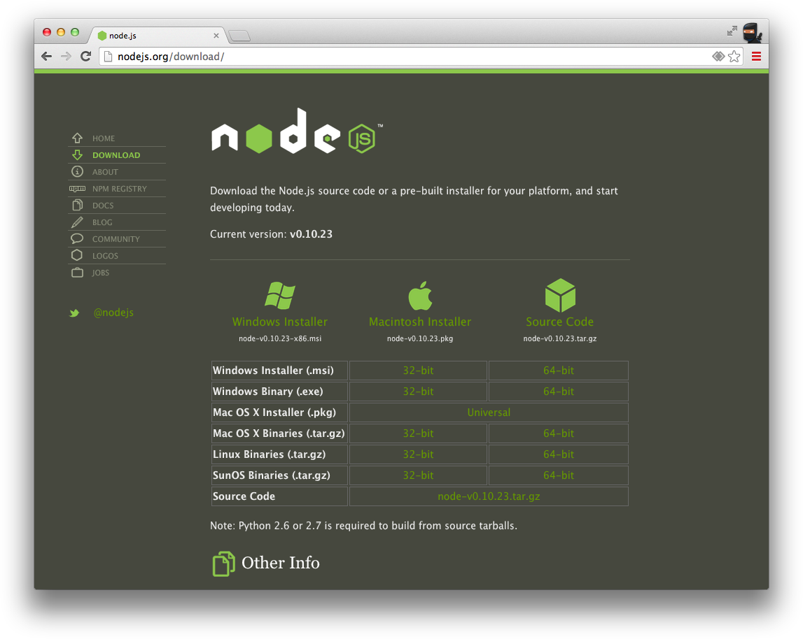
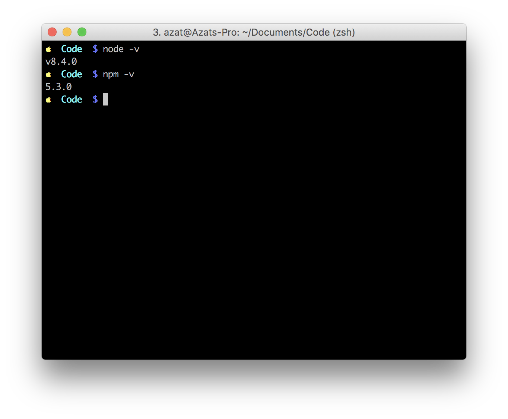
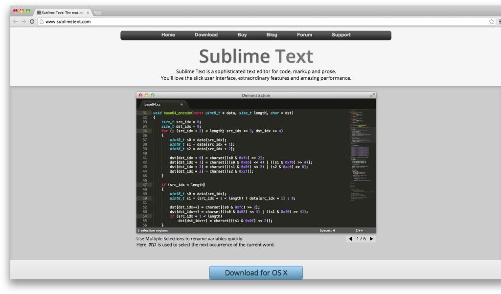

Chapter 1

---------

# Setting up Node.js and Other Essentials

As with many technologies, it’s vital to have the proper foundation set up first, before moving on to solving more complex problems. In this chapter, we cover the following:

- Node.js and npm (Node package manager) installation
- Node.js script launches
- Node.js syntax and basics
- Node.js integrated development environments (IDEs) and code editors
- Awareness of file changes
- Node.js program debugging

# Installing Node.js and npm

Although your operating system (OS) might have Node.js installed on it already, you should update to at least 8.x which is the latest long-term support (LTS) version as of this writing (December 2017). In the following subsection, we examine a few different approaches to installing Node.js:

- *One-click installers*: probably the easiest and fastest way to get started with the platform
- *Installing with HomeBrew or MacPorts*: straightforward installation for Max OS X users
- *Installing from a tar file*: an alternative installation from an archive file
- *Installing without sudo*: the best way to avoid needing sudo (admin rights) when using the node and npm commands
- *Installing from a Git repo*: an option for advanced developers who need the latest version and/or contribute to the project
- *Multiversion setup with Nave*: a must-have for developers contributing to projects that use different Node.js versions
- *Multiversion setup with Node Version Manager* (*NVM*): alternative to Nave (see previous entry)

A note about Long-Term Support (LTS) and non-LTS versions: LTS versions have longer maintenance window. This means that LTS versions will have patches and updates longer than non-LTS versions. Thus LTS versions are recommended for most users and production deployment (not because non-LTS is not proven but simply because LTS has a longer support time). 

LTS versions are even number, such as 4, 6, 8, 10, etc. and non-LTS versions are odd numbers. Non-LTS versions have the latest features before they are rolled out to the next LTS version. We would be using LTS version 8.x. For more information and the current release schedule, please see <https://github.com/nodejs/LTS>.

## One-Click Installers

First, let’s go to <http://nodejs.org> and download a one-click installer for your OS (Figure 1-1) by clicking on the Install button. Don’t choose binaries or source code unless you know what to do with them or your OS is not present there (i.e., not Windows or Mac).

The installers come with npm, Node package manager, which is an important tool for managing dependencies.


***Figure 1-1.** One-click installers for Node.js*

If there’s no installer for your OS (page <https://nodejs.org/en/download>), you can get the source code and compile it yourself (Figure 1-2).



***Figure 1-2.** Multiple options for downloading*

**Note**  For older macOS machines, you can pick 32-bit versions.

## Installing with HomeBrew or MacPorts

If you already have HomeBrew (`brew`) installed, first update the brew itself, and run install commands:

```sh
$ brew update
$ brew install node
```

To install the latest Node version, run:

```sh
$ brew upgrade node
```

If your macOS does not have HomeBrew, go to <http://brew.sh> or install it with the following command:

```sh
$ ruby -e "$(curl -fsSL https://raw.github.com/Homebrew/homebrew/go/install)"
```

Similarly, for MacPorts, run

```sh
$ sudo port install nodejs
```

## Installing from a Tar File

To install from a tar file (which is type of archive), set up a folder for the latest Node.js as follows:

```sh
$ echo  'export PATH=$HOME/local/bin:$PATH' >> ~/.bashrc
$ . ~/.bashrc
$ mkdir ~/local
$ mkdir ~/node-latest-install
$ cd ~/node-latest-install
```

**Note**  Advanced users who choose to make their own Node.js builds need to have certain compilers installed first. For more information about building Node from source, refer to [the official documentation](https://github.com/nodejs/node/blob/master/BUILDING.md) (<https://github.com/nodejs/node/blob/master/BUILDING.md>).

Download the tar file with CURL and unpack it:

```sh
$ curl http://nodejs.org/dist/node-latest.tar.gz | tar xz --strip-components=1
$ ./configure --prefix=~/local
```

Build Node.js and install it:

```sh
$ make install
$ curl https://npmjs.org/install.sh | sh
```

**Tip**  If you find yourself getting errors when trying to install the module globally via npm (`$ npm install -g <packagename>`), reinstall Node.js and npm with the  "Installing Without sudo" solution below to eliminate the need to use `sudo` with the installation command. 

## Installing Without sudo

Sometimes, depending on your configuration, npm asks users for `sudo`— root user permissions. To avoid using `sudo`, advanced developers can use the following::

```sh
$ sudo mkdir -p /usr/local/{share/man,bin,lib/node,include/node}
$ sudo chown -R $USER /usr/local/{share/man,bin,lib/node,include/node}
```

**Note**  Please be sure you are comfortable with the functionality of the `chown` command before you run it.

Then, proceed with a normal installation:

```sh
$ mkdir node-install
$ curl http://nodejs.org/dist/node-v0.4.3.tar.gz | tar -xzf - -C node-install
$ cd node-install/*
$ ./configure
$ make install
$ curl https://npmjs.org/install.sh | sh
```

## Installing from Source Code

If you want to use the latest core Node.js code, and maybe even contribute to the Node.js and npm projects, your best choice is to use the installation from the source code which is in GitHub. This will allow you to change the Node code itself, and then compile and run it

This step requires Git. To install it, go to <http://git-scm.com> and click Download. For basic Git commands, refer to Chapter 11, where we explore deployment.  

For the full detailed instructions, go to <https://github.com/nodejs/node/blob/master/BUILDING.md>. Here is the short version of the instructions.

1. Make the folders and add the path:

    ```sh
    $ mkdir ~/local
    $ echo 'export PATH=$HOME/local/bin:$PATH' >> ~/.bashrc
    $ . ~/.bashrc
    ```

    To clone the original Node.js repo from [nodejs/node](https://github.com/nodejs/node) (alternatively, you can fork it and clone your own repository), do the following:

    ```sh
    $ git clone git@github.com:nodejs/node.git
    $ cd node
    $ ./configure --prefix=~/local
    ```

2. Build Node with the make command:

    ```sh
    $ make install
    ```

3. Repeat for npm:

    ```sh
    $ git clone https://github.com/npm/npm
    $ cd npm
    $ make install
    ```


## Multiversion Setup with NVM

If you plan to work on various Node projects, you might have to have to switch between multiple versions of Node.js. To make things easier, I recommend to use a version manager which will allow to install multiple versions and switch between them quickly and without a hassle.

One of the trusted and battle-tested version managers is nvm (Node Version Manager): <https://github.com/creationix/nvm>. Install NVM as follows:

```sh
$ curl https://raw.github.com/creationix/nvm/master/install.sh | sh
```

or

```sh
$ wget -qO- https://raw.github.com/creationix/nvm/master/install.sh | sh
```

Then, you should be ready to start using NVM and its `install`. For example, to install Node v0.10, use:

```sh
$ nvm install 0.10
```

After installing Node v0.10 to switch to the 0.10 version, apply the `use` command. For example:

```sh
$ nvm use 0.10
```

NVM won't move global npm modules from one version to another. If you are switching from y to x, then use `nvm install x --reinstall-packages-from=y` to reinstall all the global packages from "y" in the new "x". For example, to move packages to Node v8 from Node v6, use `nvm install 8.4.0 --reinstall-packages-from=6.11.2`


## Multiversion Setup with NVM for Windows

[Node Version Manager (nvm) for Windows](https://github.com/coreybutler/nvm-windows) is a separate project from original nvm which is for macOS and Linux. nvm for Windows is ironically written in Go. 

To download nvm for Windows, simply go to <https://github.com/coreybutler/nvm-windows> releases and select the latest version of the installer.


## Alternative Multiversion Systems

The most popular and used alternatives to NVM include the following tools:

- [n](https://github.com/visionmedia/n]) (<https://github.com/visionmedia/n>): the original and *simple* Node version manager without subshells (I still use it today on my personal computer)
- [nave](https://github.com/isaacs/nave) (<https://github.com/isaacs/nave>): version manager from the creator of npm; and it supports subshells
- [ndevn](https://github.com/riywo/ndenv) (<https://github.com/riywo/ndenv>): Node.js version manager based on rbenv

## Updating npm

Some of the readers might have npm already, but due to big changes between npm v3, 4 and 5, it's recommended to update npm to version 5. Luckily, you can use npm to update npm! 

```
npm i -g npm@latest
```

## Checking the Installation

To test your installation, run the following commands in your Terminal app (command line `cmd.exe` in Windows):

```sh
$ node -v
$ npm -v
```

You should see the latest versions of Node.js and npm that you just downloaded and installed, as shown in Figure 1-3.



***Figure 1-3.** Checking Node.js and npm installations*

That’s it! You now have Node.js and npm installed, and you should be ready to dig deeper into using the platform. The simplest way to run Node.js is through its virtual environment, which is often called *read–eval–print–loop*, or REPL.

## Node.js Console (REPL)

Like most platforms/languages (e.g., Java, Python, Ruby, and PHP), Node.js comes with a virtual environment called read–eval–print–loop (REPL). Using this shell program, we can execute pretty much any Node.js/JavaScript code. It’s even possible to include modules and work with the file system! Other REPL use cases involve controlling drones nodecopters (<http://nodecopter.com>) and debugging remote servers (more about this in Chapter 10). To start the console, run the following command in your terminal:

```sh
$ node
```

The prompt should change from `$` to `>` (or something else, depending on your shell). From this prompt, we can run any JavaScript/Node.js (akin to the Chrome Developer Tools console) we want. For example:

```js
> 1+1
> "Hello"+" "+"World"
> a=1;b=2;a+b
> 17+29/2*7
> f = function(x) {return x*2}
> f(b)
```

The result of the previous snippet is shown in Figure 1-4.


***Figure 1-4.** Executing JavaScript in Node.js REPL*

There are slight deviations in ECMAScript implementations in Node.js and browsers such as the Chrome Developer Tools console. For example, `require()` is a valid method in Node.js REPL, whereas the same code is `ReferenceError` in the Chrome console because of browsers don't support Node.js modules feature. However, for the most part, Node.js REPL and the Chrome/Firefox consoles are similar.

# Launching Node.js Scripts

To start a Node.js script from a file, simply run `$ node filename`—for example, `$ node program.js`. If all we need is a quick set of statements, there’s a `-e` option that allows us to run inline JavaScript/Node.js—for example, `$ node -e "console.log(new Date());"`.

If the Node.js program uses environmental variables, it’s possible to set them right before the `node` command. For example:

    $ NODE_ENV=production API_KEY=442CC1FE-4333-46CE-80EE-6705A1896832 node server.js

Preparing your code for production is discussed later in Chapter 10.

# Node.js Basics and Syntax

Node.js was built on top of the Google Chrome V8 engine and its ECMAScript, which means most of the Node.js syntax is similar to front-end JavaScript (another implementation of ECMAScript), including objects, functions, and methods. In this section, we look at some of the most important aspects; let’s call them *Node.js/JavaScript fundamentals*:

- Loose typing
- Buffer—Node.js super data type
- Object literal notation
- Functions
- Arrays
- Prototypal nature
- Conventions

## Loose Typing

Automatic typecasting works well most of the time. It’s a great feature that saves a lot of time and mental energy! There are only a few types of primitives:

- String
- Number (both integer and real)
- Boolean
- Undefined
- Null
- RegExp

Everything else is an object (i.e., mutable keyed collections, read Stackoverflow on "[What does immutable mean?](http://stackoverflow.com/questions/3200211/what-does-immutable-mean) (<http://stackoverflow.com/questions/3200211/what-does-immutable-mean>)" if in doubt).

Also, in JavaScript, there are String, Number, and Boolean objects that contain helpers for the primitives, as follows:

```js
'a' === new String('a') *//false*
```

but

```js
'a' === new String('a').toString() *//true*
```

or

```js
'a' == new String('a') *//true*
```

By the way, `==` performs automatic typecasting whereas `===` does not.

## Buffer—Node.js Super Data Type

Buffer is a Node.js addition to four primitives (boolean, string, number, and RegExp) and all-encompassing objects (array and functions are also objects) in front-end JavaScript. Think of buffers as extremely efficient data stores. In fact, Node.js tries to use buffers any time it can, such as when reading from a file system and when receiving packets over the network. Buffer is functionally similar to JavaScript's [ArrayBuffer](https://developer.mozilla.org/en/docs/Web/JavaScript/Reference/Global_Objects/ArrayBuffer).

To create a Buffer, use `from`. Buffer can be created from an array, another Buffer, ArrayBuffer or a string:

```js
const bufFromArray = Buffer.from([0x62, 0x75, 0x66, 0x66, 0x65, 0x72])
console.log(bufFromArray.toString()) // "buffer"

const arrayBuffer = new Uint16Array(2)
arrayBuffer[0] = 5
arrayBuffer[1] = 7000

// Shares memory with `arrayBuffer`
const bufFromArrayBuffer = Buffer.from(arrayBuffer.buffer)

// Prints: <Buffer 05 00 58 1b>
console.log(bufFromArrayBuffer)

// Changing the original Uint16Array changes the Buffer also
arrayBuffer[1] = 7001

// Prints: <Buffer 05 00 59 1b>
console.log(bufFromArrayBuffer)
```

As you saw in the code above, to convert Buffer to a string, you can use `toString()` method. By default, it will convert to UTF-8 encoding, but other encoding options are possible too such as ASCII, HEX or others:

```js
const bufFromString = Buffer.from('¿Cómo está?')

console.log(bufFromString.toString('utf8')) // ¿Cómo está?
console.log(bufFromString.toString()) // ¿Cómo está?

console.log(bufFromString.toString('ascii')) // B?CC3mo estC!?

const bufFromHex = Buffer.from('c2bf43c3b36d6f20657374c3a13f', 'hex')

console.log(bufFromHex.toString()) // ¿Cómo está?
```

## Object Literal Notation

Node object notation is the same as JavaScript which means it is super readable and compact:

```js
const car = {
  color: "green",
  type: "suv",
  owner: {
    ...
  },
  drive: function() {
    ...
  }
}
```

In Node version 8, all the ES2015 (ES6) features available which allows developers to write advanced object literals which are so enhanced that they are more like classes rather than simple ES5 object. For example, you can extend another object, define fields dynamically, invoke super and use shorter syntax for functions: 

```js
const serviceBase = {
  port: 3000, 
  url: 'azat.co'
}

const getAccounts = () => {
  return [1,2,3]
}
    
const accountService = {
  __proto__: serviceBase,
  getUrl() {  // define method without "function"
    return "http://" + this.url + ':' + this.port
  },
  getAccounts() // define from an outer-scope function
  toString() { // overwrite proto method
    return JSON.stringify((super.valueOf()))
  },
  [ 'valueOf_' + getAccounts().join('_') ]: getAccounts()
}
console.log(accountService) // ready to be used
```


## Functions

In Node.js (as well as in JavaScript), functions are *first-class citizens*, and we treat them as variables, because they are objects! Yes, functions can even have properties/attributes. First, let’s learn how to define a function.:

### Define/Create a Function

The three most common ways to define/create a function are to use a named expression, an anonymous expression assigned to a variable, or both. The following is an example of a named expression:

```js
function f() {
  console.log('Hi')
  return true
}
```

An anonymous function expression assigned to a variable looks as follows (note that it must precede the invocation, because the function is not hoisted, unlike the previous example):

```js
const f = function() {
  console.log('Hi')
  return true
}
```

The new analog of the definition above is fat arrow function with an added benefit of using `this` safely due to its value always remaining an outer `this`:

```js
// outer "this"
const f = () => {
  // still outer "this"
  console.log('Hi')
  return true
}
```

The following is an example of both approaches:

```js
const f = function f() {
  console.log('Hi')
  return true
}
```

A function with a property (remember, functions are just objects that can be invoked/initialized) is as follows:

```js
const f = function() {console.log('Boo')}
f.boo = 1
f() *//outputs Boo*
console.log(f.boo) *//outputs 1*
```

Note: The return keyword is optional. When it is omitted, the function returns `undefined` on invocation. I like to call functions with return, expressions (see Functions Invocation vs. Expression).

### Pass Functions as Parameters

JavaScript treats functions like any other objects, so we can pass them to other functions as parameters (usually, callbacks in Node.js):

```js
const convertNum = function(num) {
  return num + 10
}
const processNum = function(num, fn) {
  return fn(num)
}
processNum(10, convertNum)
```

### Function Invocation vs. Expression

The function definition is as follows:

```js
function f() {

}
```

On the other hand, the function invocation looks like

```js
f()
```

Expression, because it resolves to some value (which could be a number, string, object, or boolean), is as follows:

```js
function f() {
  return false
}
f()
```

A statement looks like

```js
function f(a) {
  console.log(a)
}
```

There's also an implicit return when you are using fat arrow function. It works when there's just one statement in a function.

```js
const fWithImplicitReturn = (a,b) => a+b
```

## Arrays

Arrays are also objects that have some special methods inherited from the [Array.prototype](https://developer.mozilla.org/en-US/docs/Web/JavaScript/Reference/Global_Objects/Array/prototype#Properties) (<https://developer.mozilla.org/en-US/docs/Web/JavaScript/Reference/Global_Objects/Array/prototype#Properties>) global object. Nevertheless, JavaScript arrays are *not* real arrays; instead, they are objects with unique integer (usually 0 based) keys.

```js
let arr = []
let arr2 = [1, "Hi", {a:2}, () => {console.log('boo')}]
let arr3 = new Array()
let arr4 = new Array(1,"Hi", {a:2}, () => {console.log('boo')})
arr4[3]() // boo
```

## Prototypal Nature

There are *no classes* in JavaScript because objects inherit directly from other objects, which is called *prototypal inheritance*. There are a few types of inheritance patterns in JavaScript:

- Classical
- Pseudoclassical
- Functional

This is an example of the functional inheritance pattern:

```js
let user = function (ops) {
  return { firstName: ops.firstName || 'John', 
    lastName: ops.lastName || 'Doe', 
    email: ops.email || 'test@test.com', 
    name: function() { return this.firstName + this.lastName}
  }
}

let agency = function(ops) {
  ops = ops || {}
  var agency = user(ops)
  agency.customers = ops.customers || 0
  agency.isAgency = true
  return agency
}
```

With `class` introduced in ES2015 (ES6), things are somewhat easier especially for object-oriented programmers. A class can be extended, defined and instantiated with `extends`, `class` and `new`. 

For example, this base class has constructor and a method:

```js
class baseModel {
  constructor(options = {}, data = []) { // class constructor
    this.name = 'Base'
    this.url = 'http://azat.co/api'
    this.data = data
    this.options = options
  }
  getName() { // class method
    console.log(`Class name: ${this.name}`)
  }
}
```

Then we can create new class using the base class. The new class will have all the functionality of a base class from which it inherits and then some more:

```js
class AccountModel extends baseModel {
  constructor(options, data) {
    super({private: true}, ['32113123123', '524214691']) // call the parent method with super
    this.name = 'Account Model'
    this.url +='/accounts/'
  }
  get accountsData() { // calculated attribute getter
    // ... make XHR
    return this.data
  }
}

let accounts = new AccountModel(5)
accounts.getName()
console.log('Data is %s', accounts.accountsData)
```

The results will be:

```
Class name: Account Model
Data is %s 32113123123,524214691
```

## Conventions

It’s important to follow the most common language conventions. Some of them are listed here:

- Semicolons
- camelCase
- Naming
- Commas
- Indentations
- Whitespace

These JavaScript/Node.js conventions (with semicolons being an exception) are stylistic and highly preferential. They don’t impact the execution; however, it’s strongly suggested that you follow one style consistently, especially if you are a developer working in teams and/or on open-source projects. Some open-source projects might not accept pull requests if they contain semicolons (e.g., npm) or if they don’t use comma-first style (e.g., request).

### Semicolons

Almost all statements in JavaScript and thus Node.js must be terminated with a semicolon. However, there's a automatic semicolon insertion feature in JavaScript interpreters which will follow the rules and insert semicolons for developers.

Hence, the use of semicolons is optional, except for these cases:

1. In loop constructions such as `for (var i=0; i++; i<n)`
2. When a new line starts with parentheses or square brace or regular expression, such as when using an immediately invoked function expression (IIFE): `;(function(){...}())`
3. When doing something weird like empty statements (see [Automatic semicolon insertion in JavaScript](http://2ality.com/2011/05/semicolon-insertion.html))

In this, as well as in my other books, I don't use semicolons. There are a few reasons why. If you use semicolons and forget or omit one, then you code will still work but you'll end up with inconsistency which will create a necessity for a linter or a similar tool to check for your syntax. Let's say you spotted the missing semicolon or saw a warning from a linter, then you need to go to your code and fix it. Why to go through all this trouble? 

Semicolon-less code works perfectly fine except two cases shown above and when you try to multiple statements are in one line. But developers should NOT write multiple statements in one line. That's a job of a bundler/minimizer. The bottom line, I recommend developers focus on their work and not looking for missing semicolons. Let the language use its own feature (Automatic Semicolon Insertion). 

### camelCase

camelCase is the main naming pattern in JavaScript, except for class names, which are CapitalCamelCase. An example follows:

```js
let MainView = Backbone.View.extend({...})
let mainView = new MainView()
```

### Naming

`_` and `$` are perfectly legitimate characters for literals (jQuery and Underscore libraries use them a lot). Private methods and attributes start with `_` (and it does nothing by itself!).

### Commas

One in a while you might see comma-first style. An example of a comma-first style is as follows:

```js
const obj = { firstName: "John"
  , lastName: "Smith"
  , email: "johnsmith@gmail.com"
}
```

I recommend to avoid comma-first style. The *erroneous* (in my view) reason for using comma-first style was that it can make a developer work easier. However while it simplifies the removal of the last line easier, it complicates the removal of the first line. 

Moreover, with ES2017/ES8 developers can use trailing commas in function calls (for arguments) in addition to object literals and arrays. I recommend using traditional style (with or without trailing comma):

```js
const obj = { firstName: "John", 
  lastName: "Smith", 
  email: "johnsmith@gmail.com",  // trailing comma - okay
}
```

### Indentation

Indentation is usually done using either a tab, or four- or two-space indentation, with supporting camps split almost religiously between the two options. I recommend using two spaces because this will allow you to have more code on the screen and believe me, you'll need all the width of your code editor due to nested promises and callbacks.

I recommend having the closing curly brackets on the same indentation level as the opening statement. It'll be easier to find the matching brackets. For example, like this:

```js
if (error) {
  console.error(error)
  process.exit(1)
}
```

### Whitespace

Usually, there is a space before and after the `=`, `+`, `{`, and `}` symbols. There is no space on invocation (e.g., `arr.push(1);`). And there’s no space when we define an anonymous function: `function() {}`.

For example, 

```js
const f = function(a, b) {
  return a + b
}
f(1, 2)
```

## Node.js Globals and Reserved Keywords

Despite being modeled after one standard, Node.js and browser JavaScript differ when it comes to globals. As you might know, in browser JavaScript we have a `window` object. However, in Node.js, it is absent (obviously we don’t deal with a browser window), but developers are provided with new objects/keywords:

- `process`
- `global`
- `module.exports` and `exports`

So, let’s take a look at the main differences between Node.js and JavaScript.

### Node.js Process Information

Each Node.js script that runs is, in essence, a system process. For example, a POSIX (Linux, macOS, etc.) command `ps aux | grep 'node'` outputs all Node.js programs running on a machine. Conveniently, developers can access useful process information in code with the `process` object (e.g., `node -e "console.log(process.pid)"`), as shown in Figure 1-5.


***Figure 1-5.** Node.js process examples using `pid` (process ID) and `cwd` (current working directory).*

### Accessing Global Scope in Node.js

Node.js is JavaScript which is a good news for front-end developers who already familiar with JavaScript. You'll learn Node quickly. But there are huge differences when it comes to global objects. In a sense, the `window` object from front-end/browser JavaScript metamorphosed into a combination of `global` and `process` objects. Needless to say, the `document` object, which represents the DOM (Document Object Model) of the web page, is nonexistent in Node.js.

`global` can be accessed from anywhere. It has special methods including familiar to you `console`, `setTimeout()`, as well as Node-specific `global.process`, `global.require()` and `global.module`.

Node.js has a lot of useful information and methods in `global.process` including but not limited: 

* `process.pid`: Get this process ID
* `process.argv`: List command-line argument supplied to this process
* `process.env`: List environment variables
* `process.platform`: Get platform name, such as `darwin` for macOS
* `process.release`: Get this Node release URL
* `process.versions`: List versions of Google Chrome V8, zlib, uv, etc.
* `process.stdin()`: Access standard input (for reading)
* `process.stdout()`: Access standard output (for writing)
* `process.uptime()`: How long this process is running
* `process.memoryUsage()`: What is a memory usage
* `process.kill()`: Terminate another process
* `process.exit()`: Exit/terminate this process

### Exporting and Importing Modules

One of the bad parts of browser JavaScript is that there was no easy way to include other JavaScript file (modules). Browser JavaScript files are supposed to be linked together using a different language (HTML), but everything from an included file is just run without name spacing and dependency management is hard because managing a lot of `<script>` tags and files is not fun. 

[CommonJS](http://www.commonjs.org) (<http://www.commonjs.org>) and [RequireJS](http://requirejs.org) (<http://requirejs.org>) solve this problem with the AJAX-y approach. ES6 solved the issue on the standard level, but lacks implementations. Node.js offers modules natively. No tools or hacks needed. Node.js borrowed many things from the browser CommonJS concept but took the implementation steps further than CommonJS. 

Node.js modules are simple to learn and use. They allow of import/export only specific targeted functionality making name spacing easier unlike when you include a browser JavaScript file with a `<script>` tag.

To export an object in Node.js, use `exports.name = object;`. An example follows:

```js
const messages = {
  find: function(req, res, next) {
  ...
  },
  add: function(req, res, next) {
  ...
  },
  format: 'title | date | author'
}
exports.messages = messages
```

You can use `let` or `var` for `messages` in the module above, but `const` makes more sense since we are not updating this object, and can use an extra safety of `const` (respects the logical scope and prevents re-declaration). `const` will still allow you to modify object properties.

While in the file where we import the aforementioned script (assuming the path and the file name is `route/messages.js`), write the following:

```js
const messages = require('./routes/messages.js')
```

However, sometimes it’s more fitting to invoke a constructor, such as when we attach properties to the Express.js app (which is explained in detail in [*Express.js FUNdamentals: An Essential Overview of Express.js*](*http://webapplog.com/express-js-fundamentals*)(*<http://webapplog.com/express-js-fundamentals>*) *[2013]*). In this case, `module.exports` is needed:

```js
module.exports = (app) => {
  app.set('port', process.env.PORT || 3000)
  app.set('views', __dirname + '/views')
  app.set('view engine', 'jade')
  return app
}
```

In the file that includes the previous sample module, write

```js
...
let app = express()
const config = require('./config/index.js')
app = config(app)
...
```

The more succinct code is to skip the `config` variable declaration:

```js
const express = require('express')
let app = express()
require('./config/index.js')(app)
```

The most common mistake when including modules is creating a wrong path to the file. For core Node.js modules, use the name without any path—for example, `require('name')`. The same goes for modules in the `node_modules` folder (more on this when we examine npm later in the chapter).

For all other files (i.e., not modules), use `.` with or without a file extension. An example follows:

```js
const keys = require('./keys.js'),
  messages = require('./routes/messages.js')
```


In addition, for including files it’s advisable to use statements with `__dirname` and `path.join()` to insure the paths work across-platforms. For example, to include a file `messages.js` in a `routes` folder which itself is inside a folder where the currently running script is, use:

```js
const messages = require(path.join(__dirname, 'routes', 'messages.js'))
```

Using `path.join()` is a recommended approach, because `path.join()` will produce a path with valid slashes (forward or backward depending on your OS). You'll also use absolute path which will make `require()` behave in a more robust and predictable manner.

Oh yeah, if `require()` points to a folder, Node.js attempts to read the `index.js` file in that folder. For example, the following statement will import file `index.js` in the folder `routes/messages` *if* there's no file `messages.js` in `routes`:

```
const messages = require(path.join(__dirname, 'routes', 'messages'))
```

There's another variable related to paths.

## __dirname vs. process.cwd

`__dirname` is an absolute path to the folder with the source code script (a file in which the global variable is called), whereas `process.cwd` is an absolute path to the folder from which the process that runs the script was launched. They are the same in the example of `node program.js`. 

The `cwd` will be different from `__dirname`, if we started the program from a different folder. For example, for the process `$ node ./code/program.js`, `__dirname` will have `code` but `cwd` not since it'll be one folder above in the directory tree.

On POSIX systems (macOS, Linux and its distributions), Node developers can also use `process.evn.PWD` which works similarly to `process.cwd`.

## Browser Application Programming Interface Helpers

There are myriad helper functions in Node.js from the browser JavaScript application programming interface (API). The most useful come from `String`, `Array`, and `Math` objects. To make you aware of their existence, or to remind you, here is a list of the most common functions and their meanings:

- **Array**

	- `some()` and `every()`:assertions for array items
	- `join()` and `concat()`: convertion to a string
	- `pop()`, `push()`, `shift()`, and `unshift()`: working with stacks and queues
	- `map()`: model mapping for array items
	- `filter()`: querying array items
	- `sort()`: ordering items
	- `reduce()`, `reduceRight()`: computing
	- `slice()`: copying
	- `splice()`: removing
	- `indexOf()`: lookups of finding the value in the array
	- `reverse()`: reversing the order
	- The `in` operator: iteration over array items

- **Math**

	- `random()`: random real number less than one

- **String**

	- `substr()` and `substring()`: extracting substrings
	- `length`: length of the string
	- `indexOf()`: index of finding the value in the string
	- `split()`: converting the string to an array

In addition, we have `setInterval()`, `setTimeout()`, `forEach()`, and `console` methods in Node.js. For the complete list of methods and examples of the String, Array and Math Node.js objects, visit the following Mozilla Developer Network documentation pages:

- *String*: <https://developer.mozilla.org/en-US/docs/Web/JavaScript/Reference/Global_Objects/String>
- *Array*: <https://developer.mozilla.org/en-US/docs/Web/JavaScript/Reference/Global_Objects/Array>
- *Math*: <https://developer.mozilla.org/en-US/docs/Web/JavaScript/Reference/Global_Objects/Math>

## Node.js Core Modules

Unlike other programming technologies, Node.js doesn’t come with a heavy standard library. The core modules of Node.js are a bare minimum, and the rest can be cherry-picked via the npm registry. The core is small but it has enough modules to build almost any networking application. Networking is at the core of Node.js! 

The main (not all) core modules, classes, methods, and events include the following:

- `http`(<http://nodejs.org/api/http.html#http_http>): Allows to create HTTP clients and servers
- `util`(<http://nodejs.org/api/util.html>): Has a set of utilities
- `querystring`(<http://nodejs.org/api/querystring.html>): Parses query-string formatted data
- `url`(<http://nodejs.org/api/url.html>): Parses URL data
- `fs`(<http://nodejs.org/api/fs.html>): Works with a file system (write, read)

Let's dive deeper into each of these core modules.

### [**http**](**http://nodejs.org/api/http.html**) (**<http://nodejs.org/api/http.html>**)

`http` is the main module responsible for the Node.js HTTP server. The main methods are as follows:

- `http.createServer()`: returns a new web server object
- `http.listen()`: begins accepting connections on the specified port and hostname
- `http.createClient()`: is a client and makes requests to other servers
- `http.ServerRequest()`: passes incoming requests to request handlers
	- **data** : emitted when a part of the message body is received
	- **end** : emitted exactly once for each request
	- `request.method()`: the request method as a string
	- `request.url()`: request URL string

- `http.ServerResponse()`: creates this object internally by an HTTP server — not by the user— and is used as an output of request handlers

	- `response.writeHead()`: sends a response header to the request
	- `response.write()`: sends a response body
	- `response.end()`: sends and ends a response body

### [**util**](**http://nodejs.org/api/util.html**) (**<http://nodejs.org/api/util.html>**)

The util module provides utilities for debugging. One method is as follows:

- `util.inspect()`: returns a string representation of an object, which is useful for debugging

### [**querystring**](**http://nodejs.org/api/querystring.html**) (**<http://nodejs.org/api/querystring.html>**)

The `querystring` module provides utilities for dealing with query strings. Some of the methods include the following:

- `querystring.stringify()`: serializes an object to a query string
- `querystring.parse()`: deserializes a query string to an object

### [**url**](**http://nodejs.org/api/url.html**) (**<http://nodejs.org/api/url.html>**)

The `url` module has utilities for URL resolution and parsing. One method is as follows:

- `parse()`: takes a URL string and returns an object

### [**fs**](**http://nodejs.org/api/fs.html**) (**<http://nodejs.org/api/fs.html>**)

`fs` handles file system operations such as reading to and writing from files. There are synchronous and asynchronous methods in the library. Some of the methods include the following:

- `fs.readFile()`: reads files asynchronously
- `fs.writeFile()`: writes data to files asynchronously

There is no need to install or download core modules. To include them in your application, all you need is to use the following syntax:

```js
const http = require('http')
```

Node comes with core modules but most developers rely on the vast ecosystem of community-created  FOSS (free and open-source) modules. These modules often allow developers to not write code because  a module has all the functionality needed. With large number of modules, it's important to find just the right one for the job. The best place to start your search for a module is your favorite search engine such as Google, Bing or DuckDuckGo. A list of noncore modules is found at the following locations:

- [npm search](https://www.npmjs.com/browse/keyword/search): <https://www.npmjs.com/browse/keyword/search>: the main npm search by npm itself
- [node-modules.com](http://node-modules.com) (<http://node-modules.com>): search for npm
- [Nipster](http://nipstr.com) (<http://nipstr.com>): npm search combined with GitHub stats
- [npms.io](https://npms.io) (<https://npms.io>): another search for npm

## Handy Node.js Utilities

Although the core of the Node.js platform was, intentionally, kept small, it has some essential utilities, including the following:

- [*Crypto*](*http://nodejs.org/api/crypto.html*) (*<http://nodejs.org/api/crypto.html>*): has randomizer, MD5, HMAC-SHA1, and other algorithms
- [*Path*](*http://nodejs.org/api/path.html*) (*<http://nodejs.org/api/path.html>*): handles system paths
- [*String decoder*](*http://nodejs.org/api/string_decoder.html*) (*<http://nodejs.org/api/string_decoder.html>*): decodes to and from buffer and string types

The method we use throughout is `path.join` and it concatenates the path using an appropriate folder separator (`/` or `\\`).

## Reading to and Writing from the File System in Node.js

Reading from files is done via the core `fs` [module](http://nodejs.org/api/fs.html) (<http://nodejs.org/api/fs.html>). There are two sets of reading methods: async and sync. In most cases, developers should use async methods, such as `fs.readFile`(<http://nodejs.org/api/fs.html#fs_fs_readfile_filename_options_callback>):

```js
const fs = require('fs')
const path = require('path')
fs.readFile(path.join(__dirname, 
  '/data/customers.csv'), 
  {encoding: 'utf-8'}, (err, data) => {
  if (err) {
    console.error(err)
    process.exit(1)
  } else {
    console.log(data)
  }
})
```

To write to the file, execute the following:

```js
const fs = require('fs')
fs.writeFile('message.txt', 
  'Hello World!', (err) => {
  if (err) {
    console.error(err)
    process.exit(1)
  } else {
    console.log('Writing is done.')
  }
})
```

## Streaming Data in Node.js

*Streaming data* means an application processes the data while it’s still receiving it. Node has supports for streams. This feature is useful for extra large datasets such as video or database migrations.

Here's a basic example of using streams that reads a file as a stream and outputs the binary file content back to the standard output:

```js
const fs = require('fs')
fs.createReadStream('./data/customers.csv').pipe(process.stdout)
```

By default, Node.js uses buffers for streams. For more immersive instruction, take a look at `stream-adventure`(<http://npmjs.org/stream-adventure>) and [Stream Handbook](https://github.com/substack/stream-handbook) (<https://github.com/substack/stream-handbook>).

## Installing Node.js Modules with npm

npm comes with the Node.js platform and allows for seamless Node.js package management. The way `npm install` works is similar to Git in the way [it traverses the working tree to find a current project](https://npmjs.org/doc/files/npm-folders.html) (<https://npmjs.org/doc/files/npm-folders.html>). For starters, keep in mind that we need either the `package.json` file or the `node_modules` folder to install modules locally with `$ npm install name`. For example, `$ npm install superagent` in the program.js write: `const superagent = require('superagent')`.

The best thing about npm is that it keeps all the dependencies local, so if module A uses module B v1.3, and module C uses module B v2.0 (with breaking changes compared with v1.3), both A and C will have their own localized copies of different versions of B. This proves to be a more superior strategy than that of Ruby and other platforms that use global installations by default.

The best practice is *not to include* a `node_modules` folder in the Git repository when the project is a module that is supposed to be used in other applications. However, it’s recommended *to include* `node_modules` for deployable applications to prevent breakage caused by unfortunate dependency updates.

**Note**  The npm creator likes to call it `npm` ([lowercase](http://npmjs.org/doc/misc/npm-faq.html#Is-it-npm-or-npm-or-Npm) (<http://npmjs.org/doc/misc/npm-faq.html#Is-it-npm-or-npm-or-Npm>).

## Taming Callbacks in Node.js

[Callbacks](https://github.com/maxogden/art-of-node#callbacks) (<https://github.com/maxogden/art-of-node%23callbacks>) are able to make Node.js code asynchronous, yet programmers unfamiliar with JavaScript, who work with Java or PHP, might be surprised when they see Node.js code described on [Callback Hell](http://callbackhell.com) (<http://callbackhell.com>):

```js
fs.readdir(source, (err, files) => {
  if (err) {
    console.log('Error finding files: ' + err)
  } else {
    files.forEach((filename, fileIndex) => {
      console.log(filename)
      gm(source + filename).size((err, values) => {
        if (err) {
          console.log('Error identifying file size: ' + err)
        } else {
          console.log(filename + ' : ' + values)
          aspect = (values.width / values.height)
          widths.forEach((width, widthIndex) => {
            height = Math.round(width / aspect)
            console.log('resizing ' + filename + 'to ' + height + 'x' + height)
            this.resize(width, height).write(destination + 'w' + width + '_' + filename, (err) => {
              if (err) console.log('Error writing file: ' + err)
            })
          }.bind(this))
        }
      })
    })
  }
})
```

There’s nothing to be afraid of here as long as two-space indentation is used. ;-) However, callback code can be rewritten with the use of event emitters or promises, or by using the [`async`](https://www.npmjs.com/package/async) library (see chapter 14).

## Hello World Server with HTTP Node.js Module

Although, Node.js can be used for a wide variety of tasks, it’s used primarily for building web applications. Node.js thrives in the network as a result of its asynchronous nature and built-in modules such as `net` and `http`.

Here’s a quintessential Hello World example in which we create a server object, define the request handler (function with `req` and `res` arguments), pass some data back to the recipient, and start up the whole thing (`hello.js`):

```js
const http = require('http')
const port = 3000
http.createServer((req, res) => {
  res.writeHead(200, {'Content-Type': 'text/plain'})
  res.end('Hello World\n')
}).listen(port, ()=>{
  console.log(`Server running at http://localhost:${port}`)
})
```

Let’s break it down a bit (if you know this already, skip to the next section). The following loads the core `http` module for the server (more on the modules later):

```js
const http = require('http')
const port = 3000
```

This snippet below creates a server with a callback function which contains the response handler code:

```js
const server = http.createServer((req, res) => {
```

To set the right header and status code, use the following:

```js
  res.writeHead(200, {'Content-Type': 'text/plain'})
```

To output Hello World with the line end symbol, use

```js
  res.end('Hello World\n')
})
```

The `req` and `res` arguments have all the information about a given HTTP request and response correspondingly. In addition, `req` and `res` can be used as streams (see previous section).

To make the server accept requests, use the following:

```js
}).listen(port, ()=>{
  console.log(`Server running at http://localhost:${port}`)
})
```

From the folder in which you have `server.js`, launch in your terminal the following command:

```
$ node server.js
```

Open [localhost:3000](http://localhost:3000) (<http://localhost:3000>) or [127.0.0.1:3000](http://127.0.0.1:3000) (<http://127.0.0.1:3000>) or any other address you see in the terminal as a result of the `console.log()` function and you should see Hello World in a browser. To shut down the server, press Control + c (on macOS X).

**Note**  The name of the main file could be different from `server.js` (e.g., `index.js` or `app.js`). In case you need to launch the `app.js` file, just use `$ node app.js`.

# Debugging Node.js Programs

Modern-day software developers, especially those who use compiled languages such as Java, get accustomed to rich tool sets for debugging purposes. Back in the day, before JavaScript and AJAX apps were starting to gain momentum (~2005–2007), the only way to debug was to put a bunch of `alert()` statements everywhere.

Now, there are amazing environments such as Chrome Developer Tools and Firefox Firebug, and because Node.js has a lot of things in common with the browser JavaScript environment, we have plenty of options for debugging in Node.js, including the following:

- *Core Node.js Debugger*: a non-graphic user interface (non-GUI) minimalistic tool that works everywhere
- *Node Inspector*: port of Google Chrome Developer Tools
- WebStorm and other IDEs (covered in the next section)

## Core Node.js Debugger

The best debugger is `console.log()`, because it doesn’t break/interrupt the flow, and it is fast and informative. However, to use it, we first need to know where to put it. Sometimes, we just don’t know where to put the logs! Other times, we need to see the call stack and orient ourselves in the async code a bit more. To do this, put `debugger` statements in your code and use `$ node debug program.js` to start [the debugging process](http://nodejs.org/api/debugger.html) (<http://nodejs.org/api/debugger.html>).

For example, the Hello World from the previous section can be enhanced with `debugger` in two places: when an instance is created and when a request is made (`hello-debug.js`):

```js
const http = require('http')
const port = 3000
http.createServer((req, res) => {
  res.writeHead(200, {'Content-Type': 'text/plain'})
  debugger  
  res.end('Hello World\n')
}).listen(3000, ()=>{
  console.log(`Server running at http://localhost:${port}`)
})
```

Now, if we run the previous snippet (`hello-debug.js`), just like we did earlier (`$ node hello-debug.js`), nothing changes, because we need to use `$ node debug hello-debug.js`. And only then, the execution halts at the first line, and then again on the next `debugger` statement if we use the `cont` command.

The main node debug commands are as follows:

- `next`, `n`: step to the next statement
- `cont`, `c`: continue until the next debugger/break point
- `step`, `s`: step inside the function call
- `out`, `o`: step outside the function call
- `watch(expression)`: watch the expression

The full list of commands is available through the `help` command or on [the official web site](http://nodejs.org/api/debugger.html) (<http://nodejs.org/api/debugger.html>).

So, in our example (`hello-debug.js`), after we start the debugger client and execute `cont` or `c` twice (first for the first line and second for our debugger on the second line), the server will be up and running. After that, we can open the browser at (<http://localhost:3000>) or execute `$ curl "http://localhost:3000/"` in the Terminal/Command line, and the debugger client stops inside the request handler (line 5). Now we can use `repl` and `console.log(req)` to inspect the HTTP response object dynamically.

## Debugging with Node Inspector

The built-in Node.js debugger client is extensive, but it’s not intuitive because of the lack of a GUI. Therefore, for a more developer-friendly interface than the core Node.js debugger provides, [node-inspector](https://github.com/node-inspector/node-inspector) (<https://github.com/node-inspector/node-inspector>) comes to the rescue!

To download and install Node Inspector, we use our beloved npm in the global mode (`-g` or `--global`):

```
$ npm install -g node-inspector
```

Then, we start Node Inspector with the following (Figure 1-6):

```
$ node-inspector
```


***Figure 1-6.** Running the Node Inspector tool*

Now start the program in a new terminal window/tab/session with `--debug` or `--debug-brk` flags (not just `debug`; Figure 1-7). For example:

```
$ node --debug-brk hello-debug.js
```

or

```
$ node --debug hello-debug.js
```


***Figure 1-7.** Running node server in `--debug` mode*

Open <http://127.0.0.1:8080/debug?port=5858> (or http://localhost:8080/debug?port=5858) in Chrome (it must be Chrome and not another browser because Node Inspector uses the Web Developer Tools interface). You should be able to see the program halted at a break point. Clicking the blue play button resumes the execution, as shown in Figure 1-8.


***Figure 1-8.** Resuming execution in Node Inspector*

If we let the server run and open <http://localhost:1337/> in a new browser tab, this action pauses the execution on the second break point, which is inside the request handler. From here, we can use Node Inspector’s right GUI and add a `res` watcher (Figure 1-9), which is way better than the terminal window output!


***Figure 1-9.** Inspecting `res` object in Node Inspector*

In addition, we can follow the call stack, explore scope variables, and execute any Node.js command in the console tab (Figure 1-10)!


***Figure 1-10.** Writing to response (i.e., the `res` object) from the Node Inspector console*

# Node.js IDEs and Code Editors

One of the best things about Node.js is that you don’t need to compile the code, because it’s loaded into memory and interpreted by the platform! Therefore, a lightweight text editor is highly recommended, such as Sublime Text (Figure 1-11), vs. a full-blown IDE. However, if you are already familiar and comfortable with the IDE of your choice, such as [Eclipse](http://www.eclipse.org) (<http://www.eclipse.org>), [NetBeans](http://netbeans.org) (<http://netbeans.org>), or [Aptana](http://aptana.com) (<http://aptana.com>), feel free to stick with it.



***Figure 1-11.** Sublime Text code editor home page.*

The following is a list of the most popular text editors and IDEs used in web development:


- [Visual Studio Code](https://code.visualstudio.com/nodejs) (<https://code.visualstudio.com/nodejs>): a free, cross-platform, feature-rich editor by Microsoft powered by Node.js. It includes a built-in terminal, Node.js debugging, and lots of handy extensions (Figure 1-12). *I highly recommend using this editor! (At least until something new comes out in the next few years.)*
- [Atom](https://atom.io) (<https://atom.io>): a free, cross-platform editor by GitHub (also powered by Node.js) comparable to Visual Studio Code.
- [TextMate](http://macromates.com) (<http://macromates.com>): macOS version only, free 30-day trial for v1.5, dubbed *The Missing Editor for macOS*
- [Sublime Text](http://www.sublimetext.com) (<http://www.sublimetext.com>): macOS and Windows versions are available, an even better alternative to TextMate, with an unlimited evaluation period
- [Coda](http://panic.com/coda) (<http://panic.com/coda>): an all-in-one editor with an FTP browser and preview, has support for development with an iPad
- [Aptana Studio](http://aptana.com)(<http://aptana.com>): a full-size IDE with a built-in terminal and many other tools
- [Notepad++](http://notepad-plus-plus.org) (<http://notepad-plus-plus.org>): a free, Windows-only lightweight text editor with the support of many languages
- [WebStorm IDE](http://www.jetbrains.com/webstorm) (<http://www.jetbrains.com/webstorm>): a feature-rich IDE that allows for Node.js debugging, developed by JetBrains and marketed as “the smartest JavaScript IDE” (Figure 1-13)


***Figure 1-12.** VS Code has intelligent autocomplete based on the object type/class/library as well as many other features.*

For most developers, a simple code editor such as Sublime Text 2, TextMate, or Emacs is good enough. However, for programmers who are used to working in IDEs, there’s WebStorm by JetBrains (http://www.jetbrains.com/webstorm). For an example of the WebStorm work space, see Figure 1-13.


***Figure 1-13.** Webstorm IDE work space*

# Watching for File Changes

If you are familiar with tool that are watching for file changes and restarting apps, or it’s not an issue for you, feel free to skip this section. All other developers must pay attention. 

Node.js applications are stored in memory, and if we make changes to the source code, we need to restart the process (i.e., node). We do this manually by killing the process and starting a new one (Control + c on Macs and Ctrl + c on Windows). 

However, it’s faster for development if this constant sequence of restarts is automated. There are brilliant tools that leverage the `watch`(<http://nodejs.org/docs/latest/api/fs.html#fs_fs_watch_filename_options_listener>) method from the core Node.js `fs` module and restart servers when we save changes from an editor:

- [forever](http://npmjs.org/forever) (<http://npmjs.org/forever>) ([GitHub](http://github.com/nodejitsu/forever)) (<http://github.com/nodejitsu/forever>), usually used in production (we examine this topic in Chapter 11)
- [node-dev](https://npmjs.org/package/node-dev) (<https://npmjs.org/package/node-dev>) ([GitHub](https://github.com/fgnass/node-dev)) (<https://github.com/fgnass/node-dev>)
- [nodemon](https://npmjs.org/package/nodemon) (<https://npmjs.org/package/nodemon>) ([GitHub](https://github.com/remy/nodemon)) (<https://github.com/remy/nodemon>)
- [supervisor](https://npmjs.org/package/supervisor) (<https://npmjs.org/package/supervisor>) ([GitHub](https://github.com/isaacs/node-supervisor)) (<https://github.com/isaacs/node-supervisor>)
- [up](https://npmjs.org/package/up) (<https://npmjs.org/package/up>) ([GitHub](https://github.com/LearnBoost/up)) (<https://github.com/LearnBoost/up>), now a deprecated module

Any one of these tools is as easy to use as installing globally with `$ npm install -g node-dev`, then running the Node.js script with `$ node-dev program.js`. Just replace `node-dev` with another module name. &#x263A;

For a comparison between these tools, refer to [Comparison: Tools to Automate Restarting Node.js Server After Code Changes](http://strongloop.com/strongblog/comparison-tools-to-automate-restarting-node-js-server-after-code-changes-forever-nodemon-nodesupervisor-nodedev) (<http://strongloop.com/strongblog/comparison-tools-to-automate-restarting-node-js-server-after-code-changes-forever-nodemon-nodesupervisor-nodedev>)

**Tip**  It’s good to know that Express.js reloads a template file for every new request by default. So, no server restart is necessary. However, we can cache templates by enabling the `view cache` setting. For more Express.js setting, take a look at Pro Express.js 4 [2014, Apress].

# Summary

In this chapter, we explored Installing Node.js and npm, and launching Node.js scripts from the command line. We also looked at the essential concepts of Node.js syntax and the platform. Last, lists of Node.js IDEs and libraries for development were provided.

In the next chapter, we dive deep into using the most popular Node.js framework for creating web apps.
