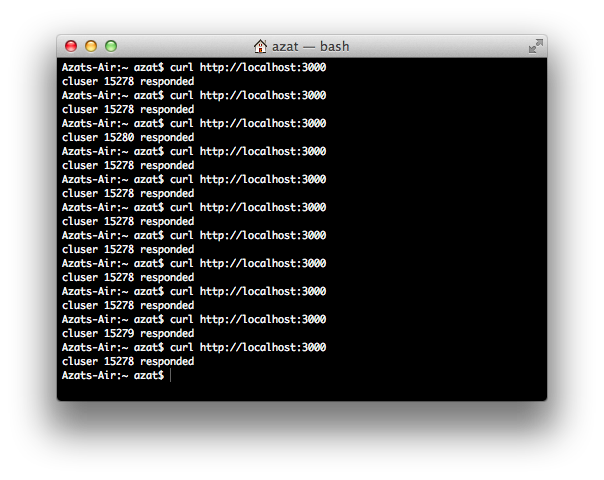
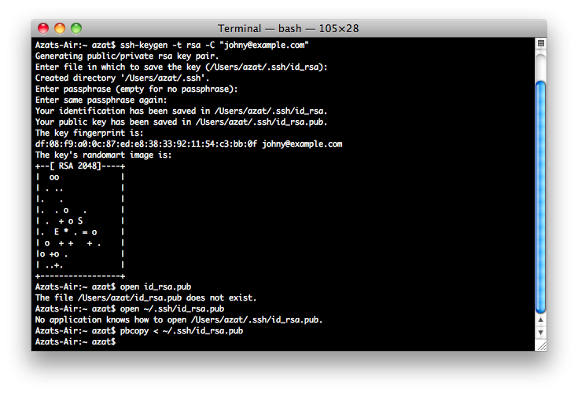

Chapter 10
----------
# Getting Node.js Apps Production Ready

TK:  yarn, pnpm Webpack, 

Getting Node.js apps to a production-ready state is probably the most unexplored and skipped topic in the Node.js literature. The reason could be the lack of expertise in production deployments or the vast number of options and edge cases. However, getting apps to the production level is one of the most important topics in this entire book in my humble opinion.

Yes, the apps differ in structures, frameworks they use, and goals they try to achieve; however, there are a few commonalities worth knowing about, for example, environmental variables, multithreading, logging and error handling. So, in this chapter we cover the following topics:

-   Environment variables
-   Express.js in production
-   Socket.IO in production
-   Error handling
-   Node.js domains for error handling
-   Multithreading with Cluster
-   Multithreading with Cluster2
-   Event logging and monitoring
-   Building tasks with Grunt
-   Git for version control and deployments
-   Running tests in Cloud with TravisCI

Environment Variables
=====================

Before deployment to the production environment, it’s good to prepare our app’s code. Let’s start with information that needs to be private and can’t be shared in a version control system. Sensitive information such as API keys, passwords, and database URIs are best stored in [environment variables](http://en.wikipedia.org/wiki/Environment_variable) (<http://en.wikipedia.org/wiki/Environment_variable>), not in the source code itself. Node.js makes it fairly easy to access these variables:

```js
console.log (process.env.NODE_ENV,
  process.env.API_KEY,
  process.env.DB_PASSWORD)
```

Then, before the application is started, set these variables:

```
$ NODE_ENV=test API_KEY=XYZ DB_PASSWORD=ABC node envvar.js
```

**Note** There's no space between `NAME` and value (`NAME=VALUE`).

Typically, the environment variable setting is a part of the deployment or operations setup. In the next chapter, we deal with putting these variables on the server.

Express.js in Production
========================

In Express.js, use `if/else` statements to check for `NODE_ENV` values to use different level of server logs. For development we want more information but in production stack and exceptions might reveal a vulnerability so we hide them:

```js
const errorHandler = require('errorhandler')
if (process.env.NODE_ENV === 'development') {
  app.use(errorHandler({
    dumpExceptions: true,
    showStack: true
  }))
} else if (process.env.NODE_ENV === 'production') {
  app.use(errorHandler())
}
```

You might be wondering, where this mystical and mysterious `process.env.NODE_ENV` comes from. Very easy. It is an environment variable and as with all other environment variables, developers can set them outside, in the shell (bash or zsh or other) environment. The environment variables are set with `KEY=VALUE` syntax or prefixed with `export KEY=VALUE` when set for the duration of the entire shell session. For example, to run the server in a production mode, just set an environment variable to production:

```
$ NODE_ENV=production node app.js
```

Notice that the env var and the command where on the same command or same line? You must have them in one command. If you want to set the environment variable once for multiple commands, then `export` is your friend:

```
$ export NODE_ENV=production
$ node app.js
```

**Note** By default, Express.js falls back to development mode as we see in the [source code](<https://github.com/visionmedia/express/blob/0719e5f402ff4b8129f19fe3d0704b31733f1190/lib/application.js#L48>) 
(<https://github.com/visionmedia/express/blob/0719e5f402ff4b8129f19fe3d0704b31733f1190/lib/application.js#L48>) (<http://bit.ly/1l7UEi6>). Thus, set the production environment variable when in production environment.

Let's talk about sessions now. When using in-memory session store (the default choice), the data can’t be shared across different processes/servers (which we want in production mode). Conveniently, Express.js and Connect notify us about this as we see in this [source code](http://bit.ly/1nnvvhf) (<http://bit.ly/1nnvvhf>) with this message:

```
Warning: connect.session() MemoryStore is not
designed for a production environment, as it will leak
memory, and will not scale past a single process.
```

What we need here is a single source of truth. One location where all the session data is store and can be accessed by multiple Node servers. This problem is solved easily by using a shared Redis instance as a session store. For example, for Express.js, execute the following:

```js
const session = require('express-session')
const RedisStore = require('connect-redis')(session)

app.use(session({
  store: new RedisStore(options),
  secret: '33D203B7-443B'
}))
```

The secret is just some random string to make hacking of the session harder. Ideally you would take it from environment variable to make it not be in the source code.

```js
app.use(session({
  store: new RedisStore(options),
  secret: process.env.SESSION_SECRET
}))
```

The more advanced example with session options which includes a special key (TK) and cookie domain is as follows:

```js
const SessionStore = require('connect-redis')
const session = require('express-session')

app.use(session({
  key: process.env.SESSION_KEY',
  secret: process.env.SESSION_SECRET,
  store: new SessionStore({
    cookie: {domain: '.webapplog.com'},
    db: 1, // Redis DB
    host: 'webapplog.com' 
}))
```

Options for `connect-redis` are `client`, `host`, `port`, `ttl`, `db`, `pass`, `prefix`, and `url`. For more information, please refer to the official `connect-redis` documentation (<https://github.com/visionmedia/connect-redis>) (<https://github.com/visionmedia/connect-redis>).

Socket.IO in Production
========================================================================================================================

The Socket.IO library has `configure()` method
that can be used to define different rules for different environments:

```js
const io = require('socket.io').listen(80)

io.configure('production', function(){
  io.enable('browser client etag')
  io.set('log level', 1)
  io.set('transports', [ 
    'websocket', 
    'flashsocket', 
    'tmlfile', 
    'xhr-polling', 
    'jsonp-polling' 
  ])
})

io.configure('development', function(){
  io.set('transports', ['websocket'])
})
```

Often, WebSockets data are stored in a high-performance database such as Redis. In this example, you can use environment variables for values of `port` and `hostname`. There's `io.set` to define the store as the Redis connection (pretend Redis is at http://webapplog.com):

```js
const sio = require('socket.io')
const RedisStore = sio.RedisStore
const io = sio.listen()

io.configure(() => {
  io.set('store', new RedisStore({host: 'http://webapplog.com'}))
})
```

Alternative way is to go low level and implement the store using two Redis clients. One for publish and one for subscribe. TK here and nodeId

```js
const redis = require('redis')
const redisClient = redis.createClient(port, hostname)
const redisSub = redis.createClient(port, hostname)

redisClient.on('error', (err) => {
  console.error(err)
})

redisSub.on('error', (err) => {
  console.error(err)
})

io.configure(() => {
  io.set('store', new RedisStore({
    nodeId: () => nodeId, // TK
    redisPub: redisPub,
    redisSub: redisSub,
    redisClient: redisClient
  }))
})
```


Error Handling
==============

As a rule of thumb, when readying your code for production make sure to listen to *all* error events from `http.Server` and `https.Server`, i.e., always have `error` event listeners doing something like this:

```js
server.on('error', (err) => {
  console.error(err)
  // ...
})
```

Then, have a catchall event listener (`uncaughtException`) for unforeseen cases. This even is the *last* step before the app will crash, terminate the process and burn your computer to ashes. Do not try to resume a normal operation when you have this event. Log,save work (if you have anything left) and exit like this:

```js
process.on('uncaughtException', (err) => {
  console.error('uncaughtException: ', err.message)
  console.error(err.stack)
  process.exit(1) // 1 is for errors, 0 is okay
})
```

Alternatively, you can use the `addListener` method:

```js
process.addListener('uncaughtException', (err) => {
  console.error('uncaughtException: ', err.message)
  console.error(err.stack);
  process.exit(1)
})
```

Just to give you another example, the following snippet is devised to catch uncaught exceptions, log them, notify development and operations (DevOps) via e-mail/text messages (`server.notify`), and then exit:

```js
process.addListener('uncaughtException', (err) => {
  server.statsd.increment('errors.uncaughtexception')
  log.sub('uncaughtException').error(err.stack || err.message)
  if(server.notify && server.set('env') === 'production') {
    server.notify.error(err)
  }
  process.exit(1)
})
```

You might wonder what to do in the event of these uncaught exceptions (the `server.notify.error()` method). It depends. Typically, at a minimum, we want them to be recorded, most likely in the logs. For this purpose, later we'll cover a more advanced alternative to `console.log`—the Winston library (<https://github.com/flatiron/winston>). 

At a maximum, you can implement text message alerts effortlessly using the Twilio API (<http://www.twilio.com>). The following is an example in which helpers can send [HipChat](https://www.hipchat.com) (<https://www.hipchat.com>) messages via their REST API and send an e-mail containing an error stack:

```js
  const sendHipChatMessage = (message, callback) => {   
    const fromhost = server
      .set('hostname')
      .replace('-','')
      .substr(0, 15); //truncate the string
    try {
      message = JSON.stringify(message)
    } catch(e) {}
    const data = {
      'format': 'json',
      auth_token: server.config.keys.hipchat.servers,
      room_id: server.config.keys.hipchat.serversRoomId,
      from: fromhost,
      message: `v ${server.set('version')} message: ${message}`
    }
    request({
      url:'http://api.hipchat.com/v1/rooms/message',
      method:'POST',
      qs: data}, function (e, r, body) {
        if (e) console.error(e)
        if (callback) return callback();
    })
  }
  server.notify = {}
  server.notify.error = (e) => {
    const message = e.stack || e.message || e.name || e
    sendHipChatMessage(message)
    console.error(message)
    server.sendgrid.email({
      to: 'error@webapplog.com',
      from: server.set('hostname') + '@webapplog.com',
      subject: `Webapp ${server.set('version')} error: "${e.name}"`,
      category: 'webapp-error',
      text: e.stack || e.message
    }, exit)
    return
  }
```

Node.js Domains for Error Handling
==================================

TK: Probably remove this.

Because Node.js allows developers to write asynchronous code, and that’s what we usually do, and because state changes during different async parts of code, sometimes it’s harder to trace errors and have a meaningful state and context in which the application was during that exception. To mitigate this, we have domains in Node.js.

Contrary to its more popular homonym (domain as in Webapplog.com or Node.University), domain is a core Node.js [module](http://nodejs.org/api/domain.html) (<http://nodejs.org/api/domain.html>). It aids developers in tracking and isolating errors that could be a juggernaut task. Think of domains as a smarter version of `try/catch` [statements](https://developer.mozilla.org/en-US/docs/Web/JavaScript/Reference/Statements/try...catch) (<https://developer.mozilla.org/en-US/docs/Web/JavaScript/Reference/Statements/try...catch>).

When it comes to Express.js (and other frameworks), we can apply domains in error-prone routes. A route can become error prone if it has pretty much any nontrivial code (i.e., any route can be prone to error), but usually developers can just analyze logs and determine which URL and path are causing the crashes. Typically, these routes rely on third-party modules, some communication, or file system/database input/output.

Before defining the routes, we need to define custom handlers to catch errors from domains. In Express.js we do the following:

```js
const express = require('express')
const domain = require('domain')
const defaultHandler = require('errorhandler')
```

Then, we add middleware:

```js
app.use((error, req, res, next) => {
  if (domain.active) {
    console.info('caught with domain')
    domain.active.emit("error", error);
  } else {
    console.info('no domain')
    defaultHandler(error, req, res, next)
  }
})
```

Here is a “crashy route” in which the error-prone code goes inside the `d.run` callback:

```js
app.get('/e', (req, res, next) => {
  const d = domain.create()
  d.on('error', (error) => {
    console.error(error.stack)
    res.send(500, {'error': error.message})
  })
  d.run(() => {
    // Error-prone code goes here*
    throw new Error('Database is down.') // Like a real crash
  })
})
```

On the other hand, we can call `next` with an error object (e.g., when an error variable comes from other nested calls):

```js
app.get('/e', (req, res, next) => {
  var d = domain.create()
  d.on('error', (error) => {
    console.error(error.stack)
    res.send(500, {'error': error.message})
  })
  d.run(() => {
    // Error-prone code goes here*
    next(new Error('Database is down.'))
  })
})
```

After you launch this example with `$ node app`, go to the `/e` URL. You should see the following information in your logs:

```
caught with domain { domain: null,
  _events: { error: [Function] },
  _maxListeners: 10,
    members: [] }
Error: Database is down.
    at /Users/azat/Documents/Code/practicalnode/ch10/domains/app.js:29:10
    at b (domain.js:183:18)
    at Domain.run (domain.js:123:23)
```        

The stack trace information (lines after `Error: Database is down.`) might be very handy in debugging async code. And the browser should output a nice JSON error message:

```
{"error":"Database is down."}
```

The working (or should we write *crashing)* example of Express.js 4.1.2 and domains in routes is in the `ch10/domains` folder on [GitHub](https://github.com/azat-co/practicalnode/tree/master/ch10/domains)
(<https://github.com/azat-co/practicalnode/tree/master/ch10/domains>).

The `package.json` for this example looks like this:

```js
{
  "name": "express-domains",
  "version": "0.0.1",
  "private": true,
  "scripts": {
    "start": "node app.js"
  },
  "dependencies": {
    "express": "4.1.2",
    "pug": "",
    "errorhandler": "1.0.1"
  }
}
```

For your convenience, here’s the full content of `practicalnode/ch10/domains/app.js`:

```js
var express = require('express');
var routes = require('./routes');
var http = require('http');
var path = require('path');
var errorHandler = require('errorhandler');

var app = express();

app.set('port', process.env.PORT || 3000);
app.set('views', __dirname + '/views');
app.set('view engine', 'jade');
app.use(express.static(path.join(__dirname, 'public')));

var domain = require('domain');
var defaultHandler = errorHandler();
app.get('/', routes.index);

app.get('/e', function (req, res, next) {
  var d = domain.create();
  d.on('error', function (error) {
    console.error(error.stack);
    res.send(500, {'error': error.message});
  });
  d.run(function () {
    // Error-prone code goes here
    throw new Error('Database is down.');
    // next(new Error('Database is down.'));
  });
});

app.use(function (error, req, res, next) {
  if (domain.active) {
    console.info('caught with domain', domain.active);
    domain.active.emit('error', error);
  } else {
    console.info('no domain');
    defaultHandler(error, req, res, next);
  }
});

http.createServer(app).listen(app.get('port'), function () {
  console.log('Express server listening on port ' 
    + app.get('port'));
});
```

For more ways to apply domains with Express.js, take a look at the *Node.js domains your friends and neighbors* by Forrest L Norvell (<https://twitter.com/othiym23>) & Domenic Denicola
(<http://domenicdenicola.com>) presentation from NodeConf 2013 slide 4-1 (<http://othiym23.github.io/nodeconf2013-domains/#/4/1>).

**Warning** The domain module is in the *experimental* stage, which means that it’s likely that methods and behavior will change. Therefore, stay updated and use exact versions in the `package.json` file.

Multithreading with Cluster
===========================

There are a lot of opinions out there against Node.js that are rooted in the myth that Node.js-based systems *have* to be single threaded. Although a single Node.js process *is* single threaded, nothing can be further from the truth about the systems. And with the core `cluster` module (<http://nodejs.org/api/cluster.html>), we can spawn many Node.js processes effortlessly to handle the system’s load. These individual processes use the same source code and they can listen to the same port. Typically, each process uses one machine's CPU. There’s a master process that spawns all other processes and, in a way, controls them (can kill, restart, and so on).

Here is a working example of an Express.js (version 4.x or 3.x) app that runs on four processes. At the beginning of the file, we import dependencies:

```js
const cluster = require('cluster')
const http = require('http')
const numCPUs = require('os').cpus().length
const express = require('express')
```

The `cluster` module has a property that tells us whether the process is master or child (master controls children). We use it to spawn four workers (the default workers use the same file, but this can be overwritten with `setupMaster` (<http://nodejs.org/docs/v0.9.0/api/cluster.html#cluster_cluster_setupmaster_settings>)). In addition, we can attach event listeners and receive messages from workers (e.g., `kill`).

```js
if (cluster.isMaster) {
  console.log (' Fork %s worker(s) from master', numCPUs)
  for (let i = 0; i < numCPUs; i++) {
    cluster.fork()
  }
  cluster.on('online', (worker) => {
    console.log ('worker is running on %s pid', worker.process.pid)
  })
  cluster.on('exit', (worker, code, signal) => {
    console.log('worker with %s is closed', worker.process.pid)
  })
}
```

The worker code is just an Express.js app with a twist. We would like to see that a request was handled by a different process. Each process has a unique ID. Let’s get the process ID:

```js
} else if (cluster.isWorker) {
  const port = 3000
  console.log(`worker (${cluster.worker.process.pid}) is now listening to http://localhost:${port}`)
  const app = express()
  app.get('*', (req, res) => {
    res.send(200, `cluser ${cluster.worker.process.pid} responded \n`)
  })
  app.listen(port)
}
```

The full source code of `cluster.js` can be found in `practicalnode/code/ch10/examples/cluster.js`.

As usual, to start an app, run `$ node cluster`. There should be four (or two, depending on your machine’s architecture) processes, as shown in Figure 10-1.


***Figure 10-1.** Starting four processes with Cluster*

When we CURL with `$ curl http://localhost:3000`, there are different processes that listen to the *same* port and respond to us (Figure 10-2).



***Figure 10-2.** Server response is rendered by different processes*

Multithreading with pm2
============================

Achieving multithreading with pm2 is even simpler than with cluster because there's no need to modify the source code. pm2 will pick up your server.js file and fork it into multiple processes. Each process will be listening on the same port so your system will have load balanced between the processes. pm2 goes into the background because it works as a service. You can name each set of processes, view, restart, or stop them.

To get started with pm2, first you need to install it. You can do it globally on your production VM:

```
npm i -g pm2
```

Once you have pm2, use start command with the option `-i 0` which means automatically determine the number of CPUs and launch that many processes. Here's an example of launching multithreaded server from `app.js`:

```
pm2 start -i 0 app.js
```

Once the processes are running, get the list of them by using 

```
pm2 ls
```

You can terminate all processes with 

```
pm2 stop all
```

Alternatively, you can name your application which you want to scale up with `--name`:

```
pm2 start ./hello-world.js -i 0 --name "node-app"
```

and then restart or stop only that app by its name.

What's good about pm2 is that you can you it for development too, because when you install pm2 with npm, you get `pm2-dev` command. The way it works is very similar to `nodemon` or `node-dev`. It will monitor for any file changes in the project folder and restart the Node code when needed. 

For Docker containers, use `pm2-docker`. It has some special features which make running Node inside of a container better. To get the `pm2-docker` command, simply install `pm2` with npm globally as was shown before. 

Event Logging and Monitoring
============================

When things go south (e.g., memory leaks, overloads, crashes), there are two things software engineers can do:

1.  Monitor via dashboard and health statuses (monitoring and REPL).
2.  Analyze postmortems after the events have happened (Winston
    and Papertrail).

Monitoring
----------

<span id="monitor" class="anchor"></span>When going to production, software and development operations engineers need a way to get current status quickly. Having a dashboard or just an end point that spits out JSON-formatted properties is a good idea, including properties such as the following:

-   `memoryUsage`: memory usage information
-   `uptime`: number of seconds the Node.js process is running
-   `pid`: process ID
-   `connections`: number of connections
-   `loadavg`: load average
-   `sha`: Secure Hash Algorithm (SHA) of the Git commit deploy and /or
    version tag of the deploy

Here's an example of the Express.js route `/status`:

```js
app.get('/status', (req, res) => {
  res.send({`
    pid: process.pid,`
    memory: process.memoryUsage(),`
    uptime: process.uptime()
  })
})
```

A more informative example with connections and other information is as
follows:

```js
const os = require('os')
const exec = require('child_process').exec
const async = require('async')
const started_at = new Date()

module.exports = (req, res, next) => {
  const server = req.app
  if(req.param('info')) {
    let connections = {}
    let swap

    async.parallel([
      (done) => {
        exec('netstat -an | grep :80 | wc -l', (e, res) => {
          connections['80'] = parseInt(res,10)
          done()
        })
      },
      (done) => {
        exec(
          'netstat -an | grep :'
            + server.set('port')
            + ' | wc -l', 
          (e, res) => {
            connections[server.set('port')] = parseInt(res,10)
            done()
          }
        )
      },
      (done) => {
        exec('vmstat -SM -s | grep "used swap" | sed -E "s/[^0-9]*([0-9]{1,8}).*/\1/"', (e, res) => {
          swap = res
          done()
        })
      }], (e) => {
        res.send({
          status: 'up',
          version: server.get('version'), 
          sha: server.et('git sha'), 
          started_at: started_at, 
          node: {
            version: process.version,
            memoryUsage: Math.round(process.memoryUsage().rss / 1024 / 1024)+"M",
            uptime: process.uptime() 
          }, 
          system: {
            loadavg: os.loadavg(),
            freeMemory: Math.round(os.freemem()/1024/1024)+"M"
          },
          env: process.env.NODE_ENV,
          hostname: os.hostname(),
          connections: connections,
          swap: swap
        })
    })
  }
  else {
    res.send({status: 'up'})
  }
}
```

REPL in Production
------------------

What can be better than poking around a live process and its context using the REPL tool? We can do this easily with production apps if we set up REPL as a server:

```js
const net = require('net')
const options = {name: 'azat'}

net.createServer(function(socket) {
  repl.start(options.name + "> ", socket).context.app = app
}).listen("/tmp/repl-app-" + options.name)
```

Then, connect to the remote machine by using Secure Shell (SSH). Once on the remote machine, run:

```
$ telnet /tmp/repl-app-azat
```

You should be prompted with a standard &gt;, which means you’re in the REPL.

Or, if you want to connect to the remote server right away, i.e., by-passing the SSH step, you can modify the code to this:

```js
const repl = require('repl')
const net = require('net')
const options = { name: 'azat' }
const app = {a: 1}
net.createServer(function(socket) {
  repl.start(options.name + "> ", socket).context.app = app
}).listen(3000)
```

Please use `iptable` to restrict the Internet protocol addresses (IPs) when using this approach. Then, straight from your local machine (where the hostname is the IP of the remote box), execute:

```
$ telnet hostname 3000
```

Winston
-------

Winston provides a way to have one interface for logging events while defining multiple transports, e.g., e-mail, database, file, console, Software as a Service (SaaS), and so on. In other words, Winston is an abstraction layer for the server logs.

The list of transports supported by Winston include the following: TK

-   Console
-   File
-   [Loggly](https://www.loggly.com/) (<https://www.loggly.com>)
-   Riak
-   MongoDB
-   SimpleDB
-   Mail
-   Amazon SNS
-   Graylog2
-   Papertrail
-   Cassandra

It’s easy to get started with Winston. Install it into your project:

```
$ npm i -SE winston
```

In the code, implement the import and then you can log:

```js
var winston = require('winston')
winston.log('info', 'Hello distributed log files!')
winston.info('Hello again distributed logs')
```

The power of Winston comes when you add transporters. To add and remove transporters, use the `winston.add()` and `winston.remove()` functions. 

To add a file transporter, provide a file name:

```js
winston.add(winston.transports.File, {filename: 'webapp.log'})
```

To remove a transporter, use:

```js
winston.remove(winston.transports.Console)
```

For more information, go to the [official documentation](https://github.com/flatiron/winston#working-with-transports)
(<https://github.com/flatiron/winston#working-with-transports>).

Papertrail App for Logging
--------------------------

[Papertrail](https://papertrailapp.com) (<https://papertrailapp.com>) is a SaaS that provides centralized storage and a web GUI to search and analyze logs. To use Papertrail with the Node.js app, do the following:

1.  Write logs to a file and [`remote_sync`](https://github.com/papertrail/remote_syslog)
    (<https://github.com/papertrail/remote_syslog>) them to Papertrail.
2.  Send logs with [`winston`](https://github.com/flatiron/winston#working-with-transports)
    (<https://github.com/flatiron/winston#working-with-transports>),
    which is described earlier, and [winston-papertrail](https://github.com/kenperkins/winston-papertrail)
    (<https://github.com/kenperkins/winston-papertrail>) directly to
    the service.

Building Tasks with Grunt
=========================

Grunt is a Node.js-based task runner. It performs compilations, minifications, linting, unit testing, and other important tasks for automation.

Install Grunt globally with npm:

```
$ npm install -g grunt-cli
```

Grunt uses `Gruntfile.js` to store its tasks. For example,

```js
module.exports = function(grunt) {
  // Project configuration

  grunt.initConfig({
    pkg: grunt.file.readJSON('package.json'),
    uglify: {
      options: {
        banner: '/*! <%= pkg.name %> <%= grunt.template.today("dd-mm-yyyy") %> */\n'
      },
      build: {
        src: 'src/<%= pkg.name %>.js',
        dest: 'build/<%= pkg.name %>.min.js'
      }
    }
  })

  // Load the plugin that provides the "uglify" task
  grunt.loadNpmTasks('grunt-contrib-uglify')

  // Default task
  grunt.registerTask('default', ['uglify'])
}
```

`package.json` should have plugins required by the `grunt.loadNpmTasks()` method. For example,

```js
{
  "name": "grunt-example",
  "version": "0.0.1",
  "devDependencies": {
    "grunt": "~0.4.2",
    "grunt-contrib-jshint": "~0.6.3",
    "grunt-contrib-uglify": "~0.2.2",
    "grunt-contrib-coffee": "~0.10.1",
    "grunt-contrib-concat": "~0.3.0"
  }
}
```

Let’s move to the more complex example in which we use `jshint`, `uglify`, `coffee`, and `concat` plugins in the default task in Gruntfile.js.

Start by defining `package.json`:

```js
module.exports = function(grunt) {

  grunt.initConfig({
    pkg: grunt.file.readJSON('package.json'),
```

And then the `coffee` task:

```js
    coffee: {
      compile: {
        files: {
```

The first parameter is the destination and the second is `source`:

```js
          'source/<%= pkg.name %>.js': ['source/**/*.coffee']
          // Compile and concatenate into single file
        }
      }
    },
```

`concat` merges multiple files into one to reduce the number of HTTP
requests:

```js
    concat: {
      options: {
        separator: ';'
      },
```

This time, our target is in the `build` folder:

```js
      dist: {
        src: ['source/**/*.js'],
        dest: 'build/<%= pkg.name %>.js'
      }
    },
```

The `uglify` method minifies our `*.js` file:

```js
    uglify: {
      options: {
        banner: '/*! <%= pkg.name %> <%= grunt.template.today("dd-mm-yyyy") %> */\n'
      },
      dist: {
        files: {
```

Again, the first value is the destination; the second dynamic name is from the `concat` task:

```js
          'build/<%= pkg.name %>.min.js': ['<%= concat.dist.dest %>']
        }
      }
    },
```

`jshint` is a linter and shows errors if the code is not compliant:

```js
    jshint: {
      files: ['Gruntfile.js', 'source/**/*.js'],
      options: {
        // options here to override JSHint defaults
        globals: {
          jQuery: true,
          console: true,
          module: true,
          document: true
        }
      }
    }
  })
```

Load the modules to make them accessible for Grunt:

```js
grunt.loadNpmTasks('grunt-contrib-uglify')
grunt.loadNpmTasks('grunt-contrib-jshint')
grunt.loadNpmTasks('grunt-contrib-concat')
grunt.loadNpmTasks('grunt-contrib-coffee')
```

Last, define the default task as sequence of subtasks:

```js
  grunt.registerTask('default', [ 'jshint', 'coffee','concat', 'uglify'])
}
```

To run the task, simply execute `$ grunt` or `$ grunt default`.

`Gruntfile.js` is in `code/ch10/grunt-example`.

The results of running `$ grunt `are shown in Figure 10-3.


***Figure 10-3.** The results of the Grunt default task*

A Brief on Webpack
=========================

Someone might argue that a better alternative to Grunt might be Webpack. Maybe. Let's see how to get started with Webpack. You need to have `webpack.config.js` file in your project root. Luckily this file is not of some weird format such as YML or JSON but a good old Node module, that's we start `webpack.config.js` with `module.exports`. As the bare minimum, you would have a starting point from which Webpack fill unfold all the source code and its dependencies. This is `entry`. And you would have `output` which is the bundled and compiled file. Everything else is just extra and adds extra transpilers, source maps, and other features. 

For example, here's a Webpack configuration file from my new book on React.js called React Quickly. In this config file, I point to the source file `app.jsx` which is in the `jsx` folder. I write the resulting bundle file into the folder `js`. This bundle file named `bundle.js`. It comes with source maps `bundle.map.js` because I included the `devtool` setting. `module` ensures that my JSX (a special language designed just for React) is converted into regular JavaScript. I use Babel for that via the library called `babel-loader`.

```js
module.exports = {
  entry: "./jsx/app.jsx",
  output: {
    path: __dirname + '/js',
    filename: "bundle.js"
  },
  devtool: '#sourcemap',
  stats: {
   colors: true,
   reasons: true
  },
  module: {
    loaders: [
      {
        test: /\.jsx?$/,
        exclude: /(node_modules)/,
        loader: 'babel-loader' 
      }
    ]
  }
}
```

The command to install webpack locally is `npm i webpack -ES` (or without `S` if you are using npm v5). Then execute the bundling/compilation with `node_modules/.bin/webpack`. As with other tools, I do not recommend installing Webpack globally because that might lead to conflicts between versions.

So Webpack by default will look for the `webpack.config.js` file. Of course you can name your filer other than `webpack.config.js` but in this case you would have to tell Webpack what file to use. You can do so with the option `--config` such as in `node_modules/.bin/webpack --config my-weird-config-filename-example.config.js`. 

There's also a `watch` option which will rebuild the bundle file on any file change in the source. Just add `--watch` to the `webpack` command.


The way webpack works is that it uses loaders and plugins. What's the difference? Plugins are more powerful and loaders are very simplistic. For example, `babel-loader` is a loader which converts JSX into regular JavaScript. Hot Module Replacement (HMR) plugin is a plugin which enables partial updates on the Webpack server by sending chunks of data on WebSockets. 

Speaking of HMR. It's very cool and awesome. It can save you a lot of time. The idea is that you can modify your front-end app partially without losing app state. For example, after logging in, performing search and clicking a few times you are deep down in your front-end application looking at a detailed view of some item. Without HMR you have to perform this entire process each time you want to see a change in your code appear. Log in, enter search, find item, click, click, click. You got the idea. With HMR, you just edit code, save the file and boom. Your app has the change (or not) at the exact same view. In other words, your app retains state. Hot Module Replacement is a wonderful feature. 

You might want to use webpack dev server for HMR. This dev server is built on Express by the way. For a HMR guide, see [this documentation](https://webpack.js.org/concepts/hot-module-replacement) because by the time you read this my example might be out-of-date anyway. 

Loaders are awesome too. Example of loaders include libraries to work with CSS, images and of course JavaScript. For example `css-loader` will allow to use `import` and `require` in the Node code to import CSS code while `style-loader` will inject a CSS style into the DOM with a `<script>` tag. Crazy huh?

The bottom line is that Webpack is powerful. Use it. 


Git for Version Control and Deployments
=======================================

Git has become not only a standard version control system, but also—because of its distributed nature—Git has become the default transport mechanism of deployment (i.e., enables you to send source code).

Platform as a service (PaaS) solutions often leverage Git for deploys, because it’s already a part of many development flows. Instead of “pushing” your code to GitHub or BitBucket, the destination becomes a PaaS-like Heroku, Azure, or Nodejitsu. Git is also used for continuous deployment and continuous integration (e.g., TravisCI, CircleCI).

Even when IaaS solutions are used, systems such as [Chef](http://docs.opscode.com) (<http://docs.opscode.com>) can be used.

Installing Git
--------------

To install Git for your OS, download a package from [the official website](http://git-scm.com/downloads) (<http://git-scm.com/downloads>). Then, follow these steps:

1.  In your terminal, type these commands, *substituting* `"John Doe"` and
    `johndoe@example.com` with your name and e-mail address:

        $ git config --global user.name "John Doe"
        $ git config --global user.email johndoe@example.com

2.  To check the installation, run:

	    $ git version

3.  You should see something like the following in your terminal window,
    as shown in Figure 10-4 (your version might vary; in our case it’s
    1.8.3.2):

	    git version 1.8.3.2


**Figure 10-4.** Configuring and testing the Git installation

Generating SSH Keys
----------------------------------------------------------------------------------------------------------------

SSH keys provide a secure connection without the need to enter username and password every time. For GitHub repositories, the latter approach is used with HTTPS URLs (e.g., `https://github.com/azat-co/rpjs.git`) and the former with SSH URLs (e.g., `git@github.com:azat-co/rpjs.git`).

To generate SSH keys for GitHub on macOS/Unix machines, do the following:

1.  Check for existing SSH keys:

	    $ cd ~/.ssh
	    $ ls -lah

2.  If you see some files like `id_rsa` (please refer to Figure 10-5 for an example), you can delete them or back them up into a separate folder by using the following commands:

	    $ mkdir key_backup
    	$ cp id_rsa* key_backup
	    $ rm id_rsa*

3.  Now we can generate a new SSH key pair using the `ssh-keygen` command, assuming we are in the `~/.ssh` folder:

	    $ ssh-keygen -t rsa -C "your_email@youremail.com"

4.  Next, answer the questions. It’s better to keep the default name `id_rsa`. Then, copy the content of the `id_rsa.pub` file to your clipboard:

	    $ pbcopy < ~/.ssh/id_rsa.pub



***Figure 10-5.** Generating an RSA (Ron Rivest (<http://en.wikipedia.org/wiki/Ron_Rivest>), Adi Shamir (<http://en.wikipedia.org/wiki/Adi_Shamir>) and Leonard Adleman (<http://en.wikipedia.org/wiki/Leonard_Adleman>)) key pair for SSH and copying the public RSA key to a clipboard*

Alternatively, you can open the `id_rsa.pub` file in the default editor:

    $ open id_rsa.pub

or in TextMate:

    $ mate id_rsa.pub

**Tip** SSH connections are also used to connect to IaaS remote machines.

After you have copied the public key, go to [github.com](http://github.com) (<http://github.com>), log in, go to your account settings, select “SSH key,” and add the new SSH key. Assign a name (e.g., the name of your computer) and paste the value of your *public* key.

To check whether you have an SSH connection to GitHub, type and execute the following command in your terminal:

    $ ssh -T git@github.com

If you see something such as,

    Hi your-GitHub-username! You've successfully authenticated,
    but GitHub does not provide shell access.

then everything is set up.

While connecting to GitHub for the first time, you may receive the warning “authenticity of host . . . can’t be established.” Please don’t be confused with this message; just proceed by answering yes, as shown in Figure 10-6.


***Figure 10-6.** Testing the SSH connection to GitHub for the very first
time*

If, for some reason, you have a different message, please repeat steps 3 and 4 from the previous section on SSH Keys and/or reupload the content of your `*.pub` file to GitHub.

**Warning** Keep your `id_rsa` file private. Don’t share it with anybody!

More instructions are available at GitHub: [Generating SSH Keys](https://help.github.com/articles/generating-ssh-keys)
(<https://help.github.com/articles/generating-ssh-keys>). Windows users might find useful the SSH key generator feature in PuTTY (<http://www.putty.org>).

In case you’ve never used Git and/or GitHub, or you’ve forgotten how to commit code, the next section provides a short tutorial.

Creating a Local Git Repository
-------------------------------

To create a GitHub repository, go to [github.com](http://github.com) (<http://github.com>), login, and create a new repository. There will be an SSH address; copy it. In your terminal window, navigate to the project folder to which you would like to push GitHub. Then, do the following:

1.  Create a local `Git` and `.git` folder in the root of the project folder:

	    $ git init

2.  Add all the files to the repository and start tracking them:

	    $ git add .

3.  Make the first commit:

	    $ git commit -m "initial commit"

Pushing the Local Repository to GitHub
--------------------------------------

You can create a new repository in github.com via a web interface. Then, copy your newly created repo’s to the Git SSH URI, which looks something like `git@github.com:username/reponame`.

1.  Add the GitHub remote destination:

	    $ git remote add your-github-repo-ssh-url
	It might look something like this:

	    $ git remote add origin git@github.com:azat-co/simple-message-board.git

2.  Now everything should be set to push your local Git repository to the remote destination on GitHub with the following command:

	    $ git push origin master

3.  You should be able to see your files
    at [github.com](http://github.com) (<http://github.com>) under your account and repository.

Later, when you make changes to the file, there is no need to repeat all these steps. Just execute:

        $ git add .
        $ git commit -am "some message"
        $ git push origin master

If there are no new untracked files that you want to start tracking, type the following:

        $ git commit -am "some message"
        $ git push origin master

To include changes from individual files, run the following:

        $ git commit filename -m "some message"
        $ git push origin master

To remove a file from the Git repository, execute:

        $ git rm filename

For more Git commands, go to:

        $ git --help

**Note** We advise against committing the `node_modules` folder to the repository for a project intended to be used in other applications, i.e., for a module. On the other hand, it’s a good practice to commit that folder along with all the dependencies for a standalone application, because future updates might break something unintentionally.

Running Tests in Cloud with TravisCI
====================================

TravisCI is an SaaS continuous integration system that allows you to automate testing on each GitHub push (e.g., `$ git push origin master`). Alternative services include [Codeship](https://www.codeship.io) (<https://www.codeship.io>), [CircleCI](https://circleci.com) (<https://circleci.com>), and [many others](http://bit.ly/1ipdxxt) (<http://bit.ly/1ipdxxt>).

TravisCI is more common among open-source projects and has a similar configuration to other systems, i.e., a `YAML` file. In case of Node.js programs, it can look like this:

```yml
language: node_js
node_js:
  - "0.11"
  - "0.10"
```

In this configuration, 0.11 and 0.10 are versions of Node.js to use for testing. These multiple Node.js versions are tested on a separate set of virtual machines (VMs). The following configuration file can be copied and used (it’s recommended by TravisCI):

```
language: node_js
node_js:
  - "0.11"
  - "0.10"
  - "0.8"
  - "0.6"
```

npm’s `package.json` has a property `scripts.test` that is a string to execute scripts, so we can put the `mocha` command in it:

```
echo '{"scripts": {"test": "mocha test-expect.js"}}' > package.json
```

The previous line yields the following `package.json` file:

```
{"scripts": {"test": "mocha test-expect.js"}}
```

Then, we can run `$ npm test` successfully.

On the other hand, we can use any other command that invokes the execution of the test, such as the Makefile command `$ make test`:

    echo '{"scripts": {"test": "make test"}}' > package.json

TravisCI uses this npm instruction to run the tests.

After all the preparation is done in the form of the `YAML` file and the `package.json` property, the next step is to sign up for TravisCI (free
for open-source project/public repositories on GitHub) and select the repository from the web interface on [travis-ci.org](https://travis-ci.org)
(<https://travis-ci.org>).

For more information on the TravisCI configuration, follow the project in this chapter or see [*Building a Node.js* project](http://docs.travis-ci.com/user/languages/javascript-with-nodejs)
(<http://docs.travis-ci.com/user/languages/javascript-with-nodejs>).

TravisCI Configuration
----------------------

There’s no database in our application yet, but it’s good to prepare the TravisCI configuration right now. To add a database to the TravisCI testing instance, use:

    services:
      - mongodb

By default, TravisCI starts the MongoDB instance for us on the local host, port 27017:

    language: node_js
    node_js:
      - "0.11"
      - "0.10"
      - "0.8"
      - "0.6"
    services:
      - mongodb

That’s it! The test build will be synched on each push to GitHub.

If your tests fail even locally right now, don’t despair, because that’s the whole point of TDD. In the next chapter, we hook up the database and write more tests for fun.

Because of the GitHub hooks to TravisCI, the test build should start automatically. On their completion, contributors can get e-mail / Internet Relay Chat (IRC) notifications.

Summary
=======

In this chapter, we briefly touched on environment variables, went through the basics of Git, and generated SSH keys. We used Grunt for predeploy tasks such as concatenation, minification, and compilation; implemented clusters, monitoring, error handling, and logging; and configured TravisCI to run tests.

In the next chapter, we'll proceed to cover the deployment of the app to PaaS (Heroku) and IaaS (Amazon Web Services). We'll also show basic examples of Nginx, Varnish Cache and Upstart configurations.
