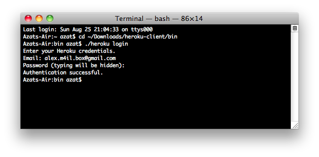

Chapter 11
----------
# Deploying Node.js Apps


As we approach the end of the book, there’s a vital step we have to explore: the deployment itself. To help you navigate between PaaS and IaaS options, and have some scripts you can use on your servers, we cover the following topics:

-   Deploying to Heroku (PaaS)
-   Deploying to Amazon Web Services (AWS)
-   Keeping Node.js apps alive with forever, Upstart, and init.d
-   Serving static resources properly with Nginx
-   Caching with Varnish

Deploying to Heroku
===================

[Heroku](http://www.heroku.com) (<http://www.heroku.com>) is a polyglot Agile application deployment Platform as a Service (PaaS). The benefits of using PaaS over other cloud solutions include the following:

1.  It’s easy to deploy, i.e., just one Git command to deploy `$ git push
    heroku master`.
2.  It’s easy to scale, e.g., log in to Heroku.com and click a
    few options.
3.  It’s easy to secure and maintain, e.g., no need to set up startup
    scripts manually.

Heroku works similarly to AWS Beanstalk, [Windows Azure](http://azure.microsoft.com/en-us/) (http://azure.microsoft.com/en-us), or many others in the sense that you can use Git to deploy applications. In other words, Heroku uses ubiquitous Git as its deployment mechanism. This means that after becoming familiar with Heroku and comfortable with Git, and after creating accounts with cloud PaaS providers, it’s fairly easy to deploy Node.js apps to them as well.

To get started with the process, we need to follow these steps:

1.  Install [Heroku Toolbelt](https://toolbelt.heroku.com) (https://toolbelt.heroku.com)—a bundle that includes Git and others tools.
2.  Log in to Heroku, which should upload a public SSH key file (e.g., `id_rsa.pub`) to the cloud (i.e., heroku.com).

To set up Heroku, follow these steps:

1.  Sign up at <http://heroku.com>. Currently, they have a free account. To use it, select all options as minimum (0) and the database as shared.
2.  Download Heroku Toolbelt at <https://toolbelt.heroku.com>. Toolbelt is a package of tools, i.e., libraries, that consists of Heroku, Git, and [Foreman](https://github.com/ddollar/foreman) (https://github.com/ddollar/foreman). For users of older Macs, get this [client](http://assets.heroku.com/heroku-client/heroku-client.tgz) (http://assets.heroku.com/heroku-client/heroku-client.tgz) directly. If you use another OS, browse [Heroku Client GitHub](https://github.com/heroku/heroku) (https://github.com/heroku/heroku).
3.  After the installation is done, you should have access to the `heroku` command. To check it and log in to Heroku, type

		$ heroku login

	The system asks you for Heroku credentials (username and password), and if you’ve already created the SSH key, it uploads it automatically to the Heroku web site, as shown in Figure 11-1.

	

	***Figure 11-1.** The response to a successful `$ heroku login` command*

4.  If everything went well, to create a Heroku application inside your specific project folder, you should be able to run

		$ heroku create

Official instructions are available at [Heroku: Quickstart](https://devcenter.heroku.com/articles/quickstart) (https://devcenter.heroku.com/articles/quickstart) and [Heroku: Node.js](https://devcenter.heroku.com/articles/getting-started-with-nodejs)
(https://devcenter.heroku.com/articles/getting-started-with-nodejs).

Then, for each app we need to deploy, perform the following setup steps:

1.  Create the local Git repository.

2.  Initialize the Heroku app with `$ heroku create` (adds a Git remote
    destination to Heroku cloud).

Last, initial deployment as well as each change is deployed by (1) staging the commit with `$ git add`, (2) committing the changes to the local repository with `$ git commit`, and (3) pushing the changes to the Heroku remote `$ git push heroku master`.

On deployment, Heroku determines which stack to use (Node.js, in our case). For this reason, we need to provide the mandatory files `package.json`, which tells Heroku what dependencies to install; `Procfile`, which tells Heroku what process to start; and Node.js app files (e.g., `server.js`). The content of `Procfile` can be as minimalistic as `web: node server.js`.

Here is a step-by-step breakdown using Git to deploy to Heroku:

1.  Create a local Git repository and `.git` folder if you haven’t done so already:

		$ git init

2.  Add files:

		$ git add .

3.  Commit files and changes:

		$ git commit -m "my first commit"

4.  Create the Heroku Cedar stack application (Cedar stack is a special technology that Heroku uses to create and run its apps) and add the Git remote destination with this command:

		$ heroku create

	If everything went well, the system should tell you that the remote has been added and the app has been created, and it should give you the app name.

5.  To look up the remote type and execute (*optional*), do the following:

		$ git remote show

6.  Deploy the code to Heroku with

		$ git push heroku master

	Terminal logs should tell you whether the deployment went smoothly (i.e., succeeded). If you have a different branch you’d like to use, you can use `$ git push heroku branch_name`, just like you would do with any other Git destination (e.g., GitHub).

7.  To open the app in your default browser, type

		$ heroku open

	or just go to the URL of your app and type something like: http://yourappname-NNNN.herokuapp.com.

8.  To look at the Heroku logs for this app, type

		$ heroku logs

To update the app with the new code, type the following *only*:

    $ git add –A
    $ git commit -m "commit for deploy to heroku"
    $ git push heroku master

**Note** You’ll be assigned a new application URL each time you create a new Heroku app with the command `$ heroku create`.

To propagate environment variables to the Heroku cloud, use the `heroku config` set of commands:

-   `$ heroku config`: list of environment variables

-   `$ heroku config:get NAME`: value of `NAME` environment variable

-   `$ heroku config:set NAME=VALUE`: setting the value of `NAME` to `VALUE`

-   `$ heroku config:unset NAME`: removal of the environment variable

**Note** Configuration variable data are limited to 16KB for each app.

To use the same environment variables locally, you can store them in the `.env` file in the root of your project. The format is `NAME=VALUE`. For example,

    DB_PASSWORD=F2C9C45
    API_KEY=7C311DA3126F

**Warning** There shouldn’t be any spaces between the name, equal sign, and the value.

After the data are in `.env`, just use Foreman (part of Heroku Toolbelt):

    $ foreman start

**Tip** Don’t forget to add your `.env` to `.gitignore` to avoid sharing it in the version control system.

As an alternative to Foreman and the `.env` file, it’s possible just to set environment variables before starting an app:

    $ DB_PASSWORD=F2C9C45 API_KEY=7C311DA3126F node server

or in your profile file (e.g., `~/.bashrc)`:

    export DB_PASSWORD=F2C9C45
    export API_KEY=7C311DA3126F

Needless to say, if you have more than one app and/or API key, then you can use names such as `APPNAME_API_KEY`.

To sync your local `.env` seamlessly with cloud variables, use [the heroku-config plugin](https://github.com/ddollar/heroku-config) (https://github.com/ddollar/heroku-config). To install it, run:

    $ heroku plugins:install git://github.com/ddollar/heroku-config.git

To get variables from the cloud to the local file, type

    $ heroku config:pull

To overwrite cloud data with local variables, type

    $ heroku config:push

For official information on setting up environment variables in Heroku, see [Configuration and Config Vars (https://devcenter.heroku.com/articles/config-vars) (https://devcenter.heroku.com/articles/config-vars). The article might require Heroku login.

There are a multitude of [add-ons for Heroku](https://addons.heroku.com/) (https://addons.heroku.com). Each add-on is like a mini service associated with a particular Heroku app. For example, [MongoHQ](https://addons.heroku.com/mongohq) (https://addons.heroku.com/mongohq) provides MongoDB database, while the [Postgres add-on](https://addons.heroku.com/heroku-postgresql) (https://addons.heroku.com/heroku-postgresql) does the same for the PostgreSQL database, and [SendGrid](https://addons.heroku.com/sendgrid) (https://addons.heroku.com/sendgrid) allows sending transactional emails. In Figure 11-2, you can see the beginning of the long list of Heroku add-ons.


***Figure 11-2.** There are a multitude of add-ons for Heroku*

Most of the add-ons pass information to the Node.js app (and others such as Rails) via environment variables. For example, the MongoHQ URI is provided in

    process.env.MONGOHQ_URL

To make our Node.js apps work locally and remotely, all we need to do is to specify the local URI to which to fall back (when the environment variable is not set):

    var databaseUrl = process.env.MONGOHQ_URL || "mongodb://@127.0.0.1:27017/practicalnode";

The same thing goes for the server port number:

    var port = process.env.PORT || 5000;
    app.listen(port);

**Note** It’s possible to copy a database connection string (and other data) from the Heroku web interface. However, it’s not recommended that you do so.

Some useful Git and Heroku commands are as follows:

-   `git remote -v`: list defined remote destinations

-   `git remote add NAME URL`: add a new remote destination with `NAME`
    and `URL` (usually SSH or HTTPS protocols)

-   `heroku start`: start the app in the cloud

-   `heroku info`: pull the app’s info

Deploying to Amazon Web Services
================================

Cloud is eating the world of computing. There are private and public clouds. AWS, probably the most popular choice among the public cloud offerings, falls under the IaaS category. The advantages of using an IaaS such as AWS over PaaS-like Heroku are as follows:

1.  It’s more configurable (any services, packages, or
    operation systems).

2.  It’s more controllable. There are no restrictions or limitations.

3.  It’s cheaper to maintain. PaaS can quickly cost a fortune for
    high-performance resources.

In this tutorial, we use 64-bit [Amazon Linux AMI](http://aws.amazon.com/amazon-linux-ami) (http://aws.amazon.com/amazon-linux-ami) with CentOS. It might be easier to use the Extra Packages for Enterprise Linux (EPEL) package manager to install Node.js and npm. If you don’t have EPEL, skip to the manual C++ build instructions.

Assuming you have your Elastic Compute Cloud (EC2) instance up and running, make an SSH connection into it and see if you have `yum` with
[EPEL](https://fedoraproject.org/wiki/EPEL) (https://fedoraproject.org/wiki/EPEL). To do so, just see if this command says `epel`:

    yum repolist

If there’s no mentions of `epel`, run:

    rpm -Uvh http://download-i2.fedoraproject.org/pub/epel/6/i386/epel-release-6-8.noarch.rpm

Then, to install both Node.js and npm, simply run this command:

    sudo yum install nodejs npm --enablerepo=epel

This might take a while. Answer with y as the process goes. In the end, you should see something like this (your results may vary):

    Installed:
      nodejs.i686 0:0.10.26-1.el6                   npm.noarch 0:1.3.6-4.el6
    Dependency Installed:
    …
    Dependency Updated:
    …
    Complete!

You probably know this, but just in case, to check installations, type the following:

    $ node –V
    $ npm –v

For more information on using `yum`, see [Managing Software with yum](https://www.centos.org/docs/5/html/yum) (https://www.centos.org/docs/5/html/yum) and [Tips on securing your EC2 instance](http://aws.amazon.com/articles/1233) (http://aws.amazon.com/articles/1233).

So, if the previous EPEL option didn’t work for you, follow these build steps. On your EC2 instance, install all system updates with `yum`:

    sudo yum update

Then, install the C++ compiler (again with `yum`):

    sudo yum install gcc-c++ make

Do the same with `openssl`:

    sudo yum install openssl-devel

Then install Git, which is needed for delivering source files to the remote machine. When Git is unavailable, `rsync` (http://ss64.com/bash/rsync.html) can be used:

    sudo yum install git

Last, clone the Node repository straight from GitHub:

    git clone git://github.com/joyent/node.git

and build Node.js:

    cd node
    git checkout v0.10.12
    ./configure
    make
    sudo make install

**Note** For a different version of Node.js, you can list them all with `$ git tag -l` and check out the one you need.

To install npm, run

    git clone https://github.com/isaacs/npm.git
    cd npm
    sudo make install

Relax and enjoy the build. The next step is to configure AWS ports / firewall settings. Here's a short example of `server.js`, which outputs "Hello readers" and looks like this:

```js
const http = require('http')
http.createServer((req, res) => {
  res.writeHead(200, {'Content-Type': 'text/plain'})
  console.log ('responding')
  res.end(`Hello readers!
    If you see this, then your Node.js server 
    is running on AWS EC2!`)
  }).listen(80, () => {
    console.log ('server is up')
})
```

On the EC2 instance, either configure the firewall to redirect connections (e.g., port to Node.js 3000, but this is too advanced for our example) or disable the firewall (okay for our quick demonstration and development purposes):

```
$ service iptables save
$ service iptables stop
$ chkconfig iptables off
```

In the AWS console, find your EC2 instance and apply a proper rule to allow for inbound traffic, as show in Figure 11-3. For example,

    Type: HTTP

The other fields fill automatically:

    Protocol: TCP
    Port Range: 80
    Source: 0.0.0.0/0


***Figure 11-3.** Allowing inbound HTTP traffic on port 80*

Or we can just allow all traffic (again, for development purposes only), as shown in Figure 11-4.


***Figure 11-4**. Allowing all traffic for development mode only*

Now, while the Node.js app is running, executing `$ netstat -apn | grep 80`, the remote machine should show the process. For example,

    tcp        0      0 0.0.0.0:80                  0.0.0.0:*
    LISTEN      1064/node

And from your local machine, i.e., your development computer, you can either use the public IP or the public DNS (the Domain Name System) domain, which is found and copied from the AWS console under that instance's description. For example,

    $ curl XXX.XXX.XXX.XXX –v

Or, just open the browser using the public DNS.

For the proper `iptables` setup, please consult experienced development operations engineers and manuals, because this is an important security aspect and it is out of the scope of this book. However, here are some commands to redirect traffic to, say, port 3001:

    sudo iptables -A PREROUTING -t nat -i eth0 -p tcp --dport 80 -j REDIRECT --to-port 8080
    sudo iptables -t nat -A INPUT -p tcp --dport 80 -j REDIRECT --to-ports 3001
    sudo iptables -t nat -A OUTPUT -p tcp --dport 80 -j REDIRECT --to-ports 3001

You can also use commands such as the following:

    $ service iptables save
    $ service iptables start
    $ service iptables restart
    $ chkconfig iptables on

It’s worth mentioning that AWS supports many other operating systems via its [AWS Marketplace](https://aws.amazon.com/marketplace) (https://aws.amazon.com/marketplace). Although AWS EC2 is a very popular and affordable choice, some companies opt for special Node.js tools available in the [SmartOS](http://smartos.org/) (http://smartos.org), e.g., [DTrace](http://dtrace.org/blogs/) (http://dtrace.org/blogs), built on top of Solaris by [Joyent](http://www.joyent.com/) (http://www.joyent.com), the company that maintains Node.js.

Keeping Node.js Apps Alive with forever, Upstart, and init.d
============================================================

This section relates only to IaaS deployment—another advantage to PaaS deployments. The reason why we need this step is to bring the application back to life in case it crashes. Even if we have a master–child system, something needs to keep an eye on the master itself. You also need a way to stop and start processes for maintenance, upgrades, and so forth.

Luckily, there’s no shortage of solutions to monitor and restart our Node.js apps:

-   [*forever*](https://github.com/nodejitsu/forever) (https://github.com/nodejitsu/forever): probably the easiest method. The forever module is installed via npm and works on almost any Unix OS. Unfortunately, if the server itself fails (not our Node.js server, but the big Unix server), then nothing resumes forever.

-   [*Upstart*](http://upstart.ubuntu.com) (http://upstart.ubuntu.com): the most recommended option. It solves the problem of starting daemons on startups, but it requires writing an Upstart script and having the latest Unix OS version support for it. We show you an Upstart script example for CentOS.

-   [*init.d*](http://www.unix.com/man-page/opensolaris/4/init.d/) (http://www.unix.com/man-page/opensolaris/4/init.d): an outdated analog of Upstart. init.d contains the last startup script options for systems that don’t have Upstart capabilities.

forever
-------

`forever` is a module that allows us to start Node.js apps/servers as daemons and keeps them running *forever*. Yes, that’s right. If the node process dies for some reason, it brings it right back up!

`forever` is a very neat utility because it’s an npm module (very easy to install almost anywhere) and it’s very easy to use without any extra language. A simple use case is as follows:

    $ sudo npm install forever –g
    $ forever server.js

If you're starting from another location, prefix the file name with the abosulte path, e.g., `$ forever /var/`. A more complex forever example looks like this:

    $ forever start -l forever.log -o output.log -e error.log server.js

To stop the process, type

    $ forever stop server.js

To look up all the programs run by forever, type

    $ forever list

To list all available forever commands, type

    $ forever --help

**Warning** The app won’t start on server reboots without extra setup/utilities.

Upstart Scripts
---------------

"Upstart is an event-based replacement for the `/sbin/init` daemon that handles starting of tasks and services during boot…"—[the Upstart web
site](http://upstart.ubuntu.com/) (http://upstart.ubuntu.com). The latest CentOS (6.2+), as well as Ubuntu and Debian OSs, come with Upstart. If Upstart is missing, try typing `sudo yum install upstart` to install it on CentOS, and try `sudo apt-get install upstart` for Ubuntu.

A very basic Upstart script—to illustrate its structure—starts with metadata:

    author      "Azat"
    description "practicalnode"
    setuid      "nodeuser"

We then start the application on startup after the file system and network:

    start on (local-filesystems and net-device-up IFACE=eth0)

We stop the app on server shutdown:

    stop on shutdown

We instruct Upstart to restart the program when it crashes:

    respawn

We log events to `/var/log/upstart/webapp.log`:

    console log

We include environment variables:

    env NODE_ENV=production

Command and file to execute:

    exec /usr/bin/node /var/practicalnode/webapp.js

A more useful example follows in which from a file in `/etc/init` (e.g., `webapp.conf`):

    cd /etc/init
    sudo vi webapp.conf

The simplistic content of an Upstart script is as follows:

    #!upstart
    description "webapp.js"
    author      "Azat"
    env PROGRAM_NAME="node"
    env FULL_PATH="/home/httpd/buto-middleman/public"
    env FILE_NAME="forever.js"
    env NODE_PATH="/usr/local/bin/node"
    env USERNAME="springloops"

    start on runlevel [2345]
    stop on shutdown
    respawn

This part of the script is responsible for launching the application webapp.js (similar to our local `$ node webapp.js` command, only with absolute paths). The output is recorded into the `webapp.log` file:

    script
        export HOME="/root"

        echo $$ > /var/run/webapp.pid
        exec /usr/local/bin/node /root/webapp.js >> /var/log/webapp.log 2>&1

    end script

The following piece is not as important, but it provides us with the date in the log file:

    pre-start script
        # Date format same as (new Date()).toISOString() for consistency
        echo "[`date -u +%Y-%m-%dT%T.%3NZ`] (sys) Starting" >> /var/log/webapp.log
    end script

The following tells what to do when we’re stopping the process:

    pre-stop script
        rm /var/run/webapp.pid
        echo "[`date -u +%Y-%m-%dT%T.%3NZ`] (sys) Stopping" >> /var/log/webapp.log 
    end script

To start/stop the app, use

    /sbin/start myapp
    /sbin/stop myapp

To determine the app’s status, type

    /sbin/status myapp

**Tip** With Upstart, the Node.js app restarts on an app crash and on server reboots.

The previous example was inspired by [Deploy Nodejs app in Centos 6.2](http://sqllyw.wordpress.com/2012/02/19/deploy-nodejs-app-in-centos-6-2/) (<http://bit.ly/1qwIeTJ>). For more information on Upstart, see [How to Write CentOS Initialization Scripts with Upstart](http://www.openlogic.com/wazi/bid/281586/How-to-write-CentOS-initialization-scripts-with-Upstart) (<http://bit.ly/1pNFlxT>) and [Upstart
Cookbook](http://upstart.ubuntu.com/cookbook/upstart_cookbook.pdf) (<http://upstart.ubuntu.com/cookbook/upstart_cookbook.pdf>).

init.d
------------------------------------------------------------------------------------------

If Upstart is unavailable, you can create an `init.d` script. init.d is a technology available on most Linux OSs. Usually, development operations engineers resort to init.d when Upstart is not available and when they need something more robust than forever. Without going into too much detail, Upstart is a newer alternative to `init.d` scripts. We put `init.d` scripts into the `/etc/` folder.

For example, the following `init.d` script for CentOS starts, stops, and restarts the node process / file `home/nodejs/sample/app.js`:

    #!/bin/sh

    #
    # chkconfig: 35 99 99
    # description: Node.js /home/nodejs/sample/app.js
    #

    . /etc/rc.d/init.d/functions

    USER="nodejs"

    DAEMON="/home/nodejs/.nvm/v0.4.10/bin/node"
    ROOT_DIR="/home/nodejs/sample"

    SERVER="$ROOT_DIR/app.js"
    LOG_FILE="$ROOT_DIR/app.js.log"

    LOCK_FILE="/var/lock/subsys/node-server"

    do_start()
    {
            if [ ! -f "$LOCK_FILE" ] ; then
                    echo -n $"Starting $SERVER: "
                    runuser -l "$USER" -c "$DAEMON $SERVER >> $LOG_FILE &" && echo_success || echo_failure
                    RETVAL=$?
                    echo
                    [ $RETVAL -eq 0 ] && touch $LOCK_FILE
            else
                    echo "$SERVER is locked."
                    RETVAL=1
            fi
    }
    do_stop()
    {
            echo -n $"Stopping $SERVER: "
            pid=` ps -aefw | grep "$DAEMON $SERVER" | grep -v " grep " | awk '{print $2}'`
            kill -9 $pid > /dev/null 2>&1 && echo_success || echo_failure
            RETVAL=$?
            echo
            [ $RETVAL -eq 0 ] && rm -f $LOCK_FILE
    }

    case "$1" in
            start)
                    do_start
                    ;;
            stop)
                    do_stop
                    ;;
            restart)
                    do_stop
                    do_start
                    ;;
            *)
                    echo "Usage: $0 {start|stop|restart}"
                    RETVAL=1
    esac

    exit $RETVAL

The `init.d` script above was borrowed from this [GitHub gist](https://gist.github.com/nariyu/1211413) (<https://gist.github.com/nariyu/1211413>). For more info on `init.d`, see this detailed [tutorial](http://www.novell.com/documentation/suse91/suselinux-adminguide/html/ch13s04.html) (<http://bit.ly/1lDkRGi>).

Serving Static Resources Properly with Nginx
============================================

Although, it’s fairly easy to serve static files from Node.js applications, and we can use `sendFile` or Express.js static middleware,
it’s a big no-no for systems that require high performance. In other words, this step is optional but recommended.

The best option is to use [Nginx](http://nginx.org/) (http://nginx.org), [Amazon S3](http://aws.amazon.com/s3/) (http://aws.amazon.com/s3) or CDNs, e.g., [Akamai](http://www.akamai.com/) (http://www.akamai.com) or [CloudFlare](https://www.cloudflare.com/) (https://www.cloudflare.com), for the purpose for which they were specifically designed, i.e., serving static content, and let Node.js apps handle interactive and networking tasks only. This tactic decreases the load on Node.js processes and improves the efficiency of your system.

Nginx is a popular choice among development operations engineers. It's an HTTP and reverse-proxy server. To install Nginx on a CentOS system
(v6.4+), type:

    sudo yum install nginx 

As a side note, for Ubuntu, you can use the `apt` packaging tool: `sudo apt-get install nginx`. For more information about `apt`, refer to the
[docs](https://help.ubuntu.com/12.04/serverguide/apt-get.html) (https://help.ubuntu.com/12.04/serverguide/apt-get.html).

But, let’s continue with our CentOS example. We need to open the `/etc/nginx/conf.d/virtual.conf` file for editing, e.g., using a VIM (Vi Improved) editor:

    sudo vim /etc/nginx/conf.d/virtual.conf

Then, we must add this configuration:

    server {
        location / {
            proxy_pass http://localhost:3000;
        }
        location /static/ {
            root /var/www/webapplog/public;
        }
    }

The first `location` block acts as a proxy server and redirects all requests that are not `/static/*` to the Node.js app, which listens on port 3000. Static files are served from the `/var/www/webapplog/public` folder.

If your project uses Express.js or a framework that’s built on top of it, don’t forget to set the trust proxy to true by adding the following line to your server configuration:

    app.set('trust proxy', true);

This little configuration enables Express.js to display true client IPs provided by proxy instead of proxy IPs. The IP address is taken from the `X-Forwarded-For HTTP` header of requests (see next code snippet).

A more complex example with HTTP headers in the proxy-server directive, and file extensions for static resources, follows:

    server { 
        listen 0.0.0.0:80;
        server_name webapplog.com;
        access_log /var/log/nginx/webapp.log;

       location ~* ^.+\.(jpg|jpeg|gif|png|ico|css|zip|tgz|gz|rar|bz2|pdf|txt|tar|wav|bmp|rtf|js|flv|swf|html|htm)$ {
            root   /var/www/webapplog/public;
        }

        location / {
            proxy_set_header X-Real-IP $remote_addr;
            proxy_set_header HOST $http_host;
            proxy_set_header X-NginX-Proxy true;

            proxy_pass http://127.0.0.1:3000;
            proxy_redirect off;
        }

**Note** Replace `3000` with the Node.js app’s port number, `webapplog.com` with our domain name, and `webapp.log` with your log’s file name.

Alternatively, we can use [upstream try_files](http://wiki.nginx.org/HttpCoreModule#try_files) (http://wiki.nginx.org/HttpCoreModule\#try_files). Then, start Nginx as a service:

    sudo service nginx start

After Nginx is up and running, launch your node app with forever or Upstart on the port number you specified in the proxy-server configurations.

To stop and restart Nginx, use

    sudo service nginx stop
    sudo service nginx start

<span id="summary" class="anchor"></span>So far, we’ve use Nginx to serve static content while redirecting nonstatic requests to Node.js apps. We can take it a step further and let Nginx serve error pages and use multiple Node.js processes. For example, if we want to serve the 404 page from the `404.html` file, which is located in the `/var/www/webapplog/public` folder, we can add the following line inside the server directive:

    error_page 404 /404.html;
    location /404.html {
        internal;
        root /var/www/webapplog/public;
    }

If there is a need to run multiple Node.js processes behind Nginx, we can set up location rules inside the server in exactly the same way we used `location` for dividing static and nonstatic content. However, in this case, both destinations are handled by Node.js apps. For example, we have a Node.js web app that is running on 3000, serving some HTML pages, and its URL path is `/`, whereas the Node.js API app is running on 3001, serving JSON responses, and its URL path is `/api`:

    server {
      listen 8080;
      server_name webapplog.com;
      location / {
        proxy_pass http://localhost:3000;
        proxy_set_header Host $host;
      }
      location /api {
        proxy_pass http://localhost:3001;
        rewrite ^/api(.*) /$1 break;
        proxy_set_header Host $host;
      }
    }

In this way, we have the following trafficking:

-   The `/` requests go to http://localhost:3000.

-   The `/api` requests go to http://localhost:3001.

Caching with Varnish
====================

The last piece of the production deployment puzzle is setting up caching using [Varnish Cache](https://www.varnish-cache.org) (https://www.varnish-cache.org). This step is optional for Node.js deploys, but, like an Nginx setup, it’s also recommended, especially for systems that expect to handle large loads with the minimum resources consumed.

The idea is that Varnish allows us to cache requests and serve them later from the cache without hitting Nginx and/or Node.js servers. This avoids the overhead of processing the same requests over and over again. In other words, the more identical requests the server has coming, the better Varnish’s optimization.

Let’s use `yum` again, this time to install Varnish dependencies on CentOS:

    $ yum install -y gcc make automake autoconf libtool ncurses-devel libxslt groff pcre-devel pckgconfig libedit libedit-devel

Download the latest stable release (as of May 2014):

    $ wget http://repo.varnish-cache.org/source/varnish-3.0.5.tar.gz

and build Varnish Cache with the following:

    $ tar -xvpzf varnish-3.0.5.tar.gz
    $ cd varnish-3.0.5
    $ ./autogen.sh
    $ ./configure
    $ make
    $ make check
    $ make install

For this example, let’s make only minimal configuration adjustments. In the file `/etc/sysconfig/varnish`, type

    VARNISH_LISTEN_PORT=80
    VARNISH_ADMIN_LISTEN_ADDRESS=127.0.0.1

Then, in `/etc/varnish/default.vcl`, type

    backend default {
      .host = "127.0.0.1";
      .port = "8080";
    }

Restart the services with

    $ /etc/init.d/varnish restart
    $ /etc/init.d/nginx restart

Everything should be working by now. To test it, CURL from your local (or another remote) machine:

    $ curl -I www.varnish-cache.org

If you see “Server: Varnish” this means that requests go through Varnish Cache first, just as we intended.

Summary
=======

In this chapter, we covered deployment using the Git and Heroku command-line interfaces to deploy to PaaS. Then, we worked through examples of installing and building a Node.js environment on AWS EC2, running Node.js apps on AWS with CentOS. After that, we explored examples of forever, Upstart, and init.d to keep our apps running. Last, we installed and configured Nginx to serve static content, including error pages, and split traffic between multiple Node.js processes. Then, we added Varnish Cache to lighten the Node.js apps’ loads even more.
