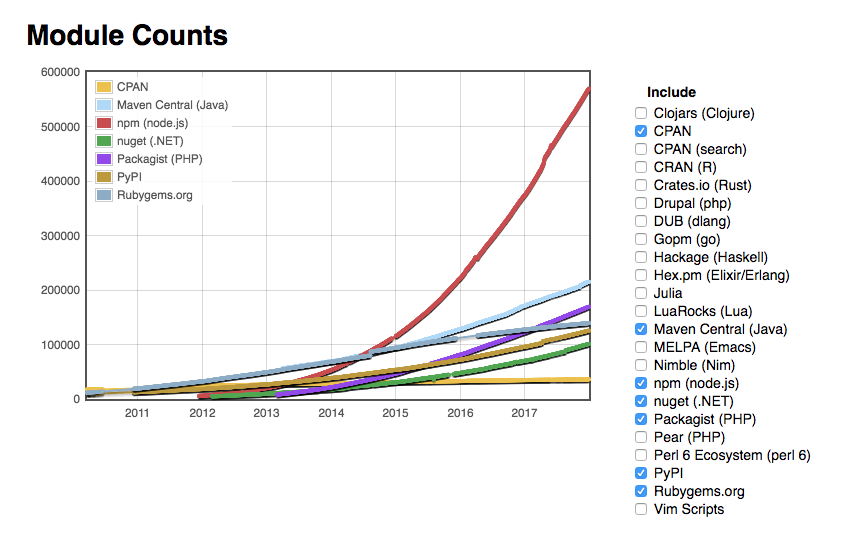

Chapter 12
----------
# Modularizing Your Code and Publishing Node.js Modules to npm

Two of the key factors that attributed to the rapid growth of the Node.js module ecosystem are its open-source nature and robust packaging systems (with registry). As of mid 2014, JavaScript and Node.js had surpassed any other language/platform in number of packages contributed per year ([source](http://caines.ca/blog/2013/04/13/the-node-dot-js-community-is-quietly-changing-the-face-of-open-source/)): 

-   *Node.js*: *6742 packages per year* (26,966 packages in 4 years)
-   *Python*: 1351 packages per year (29,720 packages in 22 years)
-   *Ruby*: 3022 packages per year (54,385 packages in 18 years)

Recent numbers are even higher with npm having over 620,000 packages. That's more than half a million! As you can see from the chart taken from <http://modulecounts.com> (Figure 12-1), Node's npm surpassed other platforms' package repositories in absolute numbers. Maven Central (Java) and Packagist (PHP) try to catch up but fail miserably. npm and Node are the top dogs.


***Figure 12-1.** Node's npm is dominating by the number of modules since mid 2014.*


Other factors that contribute to the Node.js's popularity include:

-   Ability to share code between front-end/browser and server-side (with projects such as [browserify](http://browserify.org/) and [ender.js](https://github.com/ender-js/Ender))
-   Philosophy of small (in terms of lines of code and functionality) functional modules vs. large, standard/core packages (i.e., granularity)
-   Evolving ECMAScript standard and expressive nature, and ease of adoption of the JavaScript language

With this in mind, many Node.js enthusiasts find it rewarding to contribute to the ever-growing open-source community. When doing so, there are a few conventions to follow as well as concepts to understand<span id="in-this-chapter" class="anchor"></span>:

-   Recommended folder structure
-   Required patterns
-   `package.json`
-   Publishing to npm
-   Locking versions

Recommended Folder Structure
============================

Here is an example of a good, structured npm module in which you have documentation, project manifest, starting file, and a folder for dependencies:

```
webapp
  /lib
  webapp.js
  index.js
  package.json
  README.md
```

The `index.js` file does the initialization, whereas `lib/webapp.js` has all the principal logic.

If you’re building a command-line tool, add the `bin` folder:

```
webapp
  /bin
  webapp-cli.js
  /lib
  webapp.js
  index.js
  package.json
  README.md
```

Also, for the CLI module, add the following to `package.json`:

```js
...
"bin": {
    "webapp": "./bin/webapp-cli.js"
},
...
```

The `webapp-cli.js` file starts with the line `#!/usr/bin/env node`, but then has normal Node.js code.

It’s a good idea to add unit tests to your external module, because it increases confidence and the likelihood of other people using it. Some programmers go as far as not using a module that doesn’t have any tests! The added benefit is that tests serve as a poor man’s examples and
documentation.

TravisCI, which we covered in previous chapters, allows free testing for open-source projects. Its badges, which turn from red to green, depending on the status of tests (failing or passing), became the de facto standard of quality and are often seen on the README pages of the most popular Node.js projects.

Modularizing Patterns
=================

Modularizing is the best practice because you can keep your application flexible and update different parts independently of each other. It's totally fine to have bunch of modules with only a single function in each one of them. In fact, a lot of module on npm are just that—a single function.

There are a few common patterns for writing external modules (meant for use by other users, not just within your app):

-   `module.exports` as a function pattern (recommended)
-   `module.exports` as a class pattern (not recommended)
-   `module.exports` as an object pattern
-   `exports.NAME` pattern, which could be an object or a function

Here is an example of the `module.exports` as a function pattern:

```js
let _privateAttribute = 'A'
let _privateMethod = () => {...}
module.exports = function (options) { 
  // Arrow function can also be used depending on 
  // what needs to be the value of "this"
  // Initialize module/object
  object.method = () => {...}
  return object
}
```

And here is an example of an equivalent with a function declaration, but this time we used named function that we exported via the global `module.exports`:

```js
module.exports = webapp
function webapp (options) {
  // Initialize module/object
  object.method = () => {...}
  return object
}
```

**Tip** For info about named function expressions vs. function declarations, refer to Chapter 1.

The file in which we include the module looks like this:

```js
const webapp = require('./lib/webapp.js')
const wa = webapp({...}) // Initialization parameters
```

More succinctly, it looks like this:

```js
const webapp = require('./lib/webapp.js')({...})
```

The real-life example of this pattern is the Express.js module ([source code](https://github.com/visionmedia/express/blob/master/lib/express.js#L26)).

The `module.exports` as a class pattern uses the so-called [*pseudoclassical instantiating/inheritance pattern*](http://javascript.info/tutorial/pseudo-classical-pattern), which can be recognized by the use of the `this` and `prototype` keywords:

```js
module.exports = function(options) {
  this._attribute = 'A'
  // ...
}
module.exports.prototype._method = function() {
  // ...
}
```

Notice the capitalized name and the `new` operator in the including file:

```js
const Webapp = require('./lib/webapp.js')
const wa = new Webapp()
// ...
```

The example of this `module.exports` as a class pattern is the OAuth module ([source code](https://github.com/ciaranj/node-oauth/blob/master/lib/oauth.js#L9)).

The `module.exports` as an object pattern is similar to the first pattern (functional), only without the constructor. It may be useful for defining constants, locales, and other settings:

```js
module.exports = {
  sockets: 10,
  limit: 200,
  whitelist: [
  'azat.co',
  'webapplog.com',
  'apress.com'
  ]
}
```

The including file treats the object as a normal JavaScript object. For example, we can set `maxSockets` with these calls:

```js
const webapp = require('./lib/webapp.js')
const http = require('http')
http.globalAgent.maxSockets = webapp.sockets
```

**Note** The `require` method can read JSON files directly. The main difference is that the JSON standard has the mandatory double quotes (`"`) for wrapping property names.

The `exports.NAME` pattern is just a shortcut for `module.exports.NAME` when there’s no need for one constructor method. For example, we can have multiple routes defined this way:

```js
exports.home = function(req, res, next) {
  res.render('index')
}
exports.profile = function(req, res, next) {
  res.render('profile', req.userInfo)
}
// ...
```

And we can use it in the including file the following way:

```js
const routes = require('./lib/routes.js')
// ...
app.get('/', routes.home) 
app.get('/profile', routes.profile)
// ...
```

Composing `package.json`
============

Another mandatory part of an npm module is its `package.json` file. The easiest way to create a new `package.json` file, if you don’t have one already (most likely you do), is to use `$ npm init`. The following is an example produced by this command:

```js
{
  "name": "webapp",
  "version": "0.0.1",
  "description": "An example Node.js app",
  "main": "index.js",
  "devDependencies": {},
  "scripts": {
    "test": "test"
  },
  "repository": "",
  "keywords": [
    "math",
    "mathematics",
    "simple"
  ],
  "author": "Azat <hi@azat.co>",
  "license": "BSD"
}
```

The most important fields are `name` and `version`. The others are optional and self-explanatory, by name. The full list of supported keys is located at [the npm web site](https://www.npmjs.org/doc/json.html): <https://www.npmjs.org/doc/json.html>.

**Warning** `package.json` must have double quotes around values and property names, unlike native JavaScript object literals.

npm scripts is an important feature that benefits all projects and more so large one. See that `scripts` property in the `package.json` file? Inside of it developers can define any commands, which act as aliases. The left part is the alias, and the right part (after the `:` colon) is the actual command:

```json
"scripts": {
  "test": "mocha test",
  "build": "node_modules/.bin/webpack --config webpack-dev.config.js",
  "deploy": "aws deploy push --application-name WordPress_App  --s3-location s3://CodeDeployDemoBucket/WordPressApp.zip --source /tmp/MyLocalDeploymentFolder/",
  "start": "node app.js",
  "dev": "node_modules/.bin/nodemon app.js"
}
```

To run the command, you use `npm run NAME`, e.g., `npm run build` or `npm run deploy`. The two names are special. The don't need `run`. They are `test` and `start`. That is to execute `test` or `start`, simply use `npm test` and `npm start`. 

It's possible to call other npm scripts from the right side (the values):

```json
"scripts": {
  "test": "mocha test",
  "build": "node_modules/.bin/webpack --config webpack-dev.config.js",
  "prepare": "npm run build && npm test"
}
```

Lastly, there are `post` and `pre` hooks for each npm script. They are defined as pre and post prefixes to the names. For example, if I always want to build after the installation, I can set up `postinstall`:

```json
"scripts": {
  "postinstall": "npm run build",
  "build": "node_modules/.bin/webpack --config webpack-dev.config.js"
}
```

npm scripts are very powerful. Some Node developers are even abandoning their build tools, such as Grunt or Gulp or Webpack, and implementing their build pipelines with npm scripts and some low-level Node code. I sort of agree with them. Having to learn and depend on myriads of Grunt, Gulp, or Webpack plugins is no fun. For more use cases of npm scripts, start at this page: <https://docs.npmjs.com/misc/scripts>.

It’s worth noting that `package.json` and npm do not limit their use. In other words, you are encouraged to add custom fields and devise new conventions for their cases.

Publishing to npm
=================

To publish to npm, you must have an account there. So first, you need to proceed to the website npmjs.org and register there. Once you do that, you will have an account, and you will have a username and password. The next step is to sign in on the command line. Do this by executing the following:

```
$ npm adduser
```

You just need to sign in with the npm CLI once. After you do it, you are read to publish as many times as you wish. To publish a new module or an update to an already published module, simply execute the following command from the module/package project folder:

```
$ npm publish
```

Some useful npm commands are as follows:

-   `$ npm tag NAME@VERSION TAG`: Tag a version
-   `$ npm version SEMVERSION`: Increment a version to the value of `SEMVERSION` ([semver](http://semver.org/)) and update `package.json`
-   `$ npm version patch`: Increment the last number in a version (e.g., 0.0.1 to 0.0.2) and update `package.json`
-   `$ npm version minor`: Increment a middle version number (e.g., 0.0.1 to 0.1.0 or 0.0.1 to 1.0.0) and update `package.json`
-   `$ npm unpublish PACKAGE_NAME`: Unpublish package from npm (take optional version with `@`)
-   `$ npm owner ls PACKAGE_NAME`: List owners of this package
-   `$ npm owner add USER PACKAGE_NAME`: Add an owner
-   `$ npm owner rm USER PACKAGE_NAME`: Remove an owner

Not-Locking Versions
================

The rule of thumb is that when we publish external modules, we don’t lock dependencies’ versions. However, when we deploy apps, we lock versions in `package.json`. You can read more on why and how lock versions in projects that are applications (i.e., not npm modules) in Chapter 10. 

Then why not lock versions in the modules? The answer is that open source is often a part-time gig and an afterthought for most people. It's not like you'll make millions and can spend 40 hours per week on your FOSS npm module.

Let's say there's a security vulnerability or something is outdated in a dependency of your npm module. Most likely, you'll be patching your app that is your main full-time daily job, and not patching this poor little npm module. That's why it's a good idea to NOT lock the version but let it use a caret symbol `^`, which means the patches will be updated in dependencies. 

Yes. If someone depends on your npm module, they may get a bug when it pulls a newer dependency, but the tradeoff is worth it. Your module will have the latest dependencies automatically, without requiring your attention (the next time someone installs your module). 

That's the main reason why almost all popular npm modules such as Express, Webpack, and React do have `^` in package.json (<https://github.com/expressjs/express/blob/master/package.json>, <https://github.com/webpack/webpack/blob/master/package.json> and <https://github.com/facebook/react/blob/master/package.json>).

Summary
=======

Open source factors have contributed to the success and widespread use of the Node.js platform. It’s relatively easy to publish a module and make a name for yourself (unlike other mature platforms with solid cores). We looked at the recommended patterns and structures, and explored a few commands to get started with publishing modules to npm.
