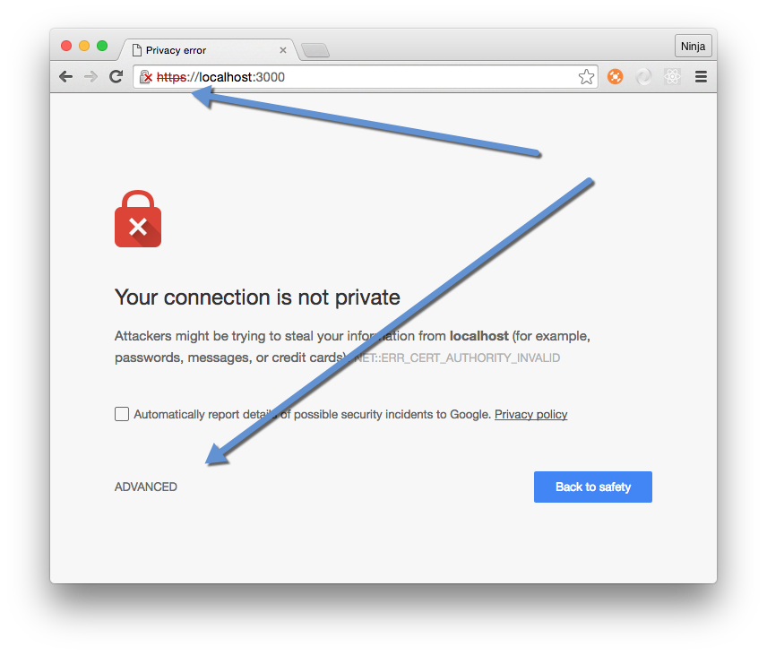
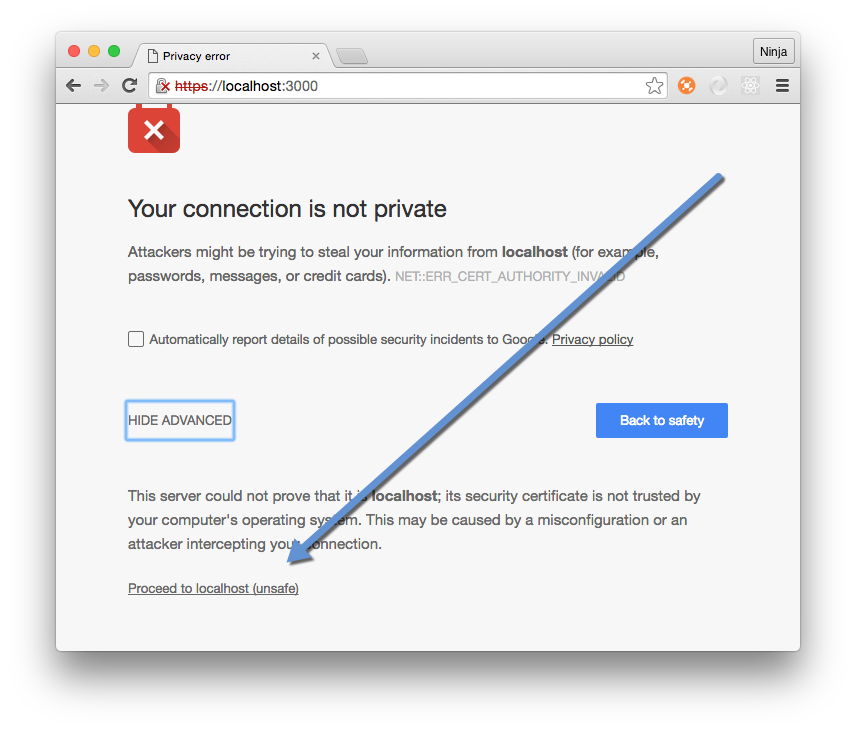
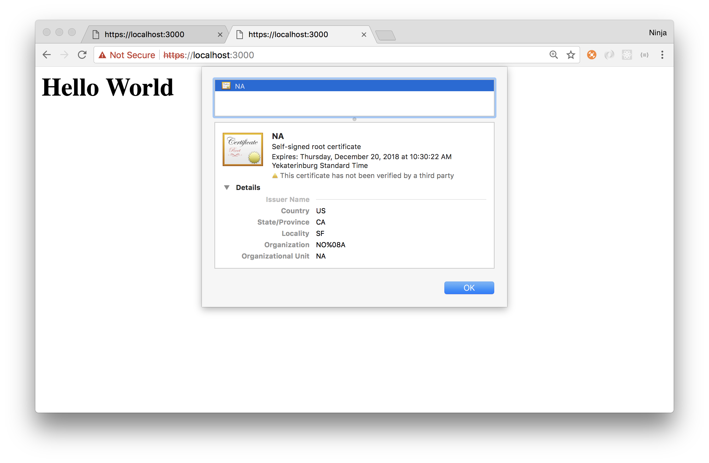
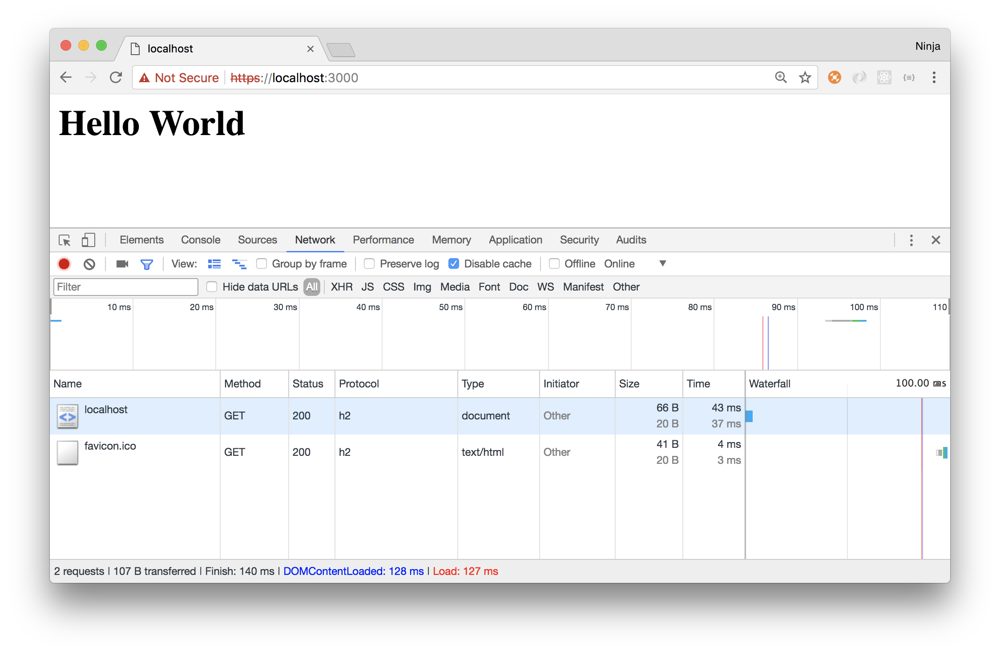
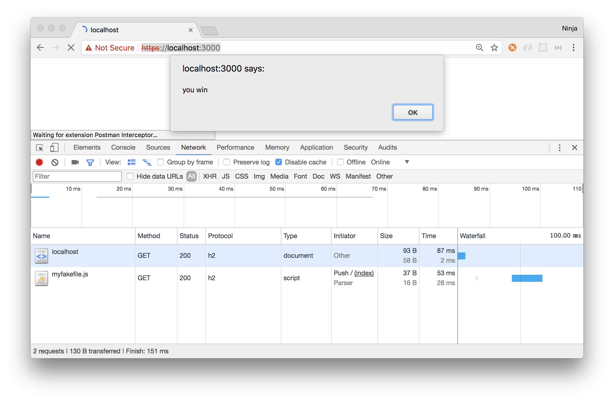
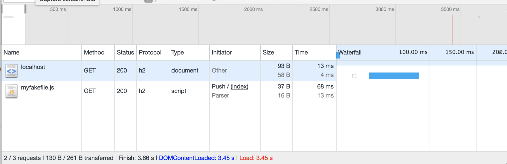

Chapter 13
----------
# Node HTTP/2 Servers

It's almost 2020, and HTTP/2 is already here. It has been here for a few years now. If you are not using HTTP/2, then you are losing out on big improvements. Major browsers already support HTTP/2. A lot of services and websites switched to HTTP/2 as early as 2016 and more continue this trend. 

HTTP/2 has some very big differences from HTTP/1 when it comes to delivering traffic. For example, HTTP/2 offers multiplexing and the server push of assets. If you are not optimizing your code for HTTP/2, then you probably have a slower app than you would have with HTTP/2. Lots of web-optimization practices of HTTP/1 are unnecessary and may even hurt with HTTP/2. 
 
In this chapter, if you know the major features of HTTP/2, then jump straight to the sections on implementing an HTTP/2 server in Node and server push. If you don't know its major features, you should read the following brief overview and then follow it up with some more reading online. 

Brief Overview of HTTP/2 
====

The modern Internet with its TCP/IP protocol started around 1975, which is an astonishing 40+ years ago. For the most part of its existence, we used HTTP and its successor HTTP/1.1 (version 1.1) to communicate between clients and servers. Those served the web well, but the way developers build websites has dramatically changed. There are myriads of external resources, images, CSS files, and JavaScript assets. The number of resources is only increasing.

HTTP/2 (or just H2) is the first major upgrade to the good old HTTP protocol in over 15 years (first HTTP is circa 1991)! It is optimized for modern websites. The performance is better without complicated hacks like domain sharding (having multiple domains) or file concatenation (having one large file instead of many small ones).

H2 is the new standard for the web, which started as Google’s SPDY protocol. It’s already being used by many popular websites and is supported by most major browsers. For example, I went to Yahoo’s Flickr, and it was using h2 protocol (HTTP2) already (back in July of 2016, as shown in Figure 13-1).


***Figure 13-1.** Yahoo!’s Flickr has been using the HTTP/2 protocol for many years now*

Semantically, HTTP/2 is no different from HTTP/1.1, meaning you have the same XML-like language in the body and also the same header fields, status codes, cookies, methods, URLs, etc. The stuff familiar to developers is still there in H2. But H2 offers a lot of the benefits, including:

* *Multiplexing*: Allows browsers to include multiple requests in a single TCP connection that enables browsers to request all the assets in parallel.
* *Server push*: Servers can push web assets (CSS, JS, images) before a browser knows it needs them, which speeds up page load times by reducing the number of requests.
* *Stream priority*: Allows browsers to specify priority of assets. For example, a browser can request HTML first to render it before any styles or JavaScript.
* *Header compression*: All HTTP/1.1 requests have to have headers which are typically duplicate the same info, while H2 forces all HTTP headers to be sent in a compressed format.
* *De facto mandatory encryption*: Although the encryption is not required, most major browsers implement H2 only over TLS (HTTPS).

While there’s some criticism of H2, it’s clearly a way forward for now (until we get something even better). What do you need to know about it as a web developer? Well, most of the optimization tricks you know have become unnecessary, and some of them will even hurt a website’s performance. In particular, the file concatenation. Stop doing that (image sprites, bundled CSS and JS), because H2 can make parallel requests and because each small change in your big file will invalidate cache. It’s better to have many small files with H2. I hope the need for build tools like Grunt, Gulp, and Webpack will drop because of that. They introduce additional complexity, steep learning curve, and dependencies to web projects.

Another thing that good developers did in the HTTP/1.1 world but that will hurt you in H2 is domain sharding (a trick to go over the browser limit on the number of active TCP connections). Okay, it might not hurt in all cases, but there’s not benefit in it in H2 because H2 supports multiplexing. It might hurt because each domain incurs additional overhead. Don’t do domain sharding in HTTP2. If you have to, then resolve domains to the same IP and make sure your SSL certificates has a wildcard which makes it valid for the subdomainsm or have a multidomain cert.

Please educate yourself on all the HTTP/2 details and how to optimize your applications and content for it. [The official website](https://http2.github.io/faq) is a good place to start.

SSL Key and Certificate
=====

Before we can submerge into the HTTP/2 module code, we must do some preparation. You see, the HTTP/2 protocol must use an SSL connection. It's when you see `https` in your browser URL address bar, the browser shows you a lock symbol, and you can inspect the secure connection certificate, which hopefully was issued by a trusted source.

SSL, HTTPS and HTTP/2 are more secure than HTTP/1 (http in an URL) because they are encrypting your traffic between the client (browser) and the server. If an attacker tries to hijack it, they'll get only some gibberish. 

For development purposes, you can create a self-signed certificate and the key instead of paying money to a trusted authority to issue a certificate for you. You will see a warning message in Chrome (Figure 13-2) when you use a self-signed certificate, but that's okay for the development purposes.

Create an empty folder and a self-signed SSL certificate in it. To create a folder named `http2` run the `mkdir`:

```
$ mkdir http2
$ cd http2
```

Once inside of the folder, use the `openssl` command to generate an RSA private key `server.pass.key`, as shown next. Never share a private key except with your sysadmin whom you know personally. If you don't have `openssl`, then download it from <https://www.openssl.org/source>.

```
$ openssl genrsa -des3 -passout pass:x -out server.pass.key 2048
```

The good message would look like this:

```
Generating RSA private key, 2048 bit long modulus
...............................................................+++
...........+++
e is 65537 (0x10001)
```

Next, trade in your `server.pass.key` for the `server.key`, which will be your RSA key:

```
$ openssl rsa -passin pass:x -in server.pass.key -out server.key
```

You should see "writing RSA key" if everything went fine. If you don't see this message, most likely you are in a wrong folder, specified a wrong path, or made a type (irony intended). Please repeat by copying the commands correctly.

We don't need the `server.pass.key` anymore, so let's keep things clean and organized. Let's remove this file:

```
$ rm server.pass.key
```

We got the key `server.key`. That's not all. What we also need is the certificate. We want to generate an certificate (`csr`) file first using the `server.key`:

```
$ openssl req -new -key server.key -out server.csr
```

You will need to answer some trivial questions about your location. Just put anything. It doesn't matter, since this is for development only. For example, put US and California as country and state:

```
Country Name (2 letter code) [AU]:US
State or Province Name (full name) [Some-State]:California
```

Come up with some answers to other questions about organization, unit, email, and password when asked. You don't have to provide an accurate info since this is a development certificate.

Finally, sign (with key `server.key`) the certificate (`server.csr`) to generate the `server.crt`, which is the file to be used in Node:

```
$ openssl x509 -req -sha256 -days 365 -in server.csr -signkey server.key -out server.crt
```

The successful message will have a subject with your answers—for example, mine had US, CA ,and SF among them:

```
Signature ok
subject=/C=US/ST=CA/L=SF/O=NO\x08A/OU=NA
Getting Private key
```

You should have at least two files:

```
server.crt
server.key
```

Keep them secret, especially the key and especially when it's a real production key. You can get rid of the `csr` file.

 Here's a somewhat simpler command that generates `crt` and `key` files. The command will bypass the `csr` file and answer questions automatically (the `subj` option):

```
openssl req -x509 -newkey rsa:2048 -nodes -sha256 -subj '/C=US/ST=CA/L=SF/O=NO\x08A/OU=NA' \
  -keyout server.key -out server.crt
```

HTTP/2 Node Server
====

Now we’ll learn how to create an HTTP/2 server with Node.js. It's actually very straightforward because the `http2` interface is for the most part is *compatible* with `http` or `https` interfaces.

See for yourself. We import and define variables. Then we instantiate `server` with a special method `createSecureServer()`. This special method takes two arguments. The first argument is for the SSL encryption. We feed the contents of the two files, i.e., the key and signed certificate. In the second argument, we define the request handler, just as we would define a request handler with the `http` module.

```js
const http2 = require('http2')
const fs = require('fs')

const server = http2.createSecureServer({
  key: fs.readFileSync('server.key'),
  cert: fs.readFileSync('server.crt')
}, (req, res) => {
  res.end('hello')
})
server.on('error', (err) => console.error(err))
server.listen(3000)
```

Alternatively, we can re-write our example to use stream. We would assign an event listener with the `on()` method to catch `stream` events. We can use `respond()` and `end()` on the `stream` object to set headers (text/html), status (200), and send back `<h1>`:

```js
const http2 = require('http2')
const fs = require('fs')

const server = http2.createSecureServer({
  key: fs.readFileSync('server.key'),
  cert: fs.readFileSync('server.crt')
})

server.on('error', (err) => console.error(err))
server.on('socketError', (err) => console.error(err))

server.on('stream', (stream, headers) => {
  // stream is a Duplex
  stream.respond({
    'content-type': 'text/html',
    ':status': 200
  })
  stream.end('<h1>Hello World</h1>')
})

server.listen(3000)
```


To launch the HTTP/2 server, run your Node code as usual with `node` or `nodemon` or `node-dev`:

```
node server.js
```

If you see a message "(node:10536) ExperimentalWarning: The http2 module is an experimental API." that's totally fine. Just ignore it because it basically says that the methods in the http2 class might change in the future. I'm using Node version 8.9.3, which is the latest LTS version as of this writing. If you use a higher LTS version, this warning should not be there anymore.

On the contrary, if you are seeing "Error: Cannot find module 'http2'", that is a BAD sign. Warnings are okay to ignore (in most cases), albeit with some limitations, but errors won't allow the execution at all. 

You might be wondering why the http2 cannot be found? You probably have an older version of Node that doesn't have the core http2 module. Your best bet is to use nvm to install a newer version, at least as high as my version 8.9.3. If nvm is too much of a hassle for you, then simply go to the Node website and use their installer. The downside of using the installer is that you won't be able to switch back and forth. You will always have to install. With nvm, you can switch back and forth between various versions once you install them. There's no need to repeat myself anymore on installations here because I covered a lot of different Node installations in Chapter 1.

Assuming you didn't get an error message, open your browser (preferably Chrome) at <https://localhost:3000>. Don't forget to use https and the correct port number 3000. Important! Also don't forget to allow your browser to use the self-signed certificate. When you’re visiting your server, make sure to select “ADVANCED” (Figure 13-2) and click “Proceed to localhost (unsafe)” (Figure 13-3). You can also add localhost as an exception. The reason being is that browsers don’t trust self-signed certificates by default.


***Figure 13-2.** Click on ADVANCED*


***Figure 13-3.** Self-signed certificate will require to click on "Proceed to localhost (unsafe)"*

As a result, you will see a glorious Hello World from the future (HTTP/2). You can inspect the certificate by clicking on the "Not Secure" to the left of the URL address https://localhost:3000. See Figure 13-4 for my example, which has NA as the organization name and location as US and CA.


***Figure 13-4.** Inspecting "Not Secure" but totally working development self-signed certificate*

And of course, we can check that the request itself was done using the HTTP/2 protocol and not the old, slow, and ugly HTTP/1 with SSL. You can easily check for the protocol in the Network tab of your Chrome browser, as I did in Figure 13-5. 


***Figure 13-5.** Localhost request in the Network tab shows h2 as the protocol.*


Another way to check that we’ve got H2 is to use CURL. To see the server response, you can make CURL requests with the following command (make sure you've got the latest version 7.46 with [nghttp2](https://simonecarletti.com/blog/2016/01/http2-curl-macosx)): 

```
$ curl https://localhost:3000/ -vik
``` 

Here are the explains of the `vik` options: `v` is for more information, `i` is for showing headers, and `k` is to make CURL to be okay with the self-signed certificate.

The successful CURL output should contain lines like these ones:

```
 Trying 127.0.0.1...
* Connected to localhost (127.0.0.1) port 3000 (#0)
* ALPN, offering h2
* ALPN, offering http/1.1
* Cipher selection: 
```

Then there's stuff you don't need to bother with, followed by:

```
* SSL connection using TLSv1.2 / ECDHE-RSA-AES128-GCM-SHA256
* ALPN, server accepted to use h2
* Server certificate:
*  subject: C=US; ST=CA; L=SF; O=NOx08A; OU=NA
* Using HTTP2, server supports multi-use
* Connection state changed (HTTP/2 confirmed)
```

So it's HTTP/2. Like we didn't know, right? And see that US and CA? That's what I used with my `openssl` command, and that's what's in my certificate. Yours might be different.

Node HTTP/2 Server Push 
=====

Multiplexing is good but it's not as cool or awesome as sending assets (stylesheets, images, JavaScript, and other goodies) even before the browser requests or knows about them. Great feature.

The way server push works is by bundling multiple assets and resources into a single HTTP/2 call. Under the hood, the server will issue a PUSH_PROMISE. Clients (browsers included) can use it or not depending on whether the main HTML file needs it. If yes, it needs it, then client will match received push promises to make them look like a regular HTTP/2 GET calls. Obviously, if there’s a match, then no new calls will be made, but the assets already at the client will be used. 

Server push is not a guarantee to improve loading time. Educate yourself and experiment to see the improvement in your particular case. I give you three good articles for more info on server push benefits:

* [What’s the benefit of Server Push?](https://http2.github.io/faq/#whats-the-benefit-of-server-push)
* [Announcing Support for HTTP/2 Server Push](https://blog.cloudflare.com/announcing-support-for-http-2-server-push-2)
* [Innovating with HTTP 2.0 Server Push](https://www.igvita.com/2013/06/12/innovating-with-http-2.0-server-push)

Now let's see the implementation. First go the imports with `require()`, and then the key and certificate that we must provide to the `createSecureServer()`.


```js
const http2 = require('http2')
const fs = require('fs')

const server = http2.createSecureServer({
  key: fs.readFileSync('server.key'),
  cert: fs.readFileSync('server.crt')
})

server.on('error', (err) => console.error(err))
server.on('socketError', (err) => console.error(err))
```

Next, we copy the same stream event listener and response as we had in the previous example, except now we add `stream.pushStream()` and include `<script>` in the HTML. You might be wondering what is happening. Let me explain. The HTML is sent right away, but with it also goes `myfakefile.js` with an alert box code. The script file won't be loaded or executed until the browser sees `<script>` in the HTML. Then the browser will be like "OMG. I have this file already from the push. LOL. Let me just use it. TTYL."

```js
server.on('stream', (stream, headers) => {
  stream.respond({
    'content-type': 'text/html',
    ':status': 200
  })
  stream.pushStream({ ':path': '/myfakefile.js' }, (pushStream) => {
    pushStream.respond({ 
      'content-type': 'text/javascript',
      ':status': 200 
    })
    pushStream.end(`alert('you win')`)
  })
  stream.end('<script src="/myfakefile.js"></script><h1>Hello World</h1>')
})

server.listen(3000)
```

The full source code is in the `ch13/http2-push/server.js` file. When you run this server and open <https://localhost:3000>, then the browser will show you the alert (Figure 13-6). And you can see in the Network tab in the Chrome DevTools the type of the protocol as h2 and the initiator as Push (Figure 13-7). The Network tab confirms that there was just *one* request, not *two* as you would normally have in HTTP/1.


***Figure 13-6.** Localhost request in the Network tab shows h2 as the protocol*


***Figure 13-7.** Localhost request in the Network tab shows h2 as the protocol*

Remember that our server was never configured to respond to a different URL, i.e., it wasn't configured to send HTML for `/` and to send JavaScript for `/myfakefile.js`. In fact, any URL path will have the same HTML response. This proves that the alert code was pushed together with HTML not independently in a new request, as we would have without the HTTP/2 server push. The only way the browser can get its hands on the JavaScript is in the same response with HTML. That's the magic 🔮 of the server push.  Use it knowingly.

Summary
=======

That’s it. As you can observe, building an HTTP/2 server with Node.js and Express.js is straightforward. In most cases, you won’t need to make many changes. Most likely, you’re already using HTTPS/SSL (if not, you *should* be unless your server is just for static assets and even then it's easier to use SSL than to constantly explain to your users why your website is insecure). Then, you’d need to swap your https for http2 or some other HTTP/2 modules, such as `spdy`.

In the end, HTTP/2 offers more benefits and removes the complexity of some web-optimization tricks. Start reaping the rewards of H2 now by implementing it in your servers. Onward to a brighter future!
