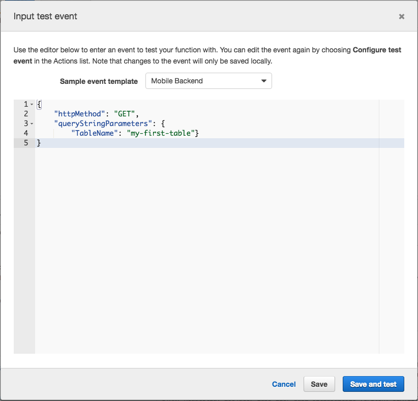
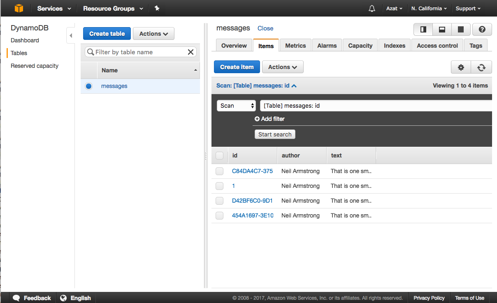
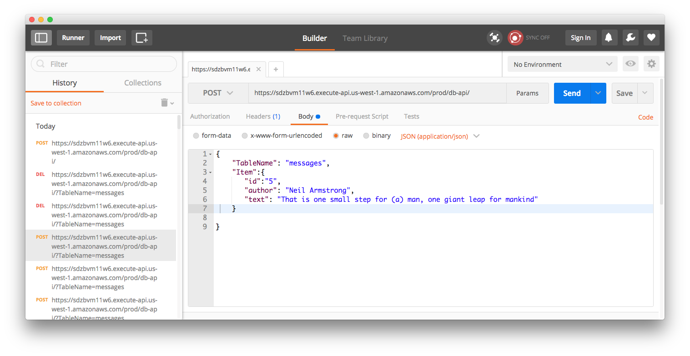

Chapter 16
----------
# Serverless Node with AWS Lambda

Servers are fun until they are not. Imagine that you run a few Node services that are important but used sporadically. Maybe you have REST APIs to access and perform CRUD on tables in your noSQL DynamoDB database. You spend money on six large AWS EC2 instances, but you need them only infrequently. It'll be more cost effective to use the serverless architecture with AWS (Amazon Web Services) Lambda then EC2. 

Unlike EC2, AWS Lambda doesn't have to run all the time. This way with Lambda, your company will pay only for actual use (compute) time. In other times when there's 0 traffic, it won't be charged at all! Big saving.

Imagine also that your last IT Ops person is leaving to work for a hot Artificial Intelligence Big Data Augmented Reality ICO-funded startup. Your company can't hire a replacement. Luckily, you read this book and docs, and you know that Lambda stack will require almost no maintenance because AWS manages its app environment. You can do everything yourself. The system quality might be even better than your IT Ops person could have achieved. AWS hires lots of good experts who will work on your Lambda infrastructure. All the patches, security, and scaling is taken care off by the AWS experts! 

Let's learn how to get started with Lambda by building a REST API for any database table, not just one. As an example, you'll be using and working with messages, but clients can work with any table by sending a different query or payload. Later, you'll be able to create auth and validate request and response in API Gateway (not covered in this lab). You are going to use three AWS services, which I will cover in this chapter:

* DynamoDB
* Lambda
* API Gateway

This chapter's project is deployed into the cloud AWS Lambda CRUD HTTP API microservice to save data in AWS DynamoDB (key value store). The API Gateway is exposing the HTTP interface. The API code is easy to implement, but the serverless setup (AWS Lambda and API Gateway) is hard. This project is broken down into digestible easy subtasks:

1. Creating a DynamoDB table
2. Creating an IAM role to access DynamoDB
3. Creating an AWS Lambda resource
4. Creating an API Gateway resource
5. Testing the RESTful API microservice
6. Cleaning up

Let's get started with the database. 

## Creating a DynamoDB Table

The name of the table in these examples is `messages`. Feel free to modify it in the command options as you wish. The key name is `id`, and the type is string (`S`):

```sh
aws dynamodb create-table --table-name messages \
  --attribute-definitions AttributeName=id,AttributeType=S \
  --key-schema AttributeName=id,KeyType=HASH \
  --provisioned-throughput ReadCapacityUnits=5,WriteCapacityUnits=5
```

You'll get back the Arn identifier `TableArn` along with other information:

```js
{
  "TableDescription": {
    "TableArn": "arn:aws:dynamodb:us-west-1:161599702702:table/messages",
    "AttributeDefinitions": [
      {
        "AttributeName": "id",
        "AttributeType": "N"
      }
    ],
    "ProvisionedThroughput": {
      "NumberOfDecreasesToday": 0,
      "WriteCapacityUnits": 5,
      "ReadCapacityUnits": 5
    },
    "TableSizeBytes": 0,
    "TableName": "messages",
    "TableStatus": "CREATING",
    "KeySchema": [
      {
        "KeyType": "HASH",
        "AttributeName": "id"
      }
    ],
    "ItemCount": 0,
    "CreationDateTime": 1493219395.933
  }
}
```

You can also get this info by:

```sh
aws dynamodb describe-table --table-name messages
```

You can get the list of all tables in your selected region (which you set in `aws configure`):

```sh
aws dynamodb list-tables
```

Next on our agenda is the access role to this table. 

## Creating an IAM Role to Access DynamoDB

The next step is to create an identity access management role that will allow the Lambda function to access the DynamoDB database. We shall start with this JSON file, which describes a thing called *trust policy*. This policy is needed for the role. Copy this code and save into `lambda-trust-policy.json`:

```js
{
  "Version": "2012-10-17",
  "Statement": [
    {
      "Sid": "",
      "Effect": "Allow",
      "Principal": {
        "Service": [
          "lambda.amazonaws.com"
        ]
      },
      "Action": "sts:AssumeRole"
    }
  ]
}
```

Let's create an IAM role so our Lambda can access DynamoDB. Create a role with a trust policy from a file using this AWS CLI command (you installed AWS CLI, right?):

```sh
aws iam create-role --role-name LambdaServiceRole --assume-role-policy-document file://lambda-trust-policy.json
```

If everything went fine, then the role will be created. Compare your results with next one, which has the trust policy content under `AssumeRolePolicyDocument` *in addition* to the identifiers of the newly created role: the role ID, name, and `Arn`. Here's my result. Yours will have different IDs. Write down the role Arn somewhere so you have it handy. 


```js
{
  "Role": {
    "AssumeRolePolicyDocument": {
      "Version": "2012-10-17",
      "Statement": [
        {
          "Action": "sts:AssumeRole",
          "Principal": {
            "Service": [
              "lambda.amazonaws.com"
            ]
          },
          "Effect": "Allow",
          "Sid": ""
        }
      ]
    },
    "RoleId": "AROAJLHUFSSSWHS5XKZOQ",
    "CreateDate": "2017-04-26T15:22:41.432Z",
    "RoleName": "LambdaServiceRole",
    "Path": "/",
    "Arn": "arn:aws:iam::161599702702:role/LambdaServiceRole"
  }
}
```

Next, add the policies so the Lambda function can work with the database. In the following command, the role is specified by name `LambdaServiceRole`, which if you remember is the name we used to create the role in the previous command. In other words, we attach a special *managed policy* that grants our future Lambda functions (which will use this role) an access to DynamoDB. The name of this special policy is `AmazonDynamoDBFullAccess`. Not all services have managed policies. In some cases, developers will have to attach policies for read, write, etc. one by one, and these are called *inline policies*.

```sh
aws iam attach-role-policy --role-name LambdaServiceRole --policy-arn arn:aws:iam::aws:policy/AmazonDynamoDBFullAccess
```

No output is a good thing in this case. 😄

Another optional managed policy, which you can use in addition to `AmazonDynamoDBFullAccess`, is `AWSLambdaBasicExecutionRole`. It has the logs (CloudWatch) write permissions:

```json
{
  "Version": "2012-10-17",
  "Statement": [
    {
      "Effect": "Allow",
      "Action": [
        "logs:CreateLogGroup",
        "logs:CreateLogStream",
        "logs:PutLogEvents"
      ],
      "Resource": "*"
    }
  ]
}
```

The commands to attach more managed policies are the same—`attach-role-policy`.


## 3. Creating an AWS Lambda Resource

On a high level view, our Lambda function (file `code/ch16/serverless/index.js`) looks like this:

```js
const doc = require('dynamodb-doc')
const dynamo = new doc.DynamoDB() // Connects to the DB in the same region automatically, no need for IPs or passwords

exports.handler = (event, context, callback) => {
  switch (event.httpMethod) {
    case 'DELETE':
      // Delete item
      // Call callback with ok
    case 'GET':
      // Read items
      // Call callback with items
    case 'POST':
      // Create item
      // Call callback with ok
    case 'PUT':
      // Update item
      // Call callback with ok
    default:
      // Call callback with error
  }
}
```

The access to the database is provided via the `dynamodb-doc` library, which is instantiated into the `dynamo` object. No need for IP/domain or passwords. The IAM and AWS will do everything and provide the access to the entire DynamoDB instance, which can have multiple tables per account per region. AWS has just a single DynamoDB "instance" per region, like US West, but there are multiple regions per account.

The Lambda function, which is in this case a request handler, is very similar to the Express request handler. There's a function with three arguments: event, context, and callback. The request body is in the `event.body`. The request HTTP method is in `event.httpMethod`. It's worth mentioning that Lambda functions could be and do anything— not just be request handlers. They can do some computation or work with data. All the operations are done with these three arguments: `event`, `context`, and `callback`.

Here's the full code for the function. It checks HTTP methods and performs CRUD on DynamoDB table accordingly. The table name comes from the query string or from the request body.

```js
'use strict'

console.log('Loading function')
const doc = require('dynamodb-doc')
const dynamo = new doc.DynamoDB()

// All the request info in event
// "handler" is defined on the function creation
exports.handler = (event, context, callback) => {
    // Callback to finish response
  const done = (err, res) => callback(null, {
    statusCode: err ? '400' : '200',
    body: err ? err.message : JSON.stringify(res),
    headers: {
      'Content-Type': 'application/json'
    }
  })
    // To support mock testing, accept object not just strings
  if (typeof event.body === 'string') { event.body = JSON.parse(event.body) }
  switch (event.httpMethod) {
        // Table name and key are in payload
    case 'DELETE':
      dynamo.deleteItem(event.body, done)
      break
        // No payload, just a query string param
    case 'GET':
      dynamo.scan({ TableName: event.queryStringParameters.TableName }, done)
      break
        // Table name and key are in payload
    case 'POST':
      dynamo.putItem(event.body, done)
      break
        // Table name and key are in payload
    case 'PUT':
      dynamo.updateItem(event.body, done)
      break
    default:
      done(new Error(`Unsupported method "${event.httpMethod}"`))
  }
}
```

So either copy or type the code of the Lambda function shown prior into a file. Then archive it with ZIP into `db-api.zip`. Yes. It's a simple archive, and that's how we will deploy it, by archiving and uploading this archive file. No Git. Funny how Lambda packaging is so low tech, right?

Now, we can create an AWS Lambda function in the cloud from the source code, which is now only on your local machines. We will use the `create-function` command. 

```
aws lambda create-function --function-name db-api \
  --runtime nodejs6.10 --role arn:aws:iam::161599702702:role/LambdaServiceRole \
  --handler index.handler \
  --zip-file fileb://db-api.zip \
  --memory-size 512 \
  --timeout 10
```

Let unpack the command and its three main options:

* For the role `--role`, use your IAM role `Arn` from the IAM step. 
* For the `--zip-file`, use the code for the function from the zip file you created earlier.
* For the `--handler`, use the name of the *exported* method in `index.js` for AWS to import and invoke that function. 

Just to clarify, `--zip-file fileb://db-api.zip` means upload the function from this file named `db-api.zip`, which is in the same folder in which you run the command `create-function`.

Memory size and timeout are optional. By default, they are 128 and 3 correspondingly. 

You can see that the Node version is 6.1. AWS takes care of installing and patching Node any other environment (Python, Java, Go, etc.).

Another important thing to notice and to know about is the function name itself, which is `db-api`. We'll use this name a lot for connecting this function to API Gateway later in this chapter.

Run the `create-function` command with your `Arn`. Also, make sure Node is at least version 6. The function name must be `db-api` or other scripts in this chapter won't work.

Results will look similar to this but with different IDs of course:  

```js
{
  "CodeSha256": "bEsDGu7ZUb9td3SA/eYOPCw3GsliT3q+bZsqzcrW7Xg=",
  "FunctionName": "db-api",
  "CodeSize": 778,
  "MemorySize": 512,
  "FunctionArn": "arn:aws:lambda:us-west-1:161599702702:function:db-api",
  "Version": "$LATEST",
  "Role": "arn:aws:iam::161599702702:role/LambdaServiceRole",
  "Timeout": 10,
  "LastModified": "2017-04-26T21:20:11.408+0000",
  "Handler": "index.handler",
  "Runtime": "nodejs6.10",
  "Description": ""
}
```

I like to test right away. To test the function I created this data that mocks an HTTP request. It's just an object with the HTTP method set to GET and the query string with the table name parameter. I saved it in the `db-api-test.json` file so you can copy it from the book's repository or from the following snippet.  

```json
{
  "httpMethod": "GET",
  "queryStringParameters": {
    "TableName": "messages"
  }
}
```

You can copy this object into the AWS web console, as shown in Figure 16-1, or use CLI like a real hacker you are. 

For CLI, run from your terminal or command prompt the AWS CLI command `aws lambda invoke` with parameters to execute the function in the cloud. The parameters will point to the data file with the mock HTTP request using `--payload file://db-api-test.json`:

```
aws lambda invoke \
  --invocation-type RequestResponse \
  --function-name db-api \
  --payload file://db-api-test.json \
  output.txt
```

It's actually pretty cool to execute a function in the cloud from the command line. It can be useful when the function performs something heavy computational. The function doesn't have to be an HTTP endpoint. It can take any data and give you the output.

The testing can be done from the AWS web console in Lambda dashboard as I mentioned before. Simply select the blue "Save and test" button once you've navigated to function's detailed view and pasted the data (Figure 16-1). Disregard the template that says Mobile Backend. I show how I tested the GET HTTP request with a query string in Figure 16-1.


***Figure 16-1.** Mocking an HTTP request to our AWS Lambda in the AWS web console*

The results should be 200 (ok status) and output in the `output.txt` file. For example, I do NOT have any record yet, so my response is this:

```
{"statusCode":"200","body":"{\"Items\":[],\"Count\":0,\"ScannedCount\":0}","headers":{"Content-Type":"application/json"}}
```

The function is working and fetching from the database.  You can test other HTTP methods by modifying the input. For example, to test creation of an item, use POST method and provide the proper body, which must have `TableName` and `Item` fields, just like in the Node code of our function. Structure the data in `body` exactly how the function expects it.

```json
{
  "httpMethod": "POST",
  "queryStringParameters": {
    "TableName": "messages"
  },
  "body": {
    "TableName": "messages",
    "Item":{
      "id":"1",       
      "author": "Neil Armstrong",
      "text": "That is one small step for (a) man, one giant leap for mankind"
    }
  }
}
```

Enough with the testing by the way of mocking the HTTP requests. The function is working, okay? It was invoked from the AWS CLI and from the AWS web console. Now we want to create a special URL that will trigger/invoke/execute our function every time there's a request.

## Creating an API Gateway Resource

API Gateway will allow us to create a REST API resource (like a route, a UR,L or an endpoint). Every time someone sends a request, this resource will invoke our Lambda. You will need to do the following to create the REST resource/endpoint:

1. Create the REST API in API Gateway
2. Create a resource `/db-api` (as an example, it's similar to `/users`, `/accounts`)
3. Define HTTP method(s) without auth
4. Define integration to Lambda (proxy)
5. Create deployment
6. Give permissions for an API Gateway resource and method to invoke Lambda

The process is not straightforward. In fact it's prone to mistake and errors. I spend many hours tweaking and mastering all these API Gateway steps to automate them, that is, I created a magical shell script. As a result, you can use a shell script which will perform all the steps (recommended) or... send hours banging your head against the table like I did. The AWS web console can help too. It can simplify and automate *some* steps for you too if you use the right template.

The shell script is in the `create-api.sh` file. It has inline comments to help you understand what is happening. Feel free to inspect `create-api.sh`. For brevity and to avoid complicating the chapter, I won't go over it line-by-line but I'll show the file with comments.

```
APINAME=api-for-db-api
REGION=us-west-1
NAME=db-api # function name
API_PATH=db-api
# Create an API
aws apigateway create-rest-api --name "${APINAME}" --description "Api for ${NAME}" --region ${REGION}
APIID=$(aws apigateway get-rest-apis --query "items[?name==\`${APINAME}\`].id" --output text --region ${REGION})
echo "API ID: ${APIID}"
PARENTRESOURCEID=$(aws apigateway get-resources --rest-api-id ${APIID} --query "items[?path=='/'].id" --output text --region ${REGION})
echo "Parent resource ID: ${PARENTRESOURCEI}"
# Create a resource as a path, our function will handle many tables (resources) but you can be more specific
aws apigateway create-resource --rest-api-id ${APIID} --parent-id ${PARENTRESOURCEID} --path-part ${API_PATH} --region ${REGION}
RESOURCEID=$(aws apigateway get-resources --rest-api-id ${APIID} --query "items[?path=='/db-api'].id" --output text --region ${REGION})
echo "Resource ID for path ${API_PATH}: ${APIID}"
# Add a method like GET, POST, PUT, etc.; for CRUD we need all methods so just put ANY. Here you can set up auth as well
aws apigateway put-method --rest-api-id ${APIID} --resource-id ${RESOURCEID} --http-method ANY --authorization-type NONE  --no-api-key-required --region ${REGION}
LAMBDAARN=$(aws lambda list-functions --query "Functions[?FunctionName==\`${NAME}\`].FunctionArn" --output text --region ${REGION})
echo "Lambda Arn: ${LAMBDAARN}"
# Create integration
# http-method: proxy any http method, but could be only GET, POST, PUT, etc.
# type: proxy everything, other possible options: HTTP and AWS
# integration-http-method: must be POST for method to lambda integration to inkove lambda
aws apigateway put-integration --rest-api-id ${APIID} \
--resource-id ${RESOURCEID} \
--http-method ANY \
--type AWS_PROXY \
--integration-http-method POST \
--uri arn:aws:apigateway:${REGION}:lambda:path/2015-03-31/functions/${LAMBDAARN}/invocations
aws apigateway create-deployment --rest-api-id ${APIID} --stage-name prod --region ${REGION}
APIARN=$(echo ${LAMBDAARN} | sed -e 's/lambda/execute-api/' -e "s/function:${NAME}/${APIID}/")
echo "APIARN: $APIARN"
UUID=$(uuidgen)
# Add permissions to invoke function
# use uuid to make sure we don't get already exists error
# in source-arn, change to prod/GET or prod/POST where pattern is stage/http-method
aws lambda add-permission \
--function-name ${NAME} \
--statement-id apigateway-db-api-any-proxy-${UUID} \
--action lambda:InvokeFunction \
--principal apigateway.amazonaws.com \
--source-arn "${APIARN}/*/*/db-api"
# This is where you can control responses
aws apigateway put-method-response \
--rest-api-id ${APIID} \
--resource-id ${RESOURCEID} \
--http-method ANY \
--status-code 200 \
--response-models "{}" \
--region ${REGION}
echo "Resource URL is https://${APIID}.execute-api.${REGION}.amazonaws.com/prod/db-api/?TableName=messages"
echo "Testing..."
curl "https://${APIID}.execute-api.${REGION}.amazonaws.com/prod/db-api/?TableName=messages"
```

Run my API Gateway script to create the API endpoint and integrate it with the Lambda function (if you modified the region or the function name, you'll need to change those values in the script as well):

```
sh create-api.sh
```

In the end, the script will make a GET request to check that everything is working. This is an example of running the automation script for the API Gateway (your IDs and Arns will be different):

```sh
sh create-api.sh
{
    "id": "sdzbvm11w6",
    "name": "api-for-db-api",
    "description": "Api for db-api",
    "createdDate": 1493242759
}
API ID: sdzbvm11w6
Parent resource ID: sdzbvm11w6
{
    "path": "/db-api",
    "pathPart": "db-api",
    "id": "yjc218",
    "parentId": "xgsraybhu2"
}
Resource ID for path db-api: sdzbvm11w6
{
    "apiKeyRequired": false,
    "httpMethod": "ANY",
    "authorizationType": "NONE"
}
Lambda Arn: arn:aws:lambda:us-west-1:161599702702:function:db-api
{
    "httpMethod": "POST",
    "passthroughBehavior": "WHEN_NO_MATCH",
    "cacheKeyParameters": [],
    "type": "AWS_PROXY",
    "uri": "arn:aws:apigateway:us-west-1:lambda:path/2015-03-31/functions/arn:aws:lambda:us-west-1:161599702702:function:db-api/invocations",
    "cacheNamespace": "yjc218"
}
{
    "id": "k6jko6",
    "createdDate": 1493242768
}
APIARN: arn:aws:execute-api:us-west-1:161599702702:sdzbvm11w6
{
    "Statement": "{\"Sid\":\"apigateway-db-api-any-proxy-9C30DEF8-A85B-4EBC-BBB0-8D50E6AB33E2\",\"Resource\":\"arn:aws:lambda:us-west-1:161599702702:function:db-api\",\"Effect\":\"Allow\",\"Principal\":{\"Service\":\"apigateway.amazonaws.com\"},\"Action\":[\"lambda:InvokeFunction\"],\"Condition\":{\"ArnLike\":{\"AWS:SourceArn\":\"arn:aws:execute-api:us-west-1:161599702702:sdzbvm11w6/*/*/db-api\"}}}"
}
{
    "responseModels": {},
    "statusCode": "200"
}
Resource URL is https://sdzbvm11w6.execute-api.us-west-1.amazonaws.com/prod/db-api/?TableName=messages
Testing...
{"Items":[],"Count":0,"ScannedCount":0}%
```

You are all done! The resource URL is there in your terminal output. The script even tested the function for you if you look at the very last line (must be `"Items": []` unless you inserted a few records in the DB already).

## Testing the RESTful API Microservice

You can manually run tests by getting the resource URL and using cURL, Postman, or any other HTTP client. For example, my GET looks like this (replace the URL with yours):

```sh
curl "https://sdzbvm11w6.execute-api.us-west-1.amazonaws.com/prod/db-api/?TableName=messages"
```

But my POST has a body and header with a unique ID:

```sh
curl "https://sdzbvm11w6.execute-api.us-west-1.amazonaws.com/prod/db-api/?TableName=messages" \
  -X POST \
  -H "Content-Type: application/json" \
  -d '{"TableName": "messages",
    "Item": {
      "id": "'$(uuidgen)'",
      "author": "Neil Armstrong",
      "text": "That is one small step for (a) man, one giant leap for mankind"
    }
  }'
```

Here's an option if you don't want to copy paste your endpoint URL. Use env var to store URL and then CURL to it. Execute this once to store the env var `API_URL`:

```sh
APINAME=api-for-db-api
REGION=us-west-1
NAME=db-api
APIID=$(aws apigateway get-rest-apis --query "items[?name==\`${APINAME}\`].id" --output text --region ${REGION})
API_URL="https://${APIID}.execute-api.${REGION}.amazonaws.com/prod/db-api/?TableName=messages"
```

Then run for GET as many times as you want:

```sh
curl $API_URL
```

And run the following to POST as many times as you want (thanks to `uuidgen`):

```sh
curl ${API_URL} \
  -X POST \
  -H "Content-Type: application/json" \
  -d '{"TableName": "messages",
    "Item": {
      "id": "'$(uuidgen)'",
      "author": "Neil Armstrong",
      "text": "That is one small step for (a) man, one giant leap for mankind"
    }
  }'
```

The new items can be observed via an HTTP interface by making another GET request... or in the AWS web console in DynamoDB dashboard as shown below in Figure 16-2:


***Figure 16-2.** Verifying newly created DB records in the `messages` table by looking at the AWS web console's DynamoDB dashboard*

You have yet another option to play with your newly created serverless REST API resource: a very popular GUI app for making HTTP requests called Postman. Here's how the POST request looks like in Postman. Remember to select POST, Raw, and JSON (`application/json`):


***Figure 16-3.** Using Postman to validate the REST API endpoint to AWS Lambda, which creates a DB record*

To delete an item with the DELETE HTTP request method, the payload must have a `Key` field of that record that we want to delete. For example:

```json
{
    "TableName": "messages",
    "Key":{
       "id":"8C968E41-E81B-4384-AA72-077EA85FFD04"
    }

}
```

Congratulations! You've built an event-driven REST API for an entire database, not just a single table!

**Note** For auth, you can set up token-based auth on a resource and method in API Gateway. You can set up response and request rules in the API Gateway as well. Also, everything (API Gateway, Lambda, and DynamoDB) can be set up in CloudFormation instead of a CLI or web console ([example of Lambda with CloudFormation](https://github.com/awslabs/lambda-refarch-webapp)).

## Cleaning Up

You can leave your function running since AWS will charge only for the usage, but I prefer to clean every AWS resource right away. Remove the API Gateway API with `delete-rest-api`. For example, here's my command (for yours, replace the REST API ID accordingly):

```sh
aws apigateway delete-rest-api --rest-api-id sdzbvm11w6
```

Delete the function by its name using `delete-function`:

```sh
aws lambda delete-function --function-name db-api
```

Finally, delete the database by its name too:

```sh
aws dynamodb delete-table --table-name messages
```

I've taught this project over 20 times, so I know the common problems that can arise. This is the troubleshooting of the common issues:

* *Internal server error:* Check your JSON input. DynamoDB requires a special format for Table Name and ID/Key.
* *Permissions:* Check the permission for API resource and method to invoke Lambda. Use the test in API Gateway to debug.
* `UnexpectedParameter: Unexpected key '0' found in params`: Check that you are sending proper format, JSON vs. string.
* ` <AccessDeniedException><Message>Unable to determine service/operation name to be authorized</Message></AccessDeniedException>`: Make sure to use POST for `integration-http-method` as in the `create-api` script, because API Gateway integration can only use POST to trigger functions, even for other HTTP methods defined for this resource (like ANY).
* *Wrong IDs:* Make sure to check names and IDs if you modified the examples.


Summary
=======

Amazon Web Services offers myriads of cloud services, and most of them use and benefit greatly from Node. Serverless architecture is one popular use case for Node. In AWS, the serverless service is AWS Lambda. It uses managed and configured Node environment to run code (among other environments such as Python, Java, and other dinosaurs). The code can be HTTP request-response services (microservices) when you add API Gateway to Lambda. That's what we did, but that's not all. Lambdas can be just code for sending notifications, doing data crunching, and performing any other tasks. 
