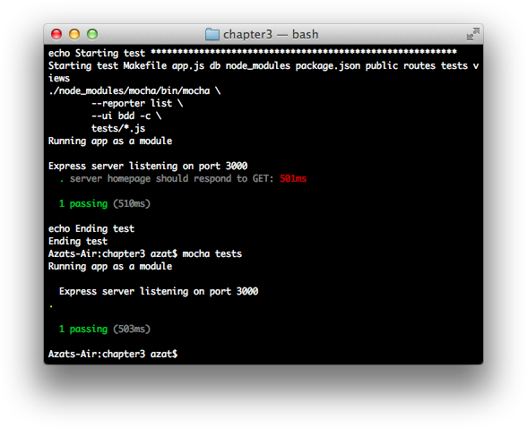

Chapter 3
---------
# TDD and BDD for Node.js with Mocha

Test-driven development (TDD), as many of you might know, is one of the main, agile development techniques. The genius of TDD lies in increased quality of code, faster development resulting from greater programmer confidence, and improved bug detection (duh!).

Historically, web apps have been hard to autotest, and developers relied heavily on manual testing. But, certain parts such as standalone services and REST API can be *and should be* tested thoroughly by the TDD. At the same time, rich user interface (UI) / user experience (UX) can be tested with headless browsers such as PhantomJS.

The behavior-driven development (BDD) concept is based on TDD. It differs from TDD in language, which encourages collaboration between product owners and programmers.

Similar to building apps themselves, most of the time software engineers should use a testing framework. To get you started with the Node.js testing framework, Mocha, in this chapter, we cover the following:

- Installing and understanding Mocha

- TDD with the assert

- BDD with Expect.js

- Project: writing the first BDD test for Blog

The source code for this chapter is in the `ch3` folder of the practicalnode(<https://github.com/azat-co/practicalnode>) GitHub repository (https://github.com/azat-co/practicalnode).

# Installing and Understanding Mocha

Mocha is a mature and powerful testing framework for Node.js. To install it, simply run:

    $ npm install –g mocha@1.16.2

**Note**: We use a specific version (the latest as of this writing is 1.16.2) to prevent inconsistency in this book&#39;s examples caused by potential breaking changes in future versions of Mocha.

If you encounter the lack-of-permissions issue, discussed in Chapters 1 and 2, run:

    $ sudo npm install –g mocha@1.16.2

To avoid using `sudo`, follow the instructions in Chapter 1 on how to install Node.js correctly.

**Tip**: It&#39;s possible to have a separate version of Mocha for each project by simply pointing to the local version of Mocha, which you install like any other npm module into `node_modules`. The command will be:

    $ ./node_modules/mocha/bin/mocha test_name

for macOS / Linux. For an example, refer to "Putting Configs into a Makefile" later in this chapter.

Most of you have heard about TDD and why it&#39;s a good thing to follow. The main idea of TDD is to do the following:

- Define a unit test

- Implement the unit

- Verify that the test passes

BDD is a specialized version of TDD that specifies what needs to be unit-tested from the perspective of business requirements. It&#39;s possible to just write test with good old plain core Node.js module `assert`. However, as in many other situations, using a framework is more preferable. For both TDD and BDD, we&#39;ll be using the Mocha testing framework because we gain many things for “free.” Among them are the following:

- Reporting
- Asynchronous support
- Rich configurability

Here is a list of optional parameters (options) that the `$ mocha [options]` command takes:

- `-h` or `--help`: print help information for the Mocha command
- `-V` or `--version`: print the version number that's being used
- `-r` or `--require <name>`: require a module with the name provided
- `-R` or `--reporter <name>`: use a reporter with the name provided
- `-u` or `--ui <name>`: use the stipulated reporting user interface (such as `bdd`, `tdd`)
- `-g` or `--grep <pattern>`: run tests exclusively with a matching pattern
- `-i` or `--invert`: invert the `--grep` match pattern
- `-t` or `--timeout <ms>`: set the test case time out in milliseconds (for example, 5000)
- `-s` or `--slow <ms>`: set the test threshold in milliseconds (for example, 100)
- `-w` or `--watch`: watch test files for changes while hanging on the terminal
- `-c` or `--colors`: enable colors
- `-C` or `--no-colors`: disable colors
- `-G` or `--growl`: enable macOS Growl notifications
- `-d` or `--debug`: enable the Node.js debugger—`$ node --debug`
- `--debug-brk`: enable the Node.js debugger breaking on the first line—`$ node --debug-brk`
- `-b` or `--bail`: exit after the first test failure
- `-A` or `--async-only`: set all tests in asynchronous mode
- `--recursive`: use tests in subfolders
- `--globals <names>`: provide comma-delimited global names
- `--check-leaks`: check for leaks in global variables
- `--interfaces`: print available interfaces
- `--reporters`: print available reporters
- `--compilers <ext>:<module>,...`: provide compiler to use

Figure 3-1 shows an example of nyan cat reporter with the command `$ mocha test-expect.js -R nyan`.

***Figure 3-1.** Mocha nyan reporter*

Usually, when it comes to choosing a type of framework, there are a few options. Mocha is one of the more robust and widely used. However, the following alternatives to Mocha are worth considering:

- [NodeUnit](https://github.com/caolan/nodeunit)(<https://github.com/caolan/nodeunit>)

- [Jasmine](http://pivotal.github.com/jasmine/)(<http://pivotal.github.com/jasmine/>)

- [Vows](http://vowsjs.org/)(<http://vowsjs.org/>)

## Understanding Mocha Hooks

A hook is some logic, typically a function or a few statements, which is executed when the associated event happens; for example, in Chapter 7 we&#39;ll use hooks to explore the Mongoose library `pre` hooks. Mocha has hooks that are executed in different parts of suites—before the whole suite, before each test, and so on.

In addition to `before` and `beforeEach` hooks, there are `after()`, and `afterEach()` hooks. They can be used to clean up the testing setup, such as database data?

All hooks support asynchronous modes. The same is true for tests as well. For example, the following test suite is synchronous and won&#39;t wait for the response to finish:

    describe('homepage', function(){
      it('should respond to GET',function(){
        superagent
          .get('http://localhost:'+port)
          .end(function(res){
            expect(res.status).to.equal(200);
        })
      })

But, as soon as we add a `done` parameter to the test&#39;s function, our test case waits for the HTTP request to come back:

    describe('homepage', function(){
      it('should respond to GET',function(done){
        superagent
          .get('http://localhost:'+port)
          .end(function(res){
            expect(res.status).to.equal(200);
            done();
        })
      })

Test cases (`describe`) can be nested inside other test cases, and hooks such as `before` and `beforeEach` can be mixed in with different test cases on different levels. Nesting of `describe` constructions is a good idea in large test files.

Sometime, developers might want to skip a test case/suite (`describe.skip()` or `it.skip()`) or make them exclusive (`describe.only()` or `describe.only()`). Exclusivity means that only that particular test runs (the opposite of `skip`).

As an alternative to the BDD interface&#39;s `describe`, `it`, `before`, and others, Mocha supports more traditional TDD interfaces:

- `suite`: analogous to `describe`
- `test`: analogous to `it`
- `setup`: analogous to `before`
- `teardown`: analogous to `after`
- `suiteSetup`: analogous to `beforeEach`
- `suiteTeardown`: analogous to `afterEach`

# TDD with the Assert

Let&#39;s write our first tests with the assert library. This library is part of the Node.js core, which makes it easy to access. It has minimal functionality, but it might be enough for some cases, such as unit tests.

After global Mocha installation is finished, a test file can be created in a `test-example` folder:

    $ mkdir test-example
    $ subl test-example/test.js

**Note**: `subl` is a Sublime Text alias command. You can use any other editor, such as Vi (`vi`) or TextMate (`mate`).

With the following content:

    var assert = require('assert');
    describe('String#split', function(){
      it('should return an array', function(){
        assert(Array.isArray('a,b,c'.split(',')));
      });
    })

We can run this simple `test.js` (inside the `test-example` folder), which checks for Array type, with:

    $ mocha test

or

    $ mocha test.js.

The results of these Mocha commands are shown in Figure 3-2.

***Figure 3-2.** Running Array-type test*

We can add to our example another test case (`it`) that asserts equality of array values:

    var assert = require('assert');
    describe('String#split', function(){
      it('should return an array', function(){
        assert(Array.isArray('a,b,c'.split(',')));
      });
      it('should return the same array', function(){
        assert.equal(['a','b','c'].length, 'a,b,c'.split(',').length, 'arrays have equal length');
        for (var i=0; i&lt;['a','b','c'].length; i++) {
          assert.equal(['a','b','c'][i], 'a,b,c'.split(',')[i], i + 'element is equal');
        };
      });
    })

As you can see, some code is repeated, so we can abstract it into `beforeEach` and `before` constructions:

    var assert = require('assert');
    var expected, current;
    before(function(){
      expected = ['a', 'b', 'c'];
    })
    describe('String#split', function(){
      beforeEach(function(){
        current = 'a,b,c'.split(',');
      })
      it('should return an array', function(){
        assert(Array.isArray(current));
      });
      it('should return the same array', function(){
        assert.equal(expected.length, current.length, 'arrays have equal length');
        for (var i=0; i&lt;expected.length; i++) {
          assert.equal(expected[i], current[i], i + 'element is equal');
        }
      })
    })

## Chai Assert

In the previous example with `test.js` and assert, we used the Node.js core module assert. Chai is a subset of that library. We can modify our previous example to use chai assert with following code:

`$ npm install chai@1.8.1`

And in `test-example/test.js`:

    var assert = require('chai').assert;

The following are some of the methods from the chai assert library:

- `assert(expressions, message)`: throws an error if the expression is false
- `assert.fail(actual, expected, [message], [operator])`: throws an error with values of `actual`, `expected`, and `operator`
- `assert.ok(object, [message])`: throws an error when the object is not double equal (`==`) to true—aka, truthy (0, and an empty string is false in JavaScript/Node.js)
- `assert.notOk(object, [message])`: throws an error when the object is falsy, i.e., false, 0  (zero), ""  (empty string), null, undefined or NaN
- `assert.equal(actual, expected, [message])`: throws an error when `actual` is not double equal (`==`) to `expected`
- `assert.notEqual(actual, expected, [message])`: throws an error when `actual` is double equal (`==`)—in other words, not unequal (`!=`)—to `expected`
- `.strictEqual(actual, expected, [message])`: throws an error when objects are not triple equal (`===`)

For the full chai assert API, refer to [the official documentation](http://chaijs.com/api/assert/)(<http://chaijs.com/api/assert/>).

**Note**: The chai assert (`chai.assert`) and the Node.js core assert (`assert`) modules are *not 100% compatible*, because the former has more methods. The same is true for chai expect and a standalone expect.js.

# BDD with Expect.js

Expect.js is one of the BDD languages. Its syntax allows for chaining and is richer in features than core module assert. There are two options to use expect.js:

1. Install as a local module

2. Install as a part of the chai library

For the former, simply execute the following:

    $ mkdir node_modules
    $ npm install expect.js@0.2.0

And, use `var expect = require('expect.js');` inside a Node.js test file. For example, the previous test can be rewritten in expect.js BDD style:

    var expect = require('expect.js');
    var expected, current;
    before(function(){
      expected = ['a', 'b', 'c'];
    })
    describe('String#split', function(){
      beforeEach(function(){
        current = 'a,b,c'.split(',');
      })
      it('should return an array', function(){
        expect(Array.isArray(current)).to.be.true;
      });
      it('should return the same array', function(){
        expect(expected.length).to.equal(current.length);
        for (var i=0; i&lt;expected.length; i++) {
          expect(expected[i]).equal(current[i]);
        }
      })
    })

For the chai library approach, run the following:

    $ mkdir node_modules
    $ npm install chai@1.8.1

And, use `var chai = require('chai'); var expect = chai.expect;` inside a Node.js test file. For example:

    var expect = require('chai').expect;

**Note**: `$ mkdir node_modules` is needed only if you install npm modules in the folder that has neither the `node_modules` directory already nor a `package.json` file. For more information, please refer to Chapter 1.

## Expect.js Syntax

The Expect.js library is very extensive. It has nice methods that mimic natural language. Often there are a few ways to write the same assertion, such as `expect(response).to.be(true)` and `expect(response).equal(true)`. The following lists some of the main Expect.js methods/properties:

- `ok`: checks for truthyness
- `true`: checks whether the object is truthy
- `to.be`, `to`: chains methods as in linking two methods
- `not`: chains with a not connotation, such as `expect(false).not.to.be(true)`
- `a`/`an`: checks type (works with `array` as well)
- `include`/`contain`: checks whether an array or string contains an element
- `below`/`above`: checks for the upper and lower limits

**Note**: Again, there is a slight deviation between the standalone `expect.js` module and its Chai counterpart.

For the full documentation on chai expect.js, refer to http://chaijs.com/api/bdd/, and for the standalone, refer to https://github.com/LearnBoost/expect.js/.

# Project: Writing the First BDD Test for Blog

The goal of this mini-project is to add a few tests for Blog (this book&#39;s primary project). We won&#39;t get into headless browsers and UI testing, but we can send a few HTTP requests and parse their responses from the app&#39;s REST end points (see Chapter 2 for a description of the Blog app).

The source code for this chapter is in the `ch3/blog-express` folder of the practicalnode(<https://github.com/azat-co/practicalnode>) GitHub repository (https://github.com/azat-co/practicalnode).

First, let&#39;s copy the Hello World project. It will serve as a foundation for Blog. Then, install Mocha in the Blog project folder, and add it to the `package.json` file at the same time with `$ npm install mocha@1.16.2 --save-dev`. The `--save-dev` flag will categorize this module as a development dependency (devDependencies). Modify this command by replacing package name and version number for expect.js (0.2.0) and [superagent](https://npmjs.org/package/superagent)(<https://npmjs.org/package/superagent>) (0.15.7). The latter is a library to streamline the making of HTTP requests. Alternatives to `superagent` include the following:

- `request`(<https://npmjs.org/package/request>): the third most-starred npm module (as of this writing)
- *core* `http` *module*: clunky and very low level
- `supertest`: a superagent-based assertions library

Here's the updated `package.json`:

    {
      "name": "blog-express",
      "version": "0.0.1",
      "private": true,
      "scripts": {
        "start": "node app.js",
        "test": "mocha test"
      },
      "dependencies": {
        "express": "4.1.2",
        "jade": "1.3.1",
        "stylus": "0.44.0"
      },
      "devDependencies": {
        "mocha": "1.16.2",
        "superagent": "0.15.7",
        "expect.js": "0.2.0"
      }
    }

Now, create a test folder with `$ mkdir tests` and open `tests/index.js` in your editor. The test needs to start the server:

    var boot = require('../app').boot,
      shutdown = require('../app').shutdown,
      port = require('../app').port,
      superagent = require('superagent'),
      expect = require('expect.js');
    describe('server', function () {
      before(function () {
        boot();
      });
      describe('homepage', function(){
        it('should respond to GET',function(done){
          superagent
            .get('http://localhost:'+port)
            .end(function(res){
              expect(res.status).to.equal(200);
              done()
          })
        })
      });
      after(function () {
        shutdown();
      });
    });

In `app.js`, we expose two methods, `boot` and `shutdown`, when the file is imported, in our case, by the test. So, instead of:

    http.createServer(app).listen(app.get('port'), function(){
      console.log('Express server listening on port ' + app.get('port'));
    });

we can refactor into:

    var server = http.createServer(app);
    var boot = function () {
      server.listen(app.get('port'), function(){
        console.info('Express server listening on port ' + app.get('port'));
      });
    }
    var shutdown = function() {
      server.close();
    }
    if (require.main === module) {
      boot();
    }
    else {
      console.info('Running app as a module')
      exports.boot = boot;
      exports.shutdown = shutdown;
      exports.port = app.get('port');
    }

To launch the test, simply run `$ mocha tests`. The server should boot and respond to the home page request (`/` route) as shown in Figure 3-3.

***Figure 3-3.** Running $ mocha tests*

## Putting Configs into a Makefile

The `mocha` accepts many options. It&#39;s often a good idea to have these options gathered in one place, which could be a Makefile. For example, we can have `test`, `test-w` test all files in the `test` folder, and have modes for just the `module-a.js` and `module-b.js` files to test them separately.

    REPORTER = list
    MOCHA_OPTS = --ui tdd --ignore-leaks

    test:
            clear
            echo Starting test *********************************************************
            ./node_modules/mocha/bin/mocha \
            --reporter $(REPORTER) \
            $(MOCHA_OPTS) \
            tests/*.js
            echo Ending test

    test-w:
            ./node_modules/mocha/bin/mocha \
            --reporter $(REPORTER) \
            --growl \
            --watch \
            $(MOCHA_OPTS) \
            tests/*.js

    test-module-a:
            mocha tests/module-a.js --ui tdd --reporter list --ignore-leaks

    test-module-b:
            clear
            echo Starting test *********************************************************
            ./node_modules/mocha/bin/mocha \
            --reporter $(REPORTER) \
            $(MOCHA_OPTS) \
            tests/module-b.js
            echo Ending test

    .PHONY: test test-w test-module-a test-module-b

To launch this Makefile, run `$ make <mode>`—for example, `$ make test`. For more information on a Makefile please refer to Understanding Make at http://www.cprogramming.com/tutorial/makefiles.html and Using Make and Writing Makefiles at http://www.cs.swarthmore.edu/~newhall/unixhelp/howto_makefiles.html.

For our Blog app, we can keep the Makefile simple:

    REPORTER = list
    MOCHA_OPTS = --ui bdd –c

    test:
        clear
        echo Starting test *********************************************************
        ./node_modules/mocha/bin/mocha \
        --reporter $(REPORTER) \
        $(MOCHA_OPTS) \
        tests/*.js
        echo Ending test

    .PHONY: test

**Note**: We point to the local Mocha in the Makefile, so the dependency needs to be added to `package.json` and installed in the `node_modules` folder.

Now we can run tests with the `$ make test` command, which allows for more configuration compared with the simple `$ mocha tests` (Figure 3-4).

***Figure 3-4.** Running `make test`*

# Summary

In this chapter, we installed Mocha as a command-line tool and learned its options, we wrote simple tests with assert and the expect.js libraries, and we created the first test for the Blog app by modifying `app.js` to work as a module. In Chapter 10, we harness TravisCI SaaS by writing a `yml` config file and using GitHub to trigger continuous multiple tests in the cloud virtual environments. In the next chapter, we proceed with the essence of a web app that outputs HTML—template engine. We&#39;ll dive deep into Jade and Handlebars, and add pages to Blog.
