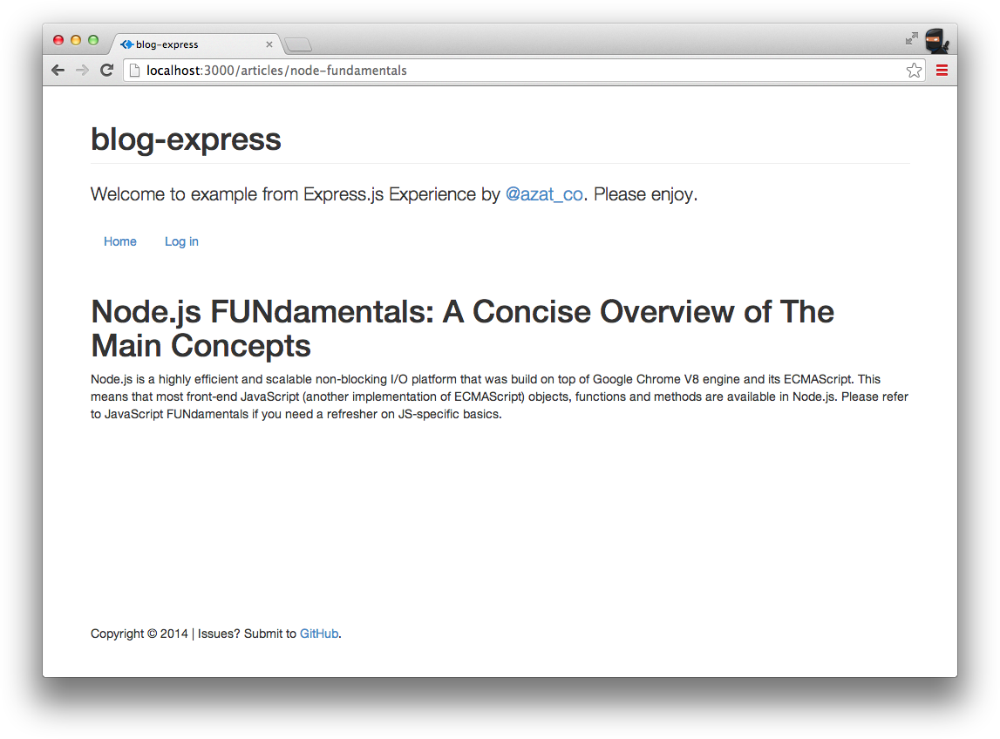

Chapter 4
---------
# Template Engines: Pug and Handlebars

A template engine is a library or a framework that uses some rules/languages to interpret data and render views. In the case of web applications, views are HTML pages (or parts of them), but they can be JSON or XML files, or GUIs in the case of desktop programs. For those of you familiar with the model–view–controller concept, templates belong to the view.

In web apps, it&#39;s beneficial to use templates because we can generate an infinite number of pages dynamically with a single template! Another side benefit is when we need to change something; we can do it in one place only.

If we go back to the diagrams in the previous chapter (traditional vs. REST API approaches), we can deduce that templates can be compiled into HTML either server-side (traditional approach) or client-side (REST API approach). No matter which approach we take, the syntax of the libraries themselves remains intact.

In this chapter we cover the following:

- Pug syntax and features
- Pug standalone usage
- Handlebars syntax
- Handlebars standalone usage
- Pug and Handlebars usage in Express.js
- Project: adding Pug templates to Blog

# Pug Syntax and Features

Pug is a Node.js brother of Haml, in the sense that it uses whitespace and indentation as part of its language. As with a real pugs, this Pug can either be cute and friendly or can chew your butt off if you don't know how to use it. Therefore, we need to be careful to follow the proper syntax.

You can follow the Pug syntax examples in this section online, at the official web site&#39;s demo page(<https://pugjs.org/api/reference.html>) or by writing standalone Node.js scripts (examples are presented in “Pug Standalone Usage,” which appears later in this chapter).

## Tags

Any text at the beginning of a line—by default—is interpreted as an HTML tag. The main advantage of Pug is that this text renders both closing and opening tags for the HTML element, as well as the `<></>` symbols. Therefore, we save many keystrokes as developers writing in Pug! It's very important to type as less as possible. It will allow you not only to avoid silly typos but also to avoid having a repetitive stress injury on your hands.

The text following a tag and a space (e.g., `tag <text>`) is parsed as the inner HTML (i.e., content inside the element). For example, if we have the following Pug code with h1 and p tags (elements). After the tag/element name, there's a space then text:

```pug
body
  div
    h1 Practical Node.js
    p The only book most people will ever need.
  div
    footer &copy; Apress
```

The text after the first space becomes the content of those elements.The output of the template above will be `<h1>`, `<p>` and other elements with the corresponding text inside of them:

```pug
<body>
  <div>
    <h1> Practical Node.js </h1>
    <p> The only book most people will ever need. </p>
  </div>
  <div>
    <footer> &copy; Apress </footer>
  </div>
</body>
```

The code above is an HTML `<body>` element. How about some more interesting HTML elements to generate the entire web page with the `<head>` and other tags? Sure. You can do that too (eat that React!). Here's an example of how to define `DOCTYPE`, and element attributes such as `lang` (for `html`), `type` (for `script`), and `id` and `class` for `div`:

```pug
doctype html
html(lang="en")
  head
    title Why JavaScript is Awesome | CodingFear: programming and human circumstances
    script(type='text/javascript').
      const a = 1
      console.log(`Some JavaScript code here and the value of a is ${a}`)
  body
    h1 Why JavaScript is Awesome
    div(id="container", class="col")
      p You are amazing
      p Get on it!
      p.
        JavaScript is fun. Almost everything 
        can be written in JavaScript. It is huge.
```

THe output will contain attributes defined with parenthesis `(key=value)`, JavaScript code which will be executed when the page is viewed in the browsers and of course text which can start on a new line if you use a dot `.` after the element or parenthesis. The `#` means it's an id attribute while the dot in the element means a class attribute. And omitting the element name like we did with the `#container.col` will produce `<div>` with id `container` and class `col`.

```html
<!DOCTYPE html>
<html lang="en">
  <head>
    <title>Why JavaScript is Awesome | CodingFear: programming and human circumstances</title>
    <script type="text/javascript">
      const a = 1
      console.log(`Some JavaScript code here and the value of a is ${a}`)
    </script>
  </head>
  <body>
    <h1>Why JavaScript is Awesome</h1>
    <div class="col" id="container">
      <p>You are amazing</p>
      <p>Get on it!</p>
      <p>
        JavaScript is fun. Almost everything
        can be written in JavaScript. It is huge.
      </p>
    </div>
  </body>
</html>
```

Check out the code bellow with the tag name... nothing? Huh. When you omit the tag name like in the `#contaner.col`, Pug will use `div` so the code below:

```pug
#container.col
  p You are amazing
  p Get on it!
```

Becomes a `<div` with the id container and the class col:

```html
<div class="col" id="container">
  <p>You are amazing</p>
  <p>Get on it!</p>
</div>
```

You can play with these example using the code which is in the `code/ch4/pug-example/pug-method-example.js`. The code uses the `pug` npm modules and its `render()` method. For example,

```js
const pug = require('pug')
const pugTemplate = `body
  div
    h1 Practical Node.js
    p The only book most people will ever need.
  div
    footer &copy; Apress`

const htmlString = pug.render(pugTemplate, {pretty: true})
console.log(htmlString)
```

So far we just outputted some pre-programmed code which is not modifiable by the application. This is static and not much fun. Most of the times we want to have some dynamism in the form of the variables which will allow the application itself to modify the output, i.e., HTML.

## Variables/Locals

Data that are passed to the Pug template are called *locals*. To output the value of a variable, use `=`. See the following examples.

This Pug code print values of variables `title` and `body` using the equal `=` symbol:

```pug
h1= title
p= body
```

The variables `title` and `body` are called locals. They are the data to supply to the Pug template to generate HTML. The data comes in a form of an object which properties *must* be the names of the variables, i.e., `title` and `body`:

```js
{
  title: "Express.js Guide",
  body: "The Comprehensive Book on Express.js"
}
```

The HTML output generated from the Pug template and locals shows the values of the variables `title` and `body`:

```html
<h1>Express.js Guide</h1>
<p>The Comprehensive Book on Express.js</p>
```

What about HTML element attributes such as `href` or `class`? You saw some of the already but let's dive deeper. 

## Attributes

Attributes are added by putting them into parentheses right after the tag name. They follow `tagName(name=value)` format. In addition, multiple attributes *need* to be separated by a comma. For example, this Pug code has various attributes on `div`, `a` and other elements:

```pug
div(id="content", class="main")
  a(href="http://expressjsguide.com", title="Express.js Guide", target="_blank") Express.js Guide
  form(action="/login")
    button(type="submit", value="save")
  div(class="hero-unit") Lean Node.js!
```

The Pug template code above turns int this HTML with attributes rendered inside of the HTML elements. Yes, the `<a>` element is right on the same line as `<div>`. It's a mystery to me too.

```html
<div class="main" id="content"><a href="http://expressjsguide.com" title="Express.js Guide" target="_blank">Express.js Guide</a>
  <form action="/login"><button type="submit" value="save"></button></form>
  <div class="hero-unit">Lean Node.js!</div>
</div>
```

Sometimes, the value of an attribute needs to be dynamic. It's more fun this way! In this case, just use the variable name. The pipe, or `|`, allows us to write the content of the HTML node on the new line—in other words, the line with the pipe becomes inner text. An example is defining input content text `yes/no` on a new line:

```pug
a(href=url, data-active=isActive)
label
  input(type="checkbox", checked=isChecked)
  |  yes / no
```

If The template above is provided with these locals:

```js
{
  url: "/logout",
  isActive: true,
  isChecked: false
}
```

Then they both, meaning template and locals data, produce this HTML output which doesn't necessarily have `yes/no` on a new line. 

```html
<a href="/logout" data-active="data-active"></a>
<label>
  <input type="checkbox"/> yes / no
</label>
```

Note that the attribute with the value `false` is omitted from the HTML output. However, when no value is passed, `true` is assumed—for example. This is a Pug template with boolean attributes `checked`:

```pug
input(type='radio', checked)
input(type='radio', checked=true)
input(type='radio', checked=false)
```

The attributes checked will be omitted when the value is false. When the value is true in Pug, then the value is "checked" in HTML. This is the resulting HTML:

```html
<input type="radio" checked="checked"/>
<input type="radio" checked="checked"/>
<input type="radio"/>
```

Next we will study literals.

## Literals

For convenience, we can write classes and IDs right after tag names. For example, we can then apply `lead` and `center` classes to a paragraph, and create a `div` element with the `side-bar` ID and `pull-right` class (again, the pipe signifies an inner text):

```pug
div#content
  p.lead.center
    | webapplog: where code lives
    #side-bar.pull-right
    span.contact.span4
      a(href="/contact") contact us
```

Note that if the tag name is omitted, `div` is used instead. See that `<div id="side-bar" class="pull-right"></div>` in the generated HTML below. This `<div>` was created by Pug when no element name was provided and only a an id of `side-bar`. 

```html
<div id="content">
  <p class="lead center">
    webapplog: where code lives
    <div id="side-bar" class="pull-right"></div>
    <span class="contact span4">
      <a href="/contact">contact us</a>
    </span>
  </p>
</div>
```

Pug is all about eloquence, compactness and convenience. `<div>` elements are very popular for layouts. Therefore, Pug defaults to rendering `<div>` when there's no element name and there is a class or an id. Nice!

Next feature is rendering text.

## Text

Outputting raw text is done via `|`—for example,

```pug
div
  | Pug is a template engine.
  | It can be used in Node.js and in the browser JavaScript.
```

If you want to render all nested (indented) lines as inner text, then use dot `.`:

```pug
div.
  Pug is a template engine.
  It can be used in Node.js and in the browser JavaScript.
```

The result in both cases is HTML with `<div>` and text inside:

```html
<div>Pug is a template engine. It can be used in Node.js and in the browser JavaScript.</div>
```

The dot comes in handy for writing JavaScript.

## Script and Style Blocks

Sometimes, developers want to write chunks of content for `script` or `style` tags in the HTML! This is possible with a dot. 

For example, we can write inline front-end JavaScript like this:

```pug
script.
  console.log('Hello Pug!')
  setTimeout(function(){
    window.location.href='http://rpjs.co'
  },200))
  console.log('Good bye!')
```

And the HTML output will have the `<script>` tag with all of our code:

```html  
<script>
  console.log('Hello Pug!')
  setTimeout(function() {
  window.location.href = 'http://rpjs.co'
  }, 200))
  console.log('Good bye!')
</script>
```

Did you like this little trick with the dot and JavaScript? Of course! But this code is not executed until the page loads. In other words, it's runtime but not compile.

## JavaScript Code

Contrary to the previous example, if we want to use *any* JavaScript at template compilation time—in other words, to write executable JavaScript code that manipulates the output of the Pug (i.e., HTML)—we can use the `-`, `=`, or `!=` symbols. This might come in handy when we output HTML elements and inject JavaScript. 

Obviously, these types of things should be done carefully to avoid cross-site scripting (XSS) attacks. For example, if we want to define an array and output `<>` symbols, we can use `!=`.

```pug
- var arr = ['<a>','<b>','<c>']
ul
  - for (var i = 0; i< arr.length; i++)
    li
      span= i
      span!="unescaped: " + arr[i] + " vs. "
      span= "escaped: " + arr[i]
```

The Pug above produces this HTML which does *NOT include* JavaScript, but the result of the JavaScript code because this JS is a compile-time JS for Pug not for a browser later. Resulting HTML has only `<ul>` and `<li>` elements:

```html
<ul>
  <li><span>0</span><span>unescaped: <a> vs. </span><span>escaped: &lt;a&gt;</span></li>
  <li><span>1</span><span>unescaped: <b> vs. </span><span>escaped: &lt;b&gt; </span></li>
  <li><span>2</span><span>unescaped: <c> vs. </span><span>escaped: &lt;c&gt; </span></li>
</ul>
```

**Tip**  One of the main differences between Pug and Handlebars is that the former allows pretty much any JavaScript in its code whereas the latter restricts programmers to only a handful of built-in and custom-registered helpers.


## Comments

When it comes to comments, we have a choice to output them or not. For the former, use JavaScript style `//`; for the latter, use `//-`. For example,

```gut
// content goes here
p Node.js is a non-blocking I/O for scalable apps.
//- @todo change this to a class
p(id="footer") Copyright 2014 Azat
```

The Pug above with comments outputs the HTML style comments with `//` but hide them with `//-` so result is only `content goes here` without `@todo change this to a class`:

```html
<!-- content goes here-->
<p>Node.js is a non-blocking I/O for scalable apps.</p>
<p id="footer">Copyright 2014 Azat</p>
```

Of course, views (i.e., templates) benefit greatly from if/else condition. Let's cover them next.

## Conditions (if)

Interestingly enough, in addition to the standard JavaScript code where the `if` statement can be used by prefixing it with `-`, we can use a minimalistic Pug alternative with no prefix and no parentheses—for example,

```pug
- var user = {}
- user.admin = Math.random()>0.5
if user.admin
    button(class="launch") Launch Spacecraft
else
    button(class="login") Log in
```

There&#39;s also `unless`, which is equivalent to `not` or `!`.

## Iterations (each loops)

Similar to conditions, iterators in Pug can be written simply with `each`—for example, this is code to iterate over an array of programming languages and create paragraphs for each of them:

```pug
- var languages = ['php', 'node', 'ruby']
div
  each value, index in languages
    p= index + ". " + value
```

The HTML output with three `<p>` elements is as follows:

```html
<div>
  <p>0. php</p>
  <p>1. node</p>
  <p>2. ruby</p>
</div>
```

The same iterative `each` construction works with objects as well. Developers even can access a `key` value. Take a look at this object with launguages as keys and their importance as values:

```pug
- var languages = {'php': -1, 'node': 2, 'ruby':1}
div
  each value, key in languages
    p= key + ": " + value
```

The Pug above is compiled into the HTML output in which each iteration over the array values produced a paragraph `<p>` element for each language:

```html
<div>
  <p>php: -1</p>
  <p>node: 2</p>
  <p>ruby: 1</p>
</div>
```

Next are filters!

## Filters

Filters are used when there are blocks of texts written in a different language. For example, the filter for Markdown looks like this:

```pug
p
  :markdown
    # Practical Node.js
```
   

**Note**  The Markdown modules still need to be installed. The `marked` and markdown npm packages are often used for this. There&#39;s no need for an additional configuration, just install them in the project&#39;s local `node_modules` folder.

## Interpolation

Interpolation is mixing of strings and dynamic values from variables. That's another word which will make you look 5 IQ points smarter. You are welcome. In Pug interpolation is achieved via the syntax with curly braces and a hashtag: `#{name}` where `name` is the name of a variable. For example, to output `title` in a paragraph, simply use `#{title}` *in the text* as in the following code:

```pug
- var title = "React Quickly: Painless web apps with React, JSX, Redux, and GraphQL"
p Read the #{title} in PDF, MOBI and EPUB
```

The interpolation is processed at the template compilation. Therefore, don't use interpolation in executable JavaScript, i.e., JS with `-`. For the `-` JS, use standard ES6 string interpolation with `${name}`.

## Case

Case allows to avoid a chain of if/else condition. Here&#39;s an example of the `case` statement in Pug:

```pug
- var coins = Math.round(Math.random()*10)
case coins
  when 0
    p You have no money
  when 1
    p You have a coin
  default
    p You have #{coins} coins!
```


## Mixins

Mixins are functions that take parameters and produce some HTML. They are super cool because they allow you reuse boatloads of code if used correctly. The declaration syntax is `mixin name(param, param2,...)`, and the usage is `+name(data)`. For example, here I define a `row` and `table` mixins which I use later with real data from arrays:

```pug
mixin row(items)
  tr
    each item, index in items
      td= item

mixin table(tableData)
  table
    each row, index in tableData
      +row(row)

- var node = [{name: "express"}, {name: "hapi"}, {name: "derby"}]
+table(node)
- var js = [{name: "backbone"}, {name: "angular"}, {name: "ember"}]
+table(js)
```

The Pug code, above when used in Express or elsewhere, produces the following output by "invoking" the mixins `table` and `row` just as a function would be invoked with arguments (bonus: developers can use `table` and `row` mixins over and over for other data!):

```html
<table>
  <tr>
    <td>express</td>
  </tr>
  <tr>
    <td>hapi</td>
  </tr>
  <tr>
    <td>derby</td>
  </tr>
</table>
<table>
  <tr>
    <td>backbone</td>
  </tr>
  <tr>
    <td>angular</td>
  </tr>
  <tr>
    <td>ember</td>
  </tr>
</table>
```

## Include

`include` is a way to split logic into a separate file for the purpose of reusing it across multiple files. Don't confuse this with ES6 `include`. That's JavaScript but we are talking about Pug here. 

This `include` is a *top-to-bottom* approach meaning we dictate what to use in the file that includes another file. The file that includes is processed first (we can define locals there), then the included file is processed (we can use earlier defined locals).

To include a Pug template, use `include /path/filename`. No need for double quotes `"` or single quotes `'`. I like it! For example, in a layout file you can import a header:

```pug
include ./includes/header
```

Notice there&#39;s no need for double or single quotes for the template name and its path. And it&#39;s possible to traverse up the folder tree. This footer can be in a parent folder's includes folder:

```pug
include ../includes/footer
```

But, there&#39;s no way to use a dynamic value for the file and path (use a variable), because includes/partials are handled at compilation (not at runtime).

## Extend

`extend` is a *bottom-to-top* approach (as oppose to `include`), in the sense that the included file commands which parts of the main file it wants to replace. The way it works is with `extend filename` and `block blockname` statements:

In `file_a` which is like a layout you define blocks:

```pug
block header
  p some default text
block content
  p Loading ...
block footer
  p copyright
```

In `file_b`, which is like a subview you define what layout to use and what blocks to overwrite (and what not- by omission). For example, in this `file_b` the header and content blocks will have new content, but footer will stay as in `file_a`. Here's the `file_b` example:

```pug
extend file_a
block header
  p very specific text
block content
  .main-content
```


# Standalone Pug Usage

Template engines (Pug) and web frameworks (Express) go like ketchup and hotdogs but not always. Template engines are not not always used with Node.js frameworks like Express.js. Sometimes, we might just want to use Pug in a standalone manner. The use cases include generating an e-mail template, precompiling Pug before deployment, and debugging. In this section, we do the following:

- Install a Pug module
- Create our first Pug file
- Create a Node.js program that uses the Pug file
- Compare `pug.compile`, `pug.render`, and `pug.renderFile`

To add a `pug` dependency to your project, or if you&#39;re starting from scratch from an empty project folder, do the following:

1. Create a `package.json` file manually or with `$ npm init -y`
1. Install and add `pug` to `package.json` with `$ npm i pug –save`. See the results in Figure 4-1.
1. Create a Node file
1. Import `pug` in the Node file
1. Invoke a method from `pug` module in your Node file


***Figure 4-1.** Installing Pug*

Tip: Add `{pretty: true}` to `pug.render()` as in `pug.render(pugTemplate, {pretty: true})` in order to have properly formatted *pretty* HTML.

Let&#39;s say we have some Node.js script that sends an e-mail and we need to use a template to generate HTML dynamically for the e-mail. This is how it might look (file `pug-example.pug`):

```pug
.header
  h1= title
  p
.body
  p= body
.footer
  div= By
    a(href="http://twitter.com/#{author.twitter}")= author.name
  ul
    each tag, index in tags
      li= tag
```

In this case, our Node.js script needs to hydrate, or populate, this template with the following data:

- `title`: string
- `body`: string
- `author`: string
- `tags`: array

We can extract these variables from multiple sources (databases, file systems, user input, tassology, and so on). For example, in the `pug-example.js` file, we use hard-coded values for `title`, `author`, `tags`, but pass through a command-line argument for `body` using `process.argv[2]`:

```js
const pug = require('pug'),
  fs = require('fs')

let data = {
  title: 'Practical Node.js',
  author: {
    twitter: '@azat_co',
    name: 'Azat'
  },
  tags: ['express', 'node', 'javascript']
}
data.body = process.argv[2]

fs.readFile('pug-example.pug', 'utf-8', (error, source) => {
  let template = pug.compile(source)
  let html = template(data)
  console.log(html)
})
```

In this way, when we run `$ node pug-example.js 'email body'`, we get the HTML output printed in the terminal as shown in Figure 4-2.


***Figure 4-2.** The result of `pug-example` output*

The "prettified" HTML output with proper spaces and indentation which I took from the terminal looks as follows:

```js
<div class="header">
    <h1>Practical Node.js</h1>
    <p></p>
</div>
<div class="body">
    <p>email body</p>
</div>
<div class="footer">
    <div><a href="http://twitter.com/@azat_co">Azat</a>
    </div>
    <ul>
        <li>express</li>
        <li>node</li>
        <li>javascript</li>
    </ul>
</div>
```

In addition to `pug.compile()`, the Pug API has the functions `pug.render()` and `pug.renderFile()`. For example, the previous file can be rewritten with `pug.render()`:

```js
fs.readFile('pug-example.pug', 'utf-8', (error, source) => {
  const html = pug.render(source, data)
  console.log(html)
})
```

Furthermore, with `pug.renderFile`, the `pug-example.js` file is even more compact because they will do two things as the same time: read a file and render it:

```js
pug.renderFile('pug-example.pug', data, (error, html) => {
  console.log(html)
})
```

**Note**  Pug can also be used as a command-line tool after installing it with the `-g` or `--global` option via npm. For more information, run `pug -h` or see the official documentation (<http://pug-lang.com/command-line>).

To use Pug in a browser, you can use browserify (<https://github.com/substack/node-browserify>) and its pugify (<https://www.npmjs.org/package/pug-browser>) middleware.

**Note**  To use the same Pug templates on front-end (browser) and server sides, I recommend `jade-browser` (<https://www.npmjs.org/package/jade-browser>) by Storify, for which I was the maintainer for a time during my work there. `jade-browser` acts as an Express.js middleware and it exposes server-side templates to the browser along with a helpful utility functions. 

# Handlebars Syntax

The Handlebars library is another template engine. It inherits from Mustache and, for the most part, is compatible with Mustache&#39;s syntax. However, Handlebars adds more features i.e., Handlebars is a superset of Mustache.

Unlike Pug, by design, Handlebars was made so that developers *can&#39;t write* a lot of JavaScript logic inside the templates. This helps to keep templates lean and related strictly to the representation of the data (no business logic).

Another drastic difference between Pug and Handlebars is that the latter requires full HTML code (`<`, `>`, closing `</>` tags, and so on), and for this reason it could care less about whitespace and indentation. It means it's easy to copypasta your existing HTML and make it Handlebars. It also means developers have to type more code when writing templates from scratch instead of copypasting.

## Variables

A Handlebars expression is `{{`, some content, followed by `}}`, hence the name of the library (see the resemblance to handlebars on a bicycle?). For example, the Handlebars code:

```html
<h1>{{title}}</h1>
<p>{{body}}</p>
```

with data which has `title` and `body` properties:

```js
{
  title: "Express.js Guide",
  body: "The Comprehensive Book on Express.js"
}
```

renders the elements with values from `title` and `body`:

```html
<h1>Express.js Guide</h1>
<p>The Comprehensive Book on Express.js</p>
```

## Iteration (each)

In Handlebars, `each` is one of the built-in helpers; it allows you to iterate through objects and arrays. Inside the block, we can use `@key` for the former (objects), and `@index` for the later (arrays). In addition, each item is referred to as `this`. When an item is an object itself, `this` can be omitted and just the property name is used to reference the value of that property.

The following are examples of the `each` helper block in Handlebars:

```html
<div>
{{#each languages}}
  <p>{{@index}}. {{this}}</p>
{{/each}}
</div>
```

The template above is supplied with this data which has array of strings:

```js
{languages: ['php', 'node', 'ruby']}
```

And output this HTML upon compilation which has `<p>` for each array element:

```html
<div>
  <p>0. php</p>
  <p>1. node</p>
  <p>2. ruby</p>
</div>
```

## Unescaped Output

By default, Handlebars escapes values. If you don&#39;t want Handlebars to escape a value, use triple curly braces: `{{{` and `}}}`.

As data, let&#39;s use this object that has an array with some HTML tags (angle braces):

```js
{
  arr: [
    '<a>a</a>',
    '<i>italic</i>',
    '<strong>bold</strong>'
  ]
}
```

To apply this Handlebars template to our data above (i.e., hydration) use an iterator `each` with `{{{this}}}` for the unescaped value of an individual array item which is HTML hence *needs* to be unescaped:

```html
<ul>
    {{#each arr}}
    <li>
      <span>{{@index}}</span>
      <span>unescaped: {{{this}}} vs. </span>
      <span>escaped: {{this}}</span>
    </li>
  {{/each}}
</ul>
```

The hydrated template produces this HTML which printed array indices for `{{@index}}` and escaped HTML (`&name;`) when double curly braces where used:

```html
<ul>
  <li>
    <span>0</span>
    <span>unescaped: <a>a</a> vs. </span>
    <span>escaped: &lt;a&amp;gt;a&lt;/a&gt;</span>
  </li>
  <li>
    <span>1</span>
    <span>unescaped: <i>italic</i> vs. </span>
    <span>escaped: &lt;i&gt;italic&lt;/i&gt;</span>
  </li>
  <li>
    <span>2</span>
    <span>unescaped: <strong>bold</strong> vs. </span>
    <span>escaped: &lt;strong&gt;bold&lt;/strong&gt;</span>
  </li>
</ul>
```

## Conditions (if)

`if` is another built-in helper invoked via `#`. For example, this Handlebars code uses an if/else conditon to check for `user.admin` value (if a user is an administrator):

```html
{{#if user.admin}}
  <button class="launch"> Launch Spacecraft</button>
{{else}}
  <button class="login"> Log in</button>
{{/if}}
```

The template is populated with data which will make if/else condition true:

```js
{
  user: {
    admin: true
  }
}
```

Everything turns into this HTML output which has `launch` element rendered due to the value of `user.admin` being true:

```html
<button class="launch">Launch Spacecraft</button>
```

## Unless

To inverse an `if not ... (if ! ...)` statement (convert negative to positive), we can harness the `unless` built-in helper block. For example, the previous code snippet can be rewritten with `unless`.

The Handlebars code that check the truthness of the admin flag (property `user.admin`). If value is true, then else will be applied. Notice the change in Log in and Launch Spacecraft. They are flipped now compared to if/else.

```html
{{#unless user.admin}}
  <button class="login"> Log in</button>
{{else}}
  <button class="launch">Launch Spacecraft</button>
{{/unless}}
```

We supply our template with this data that means that the user is an administrator:

```js
{
  user: {
    admin: true
  }
}
```

The HTML output renders the launch button, which is available only to admins. It was in `else` and the value is true.

```html
<button class="launch">Launch Spacecraft</button>
```

## With

In case there&#39;s an object with nested properties, and there are a lot of them, it&#39;s possible to use `with` to pass the context.

We have this Handlebars code that is handling a user&#39;s contact and address information:

```html
{{#with user}}
  <p>{{name}}</p>
  {{#with contact}}
    <span>Twitter: @{{twitter}}</span>
  {{/with}}
  <span>Address: {{address.city}},
{{/with}}
{{user.address.state}}</span>
```

Then we merge the template with this data. Notice the properties&#39; names are the same as in the Handlebar template, there&#39;s only one reference to the `user` object:

```js
{user: {
  contact: {
    email: 'hi@azat.co',
    twitter: 'azat_co'
  },
  address: {
    city: 'San Francisco',
    state: 'California'
  },
  name: 'Azat'
}}
```

The snippets above when compiled, produce HTML which prints values using the object name for every property:

```html
<p>Azat</p>
<span>Twitter: @azat_co</span>
<span>Address: San Francisco, California
</span>
```

## Comments

To output comments, use regular HTML `<!--` and `-->`. To hide comments in the final output, use `{{!` and `}}` or `{{!--` and `--}}`. For example, the code below has two types of comments:

```html
<!-- content goes here -->
<p>Node.js is a non-blocking I/O for scalable apps.</p>
{{! @todo change this to a class}}
{{!-- add the example on {{#if}} --}}
<p id="footer">Copyright 2018 Azat</p>
```

The code above outputs the comments with `<!-- ... -->` but omits comments with `{{! ... }}` so the result is this:

```html
<!-- content goes here -->
<p>Node.js is a non-blocking I/O for scalable apps.</p>
<p id="footer">Copyright 2014 Azat</p>
```


## Custom Helpers

Custom Handlebars helpers are similar to built-in helper blocks and Pug mixins. To use custom helpers, we need to create them as a JavaScript function and register them with the Handlebars instance.

For example, let's assume we have a custom helper `table` which we&#39;ll register (i.e., define) later in the JavaScript/Node.js code, then this Handlebars template uses our `table`:

```html
{{table node}}
```

Here goes the JavaScript/Node.js that *registers* or tells the Handlebars compiler what to do when it encounters the custom `table` function (i.e., print an HTML table out of the provided array):

```js
handlebars.registerHelper('table', (data) => {
  let str = '<table>'
  for (let i = 0; i < data.length; i++ ) {
    str += '<tr>'
    for (var key in data[i]) {
      str += '<td>' + data[i][key] + '</td>'
    }
    str += '</tr>'
  }
  str += '</table>'
  return new handlebars.SafeString (str)
})
```

This is our array for the table data. It has an array of object. Each object has name and URL:

```js
[
  {name: 'express', url: 'http://expressjs.com/'},
  {name: 'hapi', url: 'http://spumko.github.io/'},
  {name: 'compound', url: 'http://compoundjs.com/'},
  {name: 'derby', url: 'http://derbyjs.com/'}
]
```

The resulting HTML from iterating over the name and URL objects within the table function looks like this:

```html
<table>
    <tr>
        <td>express</td>
        <td>http://expressjs.com/</td>
    </tr>
    <tr>
        <td>hapi</td>
        <td>http://spumko.github.io/</td>
    </tr>
    <tr>
        <td>compound</td>
        <td>http://compoundjs.com/</td>
    </tr>
    <tr>
        <td>derby</td>
        <td>http://derbyjs.com/</td>
    </tr>
</table>
```

Thus, helpers are good for reusing the code. Another way to reuse code is includes or partials.

## Includes (Partials)

Includes or partials templates in Handlebars are interpreted by the `{{> partial_name}}` expression. Partials are akin to helpers and are registered with `Handlebars.registerPartial(name, source)`, where `name` is a string and `source` is a Handlebars template code for the partial (JS/Node code, not template).

```js
Handlebars.registerPartial('myPartial', '{{name}}')
```

Calling the partial is done with the following syntax (written in the Handlebars template, not JS/Node code):

```handlebars
{{> myPartial }}
```

For more includes and patials, see the documentation at <http://handlebarsjs.com/partials.html>.

# Standalone Handlebars Usage

Developers can install Handlebars via npm with `$ npm install handlebars` or `$ npm install handlebars --save`, assuming there&#39;s either `node_modules` or `package.json` in the current working directory (see the results of a sample installation in Figure 4-3).


***Figure 4-3.** Installing Handlebars*

**Note** Handlebars can be installed via npm as a command-line tool with the `-g` or `--global` options. For more information on how to use Handlebars in this mode, refer to the `$ handlebar` command or the official documentation(<https://github.com/wycats/handlebars.js/%23usage-1>).

Here&#39;s an example of standalone Node.js Handlebars usage from `handlebars-example.js` in which we import modules, then define `data` object (with book info), then register a few helpers and generate HTML.

```js
const handlebars = require('handlebars')
const fs = require('fs')
const path = require('path')

const data = {
  title: 'practical node.js',
  author: '@azat_co',
  tags: ['express', 'node', 'javascript']
}
data.body = process.argv[2]
const filePath = path.join(__dirname,
  'handlebars-example.html')
  
data.tableData = [
  {name: 'express', url: 'http://expressjs.com/'},
  {name: 'hapi', url: 'http://spumko.github.io/'},
  {name: 'compound', url: 'http://compoundjs.com/'},
  {name: 'derby', url: 'http://derbyjs.com/'}
]

fs.readFile(filePath, 'utf-8', (error, source) => {
  if (error) return console.error(error)
  // Register helper to generate table HTML from data (array)
  handlebars.registerHelper('table', (data) => {
    let str = '<table>'
    for (let i = 0; i < data.length; i++) {
      str += '<tr>'
      for (var key in data[i]) {
        str += '<td>' + data[i][key] + '</td>'
      }
      str += '</tr>'
    }
    str += '</table>'
    return new handlebars.SafeString(str)
  })
  // Register helper to create capitalize a string
  handlebars.registerHelper('custom_title', (title) => {
    let words = title.split(' ')
    for (let i = 0; i < words.length; i++) {
      if (words[i].length > 4) {
        words[i] = words[i][0].toUpperCase() + words[i].substr(1)
      }
    }
    title = words.join(' ')
    return title
  })
  // Compile the template and hydrate it with data to generate HTML
  const template = handlebars.compile(source)
  const html = template(data)
  console.log(html)
})
```

And the `handlebars-example.html` *template* file that uses `custom_title` helper has this content that calls the helper and outputs some other properties:

```html
<div class="header">
    <h1>{{custom_title title}}</h1>
</div>
<div class="body">
    <p>{{body}}</p>
</div>
<div class="footer">
    <div><a href="http://twitter.com/{{author.twitter}}">{{autor.name}}</a>
    </div>
    <ul>
      {{#each tags}}
        <li>{{this}}</li>
      {{/each}}
    </ul>
</div>
```

To produce this HTML when we run `$ node handlebars-example.js 'email body'`, use the following:

```html
<div class="header">
    <h1>Practical Node.js</h1>
</div>
<div class="body">
    <p>email body</p>
</div>
<div class="footer">
    <div><a href="http://twitter.com/"></a>
    </div>
    <ul>
        <li>express</li>
        <li>node</li>
        <li>javascript</li>
    </ul>
</div>
```

To use Handlebars in the browser, download the library in a straightforward manner from the official web site (<http://handlebarsjs.com>) and include it in your pages. Alternatively, it&#39;s possible to use just the runtime version from the same web site (which is lighter in size) with precompiled templates. Templates can be precompiled with the Handlebars command-line tool.

# Pug and Handlebars Usage in Express.js

By default, Express.js uses either a template extension provided to the `response.render` (or `res.render`) method or the default extension set by the `view engine` setting, to invoke the `require` and `__express` methods on the template library. In other words, for Express.js to utilize a template engine library out of the box, that library needs to have the `__express` method.

When the template engine library doesn&#39;t provide the `__express` method, or a similar one with `(path, options, callback)` parameters, it&#39;s recommended that you use Consolidate.js (https://github.com/visionmedia/consolidate.js/).

Here is a quick example of Consolidate.js for Express.js 4 (version 4.2.0 and Consolidate version is 0.10.0). In this example, a template engine Swig is used. It comes from the `consolidate` module and applied to express with the `app.engine('html', cons.swig)` statement. See the full server implementation which renders Swig templates:


```js
const express = require('express')
const cons = require('consolidate')
const path = require('path')

let app = express()

app.engine('html', cons.swig)

app.set('view engine', 'html')
app.set('views', path.join(__dirname, 'templates'))

var platforms = [
  { name: 'node' },
  { name: 'ruby' },
  { name: 'python' }
]

app.get('/', (req, res) => {
  res.render('index', {
    title: 'Consolidate This'
  })
})

app.get('/platforms', (req, res) => {
  res.render('platforms', {
    title: 'Platforms',
    platforms: platforms
  })
})

app.listen(3000, () => {
  console.log('Express server listening on port 3000')
})
```

As usually, the source code is in the GitHub repository, and the snippet is in the `ch4/consolidate` folder.

For more information on how to configure Express.js settings and use Consolidate.js, refer to the still-up-to-date book on Express.js version 4—Pro Express.js book (Apress, 2014).

## Pug and Express.js

Pug is compatible with Express.js out of the box (in fact, it&#39;s the default choice), so to use Pug with Express.js, you just need to install a template engine module (`pug`) (<https://www.npmjs.org/package/pug>) and provide an extension to Express.js via the `view engine` setting.).

For example, in the main Express server file we set the `view engine` setting as `pug` to let Express know which library to use for templates:

```js
app.set('view engine', 'pug')
```

Of course, developers need to install the `pug` npm module into their project so the pug package is stored locally in `node_modules`. Express will use the name `pug` provided to `view engine` to import the `pug` package and *also* use the `pug` as a template files extension in the `views` folder (`views` is the default name). 

**Note**  If you use `$ express <app_name>` command-line tool, you can add the option for engine support, i.e., `–e` option for EJS and –H for Hogan. This will add EJS or Hogan automatically to your new project. Without either of these options, the `express-generator` (versions 4.0.0-4.2.0) will use Pug.

In the route file, we can call the template—for example, `views/page.pug` (the `views` folder name is another Express.js default, which can be overwritten with the `view` setting):

```js
app.get('/page', (req, res, next) => {
  //get the data dynamically
  res.render('page', data)
})
```

If we don&#39;t specify the `view engine` setting, then the extension must be passed explicitly to `res.render()` as a first argument, such as:

```js
  res.render('page.pug', data)
```

Next, let's cover the Express usage for Handlebars.

## Handlebars and Express.js

Contrary to Pug, the Handlebars library from <http://handlebarsjs.com> doesn&#39;t come with the `__express` method, but there are a few options to make Handlebars work with Express.js:).

- [`consolidate`](https://www.npmjs.com/package/consolidate) (<https://github.com/tj/consolidate.js>): a Swiss-army knife of Express.js template engine libraries (shown above)
- [`hbs`](https://www.npmjs.com/package/hbs) (<https://github.com/pillarjs/hbs>): wrapper library for Handlebars
- [`express-handlebarss`](https://www.npmjs.com/package/express-handlebars) (<https://github.com/ericf/express-handlebars>) a module to use Handlebars with Express

Here&#39;s how we can use `hbs` approach (extension `hbs`). Inside of the typical Express.js app code (i.e., configuration section of the main file that we launch with the `$ node` command) write the following statements:

```js
app.set('view engine', 'hbs')
```

Or, if another extension is preferable, such as `html`, we see the following:

```js
app.set('view engine', 'html')
pp.engine('html', require('hbs').__express)
```

The `express-handlebars` approach usage is as follows:

```js
const exphbs  = require('express-handlebars')
app.engine('handlebars', exphbs({defaultLayout: 'main'}))
app.set('view engine', 'handlebars')
```

Good. Now we can put our knowledge to practice.

# Project: Adding Pug Templates to Blog

Last, we can continue with Blog. In this section we add main pages using Pug, plus add a layout and some partials:

- `layout.pug`: global app-wide template
- `index.pug`: home page with the list of posts
- `article.pug`: individual article page
- `login.pug`: page with a login form
- `post.pug`: page for adding a new article
- `admin.pug`: page to administer articles after logging in

Because the templates in this mini-project require data, we&#39;ll skip the demo until the chapter 5 where we&#39;ll plug in the MongoDB database. So the source code for the Pug templates is exactly the same as in the ch5 folder of the GitHub repository practicalnode: <https://github.com/azat-co/practicalnode>. Feel free to copy it from there or follow the instructions below.

## layout.pug

Let&#39;s open the project where we left off in the previous chapter and add `layout.pug` with the document type statement:

```pug
doctype html
```

Now we can add the main tags of the page:

```pug
html
  head
```

The title of the each page is provided from the `appTitle` variable (aka, local):

```pug
    title= appTitle
```

Then, in the `head` tag, we list all the front-end assets that we need app-wide (on each page):

```pug
    script(type="text/javascript", src="js/jquery-2.0.3.min.js")
    link(rel="stylesheet", href="/css/bootstrap-3.0.2/css/bootstrap.min.css")
    link(rel="stylesheet", href="/css/bootstrap-3.0.2/css/bootstrap-theme.min.css")
    link(rel="stylesheet", href="/css/style.css")
    script(type="text/javascript", src="/css/bootstrap-3.0.2/js/bootstrap.min.js")
    script(type="text/javascript", src="/js/blog.js")
    meta(name="viewport", content="width=device-width, initial-scale=1.0")
```

The main content lives in `body` which has the same level indentation as `head`:

```pug
  body
```

Inside the body, we write an ID and some classes for the styles that we&#39;ll add later:

```pug
    #wrap
      .container
```

The `appTitle` value is printed dynamically, but the `p.lead` element only has text:

```pug
        h1.page-header= appTitle
        p.lead Welcome to example from Express.js Experience by
          a(href="http://twitter.com/azat_co") @azat_co
          |. Please enjoy.
```

The `block` sections can be overwritten by the children templates (templates that extend this file):

```pug
        block page
        block header
          div
```

Menu is a partial (i.e., an include) that is stored in the `views/includes` folder. Note the absence of quotation marks:

```pug
            include includes/menu
```

In this block named `alert`, we can display messages for users so let's use special alerty classes on a `div`:

```pug
            block alert
              div.alert.alert-warning.hidden
```

Main content goes in this block. It is empty now because other template will define it.

```pug
        .content
          block content
```

Lastly, the footer block with `contaner` class `div` and `p` with text and a link (link is wrappen in text) looks as follows:

```pug
    block footer
      footer
        .container
          p
            | Copyright &copy; 2018 | Issues? Submit to
            a(href="https://github.com/azat-co/blog-express/issues") GitHub
            | .
```            

To give you a full picture as well as preserve proper indentation (which is PARAMOUNT in Pug), the full code of `layout.pug` is as follows:

```pug
doctype html
html
  head
    title= appTitle
    script(type="text/javascript", src="js/jquery-2.0.3.min.js")
    link(rel="stylesheet", href="/css/bootstrap-3.0.2/css/bootstrap.min.css")
    link(rel="stylesheet", href="/css/bootstrap-3.0.2/css/bootstrap-theme.min.css")
    link(rel="stylesheet", href="/css/style.css")
    script(type="text/javascript", src="/css/bootstrap-3.0.2/js/bootstrap.min.js")
    script(type="text/javascript", src="/js/blog.js")
    meta(name="viewport", content="width=device-width, initial-scale=1.0")
  body
    #wrap
      .container
        h1.page-header= appTitle
        p.lead Welcome to example from Express.js Experience by
          a(href="http://twitter.com/azat_co") @azat_co
          |. Please enjoy.
        block page
        block header
          div
            include includes/menu
        block alert
          div.alert.alert-warning.hidden
        .content
          block content
    block footer
      footer
        .container
          p
            | Copyright &copy; 2014 | Issues? Submit to
            a(href="https://github.com/azat-co/blog-express/issues") GitHub
            | .
```

Next is the home page.

## index.pug

Now, we can look at the home page template `index.pug` that extends `layout.pug`. Remember the syntax? It's `extends name`:

```pug
extends layout
```

Because we can overwrite some blocks, we set the `menu` variable to `index`, so the menu include (i.e., `menu.pug`) can determine which tab to show as active:

```pug
block page
  - var menu = 'index'
```

Of course, we need to overwrite `content` block. Ergo, the main content with the list of articles that comes from `locals` iterates over the blog posts (articles). Each article link has a title and needless to say a URL which is formed by the `article.slug` value. When there's no posts/articles, then we show a message that nothing has been published yet. The code is as follows:

```pug
block content
  if (articles.length === 0)
    | There's no published content yet.
    a(href="/login") Log in
    |  to post and publish.
  else
    each article, index in articles
      div
        h2
          a(href="/articles/#{article.slug}")= article.title
```

For your reference and the ease of comprehension Pug's style, the full code of `index.pug` is as follows. You can see `extends` and two block overwrites (of `layout`):

```pug
extends layout

block page
  - var menu = 'index'
block content
  if (articles.length === 0)
    | There's no published content yet.
    a(href="/login") Log in
    |  to post and publish.
  else
    each article, index in articles
      div
        h2
          a(href="/articles/#{article.slug}")= article.title
```

Figure 4-4 shows how the home page looks after adding style sheets.


Phew. Next is the actual blog posts (a.k.a. article).

***Figure 4-4.** The home page*

## article.pug

The individual article page (Figure 4-5) is relatively unsophisticated because most of the elements are abstracted into `layout.pug`. We only have `extends` and then overwrite the `content` block without article title (h1 heading) and article's text (p for paragraph).

```pug
extends layout

block content
  p
    h1= title
    p= text
```

This is the awesomeness which we get thanks to Twitter Bootstrap and h1 and p elements. You can clearly see that even despite defining only h1 and p, the webpage `/articles/node-fundamentals` has a page title menu and the footer. That's due to the inheritance, extends and `layout.pug`.



***Figure 4-5.** The article page*

Did you notice that log in link?  Let's implement the log in page next.

## login.pug

Similarly to `article.pug`, the login page uses `login.pug` which contains... not much! *Only* a form and a button with some minimal Twitter Bootstrap classes/markup. So likewise to `article.pug`, we extend layout and overwrite two blocks. One for the actice menu value and the other for the content, that is the main part of the page. This main part has guess what? A LOGIN FORM!

```pug
extends layout

block page
  - var menu = 'login'

block content
  .col-md-4.col-md-offset-4
    h2 Log in
    div= error
    div
      form(action="/login", method="POST")
        p
          input.form-control(name="email", type="text", placeholder="hi@azat.co")
        p
          input.form-control(name="password", type="password", placeholder="***")
        p
          button.btn.btn-lg.btn-primary.btn-block(type="submit") Log in
```

Again, thanks to Twitter Bootstrap, our page looks stellar. It has menu because of the `extends` and `layout.pug`. Figure 4-6 shows how the login page looks.


***Figure 4-6.** The login page*

But how to create a new article? By posting it's title and text.

## post.pug

The post page (Figure 4-7) has another form and it also extends `layout.pug`. This time, the form contains a text area element which will become the main text of the article. In addition to the text, there are title and the URL segment (or path) which is called slug 🐌. 

```pug
extends layout
block page
  - var menu = 'post'
block content

    h2 Post an Article
    div= error
    div.col-md-8
      form(action="/post", method="POST", role="form")
        div.form-group
          label(for="title") Title
          input#title.form-control(name="title", type="text", placeholder="JavaScript is good")
        div.form-group
          label(for="slug") Slug
          input#slug.form-control(name="slug", type="text", placeholder="js-good")
          span.help-block This string will be used in the URL.
        div.form-group
          label(for="text") Text
          textarea#text.form-control(rows="5", name="text", placeholder="Text")
        p
          button.btn.btn-primary(type="submit") Save
```

To give you some visual of the Pug of `post.pug`, take a look at the page for posting new articles. The action attribute of `<form>` will allow browsers send the data to the back-end and then Express will take care of it by processing and our Node code will save it to the database.


***Figure 4-7.** The post page*

If a valid administrator user is logged in, then we want to show an admin interface. See the Admin link in the menu? Let's implement the admin page to which this link leads.

## admin.pug

The admin page (Figure 4-8) has a loop of articles just like the home page but in addition to just showing articles, we can include a front-end script (`js/admin.js`) specific to this page. This script will do some AJAX-y calls to publish and unpublish articles. These functions will be available only to admins. Of course we will need an server-side validation on the backend later. Don't trust only the front-end validation or authorization!

So the `admin.pug` file starts with the layout extension and has content overwrite in which there's a table of articles. In each row of the table, we use `glyphicon` to show a fancy icon pause or play. The icons come from Twitter Bootstrap and enabled via classes.

```pug
extends layout

block page
  - var menu = 'admin'

block content
  div.admin
    if (articles.length === 0 )
      p
        | Nothing to display. Add a new
        a(href="/post") article
        |.
    else
      table.table.table-stripped
        thead
          tr
            th(colspan="2") Actions
            th Post Title
        tbody
          each article, index in articles
            tr(data-id=`${article._id}`, class=(!article.published)?'unpublished':'')
              td.action
                button.btn.btn-danger.btn-sm.remove(type="button")
                  span.glyphicon.glyphicon-remove(title="Remove")
              td.action
                button.btn.btn-default.btn-sm.publish(type="button")
                  span.glyphicon(class=(article.published) ? "glyphicon-pause" : "glyphicon-play", title=(article.published) ? "Unpublish" : "Publish")
              td= article.title
      script(type="text/javascript", src="js/admin.js")
```

Please notice that, we use ES6 string template (or interpolation) to print article IDs as attributes `data-id` (indentation was removed):

```pug
tr(data-id=`${article._id}`, class=(!article.published) ? 'unpublished':'')
```

And, a conditional (ternary) operator (<https://github.com/donpark/hbs>) is used for classes and title attributes. Remember, it&#39;s JavaScript! (Indentation was removed for better viewing.)

```pug
span.glyphicon(class=(article.published) ? "glyphicon-pause" : "glyphicon-play", title=(article.published) ? "Unpublish" : "Publish")
```

The result is a beautiful admin page (okay, enough with sarcasm and saying Twitter Bootstrap is stellar, pretty or cute. It's not... but compared to standard HTML which puts me to sleep, Twitter Bootstrap style is a HUGE improvement.) It has functionality to publish and unpublish articles.


***Figure 4-8.** The admin page*

# Summary

You learned about Pug and Handlebars templates (variables, iterations, condition, partials, unescaping, and so forth), and how to use them in a standalone Node.js script or within Express.js. In addition, the main pages for Blog were created using Pug.

In the next chapter we examine an important aspect of modern web development and software engineering: test-driven development. We look at the Mocha module and write some tests for Blog in true TDD/BDD style. In addition, the next chapter deals with adding a database to Blog routes to populate these templates, and shows you how to turn them into working HTML pages!
