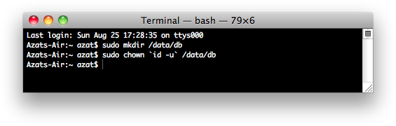
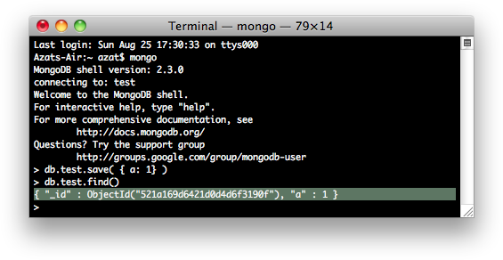

Chapter 5
---------
# Persistence with MongoDB and Mongoskin

NoSQL databases, also called _non-relational__databases_, are more horizontally scalable, usually open source, and better suited for distributed systems. NoSQL databases deal routinely with larger data sizes than traditional ones. The key distinction in implementation comes from the fact that relationships between database entities are not stored in the database itself (no more join queries); they are moved to the application or object-relational mapping (ORM) levels—in our case, to Node.js code. Another good reason to use NoSQL databases is that, because they are schemaless, they are perfect for prototyping and Agile iterations (more pushes!).

MongoDB is a document store NoSQL database (as opposed to key value and wide-column store NoSQL databases, [http://nosql-database.org/](http://nosql-database.org/)). It&#39;s the most mature and dependable NoSQL database available thus far. In addition to efficiency, scalability, and lightning speed, MongoDB uses JavaScript–like language for its interface! This alone is magical, because now there&#39;s no need to switch context between the front end (browser JavaScript), back end (Node.js), and database (MongoDB).

The company behind MongoDB (formerly 10gen, [http://en.wikipedia.org/wiki/10gen](http://en.wikipedia.org/wiki/10gen)) is an industry leader and provides education and certification through its online MongoDB University( [https://university.mongodb.com/](https://university.mongodb.com/)).

To get you started with MongoDB and Node.js, we examine the following in this chapter:

- Easy and proper installation of MongoDB

- How to run the Mongo server

- Data manipulation from the Mongo console

- MongoDB shell in detail

- Minimalistic native MongoDB driver for Node.js example

- Main Mongoskin methods

- Project: storing Blog data in MongoDB with Mongoskin

## Easy and Proper Installation of MongoDB

The following steps are better suited for Mac OS X/Linux–based systems, but with some modifications they can be used for Windows systems as well (i.e., `$PATH` variable, or the slashes). Next, we look at MongoDB installation from the official package, as well as using HomeBrew for Mac OS X users (recommended) . For non-Mac users, there are [many other ways to install](http://docs.mongodb.org/manual/installation/) (<http://docs.mongodb.org/manual/installation/>).

The HomeBrew installation is recommended and is the easiest path (assuming Mac OS X users have `brew` installed already, which was covered in Chapter 1): `$ brew install mongodb`. If this doesn&#39;t work, try the manual path described later./).

MongoDB can be downloaded at <http://www.mongodb.org/downloads>. For the latest Apple laptops, such as MacBook Air, select the OS X 64-bit version. The owners of older Macs should browse the link <http://dl.mongodb.org/dl/osx/i386>.

**Tip**  If you don&#39;t know the architecture type of your processor when choosing a MongoDB package, type `$ uname -p` in the command line to find this information.

Unpack the package into your web development folder (`~/*Documents/Development` or any other). If you want, you could install MongoDB into the `/usr/local/mongodb` folder.

_Optional:_ If you would like to access MongoDB commands from anywhere on your system, you need to add your `mongodb` path to the `$PATH` variable. For Mac OS X, you need the open-system `paths` file with

	$ sudo vi /etc/paths

Or, if you prefer TextMate:

	$ mate /etc/paths

Then, add the following line to the `/etc/paths` file:

	/usr/local/mongodb/bin

Create a data folder; by default, MongoDB uses `/data/db`. Please note this might be different in newer versions of MongoDB. To create the data folder, type and execute the following commands:

	$ sudo mkdir -p /data/db
	$ sudo chown `id -u` /data/db

Figure 5-1 shows how this looks onscreen.



***Figure 5-1.** Initial setup for MongoDB: create the data directory*

If you prefer to use `path` other than `/data/db`, you can specify it using the `--dbpath` option to `mongod` (main MongoDB service).

Detailed instructions for MongoDB installation on various OSs are available at MongoDB.org, &quot;[Install MongoDB on OS X](http://docs.mongodb.org/manual/tutorial/install-mongodb-on-os-x/)&quot;(http://docs.mongodb.org/manual/tutorial/install-mongodb-on-os-x/). For Windows users, there is a good walk-through article titled &quot;[Installing MongoDB](http://www.tuanleaded.com/blog/2011/10/installing-mongodb)&quot;(http://www.tuanleaded.com/blog/2011/10/installing-mongodb).

# How to Run the Mongo Server

To run the Mongo server, go to the folder where you unpacked MongoDB. That location should have a `bin` folder in it. From that folder, type the following command:

	$ ./bin/mongod

Or, if you added `$PATH` for the MongoDB location, type the following:

	$ mongod

**Note**        Don&#39;t forget to restart the terminal window after adding a new path to the `$PATH` variable (Figure 5-2).


***Figure 5-2.** Starting up the MongoDB server*

If you see something like

	MongoDB starting: pid =7218 port=27017...

this means the MongoDB database server is running. By default, it&#39;s listening at <http://localhost:27017>. This is the host and port for the scripts and applications to access MongoDB. However, there&#39;s a web GUI for humans. If you go to your browser and type <http://localhost:28017>, you should be able to see the version number, logs, and other useful information. In this case, the MongoDB server is using two different ports (27017 and 28017): one is primary (native) for communications with apps; the other is a web-based GUI for monitoring/statistics. In our Node.js code, we use 27017 only.

# Data Manipulation from the Mongo Console

Akin to the Node.js REPL, MongoDB has a console/shell that acts as a client to the database server instance. This means that we have to keep the terminal window with the server open and running while using the console in a different window/tab.

From the folder where you unpacked the archive, launch the `mongod` service with

	$ ./bin/mongod

Or, if you installed MongoDB globally (recommended), launch the `mongod` service with

	$ mongod

You should be able to see information in your terminal and in the browser at localhost:28017.

For the MongoDB shell, or `mongo`, launch in a new terminal window (_important!_) and, in the same folder, type the following command:

	$ ./bin/mongo

Open another terminal window in the same folder and execute

	$ ./bin/mongo

Or, if you installed `mongo` globally (recommended), type

	$ mongo

You should see something like this, depending on your version of the MongoDB shell:

	MongoDB shell version: 2.0.6
	connecting to: test

Then, type and execute

  	> db.test.save( { a: 1 } )
  	> db.test.find()

Figure 5-3 shows this. If you see that your record is being saved, then everything went well.



***Figure 5-3.** Running MongoDB client and storing sample data*

Commands `find` and `save` do exactly what you might think they do. ;-)

**Note**  On Max OS X (and most Unix systems), to close the process, use `control + c`. If you use `control + z`, it puts the process to sleep (or detaches the terminal window). In this case, you might end up with a lock on data files and then have to use the &quot;kill&quot; command (e.g., `$ killall node`) or Activity Monitor and delete the locked files in the data folder manually. For a vanilla Mac terminal, `command +` . is an alternative to `control + c`.

# MongoDB Shell in Detail

The most useful MongoDB shell commands are listed here:

- `> help`: prints a list of available commands

- `> show dbs`: prints the names of the databases on the database server to which the console is connected (by default, localhost:27017; but, if we pass params to `mongo`, we can connect to any remote instance)
 
- `> use db_name`: switches to `db_name`
 
- `> show collections`: prints a list of collections in the selected database
 
- `> db.collection_name.find(query);`: finds all items matching `query`
 
- `> db.collection_name.findOne(query);`: finds one item that matches `query`
 
- `> db.collection_name.insert(document)`: adds a document to the `collection_name` collection
 
- `> db.collection_name.save(document);`: saves a document in the `collection_name` collection—a shorthand of upsert (no `_id`) or insert (with `_id`)
 
- `> db.collection_name.update(query,{$set: data});`: updates items that match `query` in the `collection_name` collection with `data` object values
 
- `> db.collection_name.remove(query)`; removes all items from `collection_name` that match `query` criteria
 
- `> printjson(document);`: prints the variable `document`
 

It&#39;s possible to use good old JavaScript, for example, storing in variable:

      > var a = db.messages.findOne();
      > printjson(a);
      > a.text = "hi";
      > printjson(a);
      > db.messages.save(a);

1. For the purpose of saving time, the API listed here is the bare minimum to get by with MongoDB in this book and its projects. The real interface is richer and has more features. For example, `update` accepts options such as `multi: true`, and it&#39;s not mentioned here. A full overview of the MongoDB interactive shell is available at mongodb.org, &quot;[Overview— The MongoDB Interactive Shell](http://www.mongodb.org/display/DOCS/Overview+-+The+MongoDB+Interactive+Shell)&quot;(http://www.mongodb.org/display/DOCS/Overview+-+The+MongoDB+Interactive+Shell).

# Minimalistic Native MongoDB Driver for Node.js Example

To illustrate the advantages of Mongoskin, let&#39;s use [Node.js native driver for MongoDB](https://github.com/christkv/node-mongodb-native)(<https://github.com/christkv/node-mongodb-native>) first. We need to write a basic script that accesses the database.

First, however, let&#39;s install the MongoDB native driver for Node.js with

	$ npm install mongodb@1.3.23

Don&#39;t forget to include the dependency in the `package.json` file as well:

	{
      "name": "node-example",
      "version": "0.0.1",
	  "dependencies": {
	  "mongodb":"1.3.23",
	  ...
	  },
      "engines": {
        "node": ">=0.6.x"
      }
	}

This small example tests whether we can connect to a local MongoDB instance from a Node.js script and run a sequence of statements analogous to the previous section:

1. Declare dependencies

2. Define the database host and port

3. Establish a database connection

4. Create a database document

5. Output a newly created document/object

Here is the code to accomplish these five steps:

```javascript
var mongo = require('mongodb'),
	dbHost = '127.0.0.1',
	dbPort = 27017;

	var Db = mongo.Db;
	var Connection = mongo.Connection;
	var Server = mongo.Server;
	var db = new Db ('local', new Server(dbHost, dbPort), {safe:true});

	db.open(function (error, dbConnection) {
		if (error) {
			console.error(error);
	        	process.exit(1);
  		  }
	  	  console.log('db state: ', db._state);
  		  item = {
	    		name: 'Azat'
  	  	}
		dbConnection.collection('messages').insert(item, function (error, item) {
			if (error) {
	  			console.error(error);
				process.exit(1);
			}
			console.info('created/inserted: ', item);
			db.close();
			process.exit(0);
		});
	});
```

The full source code of this script is in the `mongo-native-insert.js` file. Another `mongo-native-insert.js` script looks up any object and modifies it:

1. Get one item from the `message` collection.

2. Print it.

3. Add a property text with the value `hi`.

4. Save the item back to the `message` collection.


After we install the library, we can include the MongoDB library in our `mongo-native.js` file:

	var util = require('util');
	var mongodb = require ('mongodb');

This is one of the ways to establish a connection to the MongoDB server, in which the `db` variable holds a reference to the database at a specified host and port:

	var mongo = require('mongodb'),
  	  dbHost = '127.0.0.1',
  	  dbPort = 27017;

	var Db = mongo.Db;
	var Connection = mongo.Connection;
	var Server = mongo.Server;
	var db = new Db ('local', new Server(dbHost, dbPort), {safe:true});

To open a connection, type the following:
```javascript
db.open(function (error, dbConnection) {
	//do something with the database here
	// console.log (util.inspect(db));
	console.log(db._state);
	db.close();
});
```

It&#39;s always a good practice to check for any errors and exit gracefully:

```javascript
db.open(function (error, dbConnection) {
	if (error) {
		console.error(error);
		process.exit(1);
	}
	console.log('db state: ', db._state);
```

Now we can proceed to the first step mentioned earlier—getting one item from the `message` collection. This document is in the `item` variable:
```javascript
	dbConnection.collection('messages').findOne({}, function (error, item) {
		if (error) {
			console.error(error);
			process.exit(1);
      		}
```

The second step, print the value, is as follows:
```javascript
		console.info('findOne: ', item);
```
As you can see, methods in the console and Node.js are not much different.

So let&#39;s proceed to the remaining two steps: adding a new property and saving the document:
```javascript
		item.text = 'hi';
		var id = item._id.toString(); // we can store ID in a string
		console.info('before saving: ', item);
		dbConnection.collection('messages').save(item, function (error, item) {
			console.info('save: ', item);
```
To double-check the saved object, we use the ObjectID that we saved before in a string format (in a variable `id`) with the `find` method. This method returns a cursor, so we apply `toArray()` to extract the standard JavaScript array:
```javascript
			dbConnection.collection('messages').find({_id: new mongo.ObjectID(id)}).toArray(function (error, items) {
				console.info('find: ', items);
				db.close();
      				process.exit(0);
			});
		});
  	});
});
```
The full source code of this script is available in the `mongo-native-insert.js` and `mongo-native.js` files. If we run them with `$ node mongo-native-insert` and, respectively, `$ node mongo-native`, while running the `mongod` service the scripts should output something similar to the results in Figure 5-4. There are three documents. The first is without the property text; the second and third documents include it.


***Figure 5-4.** Running a simple MongoDB script with a native driver*

The full documentation of this library is available at <http://mongodb.github.com/node-mongodb-native/api-generated/db.html> and on the MongoDB web site.

# Main Mongoskin Methods

Mongoskin provides a better API than the native MongoDB driver. To illustrate this, compare this code with the example written using native MongoDB driver for Node.js. As always, to install a module, run NPM with install—for example,`$ npm install mongoskin@0.6.1`.

The connection to the database is a bit easier:
```javascript
var mongoskin = require('mongoskin'),
dbHost = '127.0.0.1',
dbPort = 27017;

var db = mongoskin.db(dbHost + ':' + dbPort + '/local', {safe:true});
```
We can also create our own methods on collections. This might be useful when implementing an model-view-controller-like (MVC-like) architecture by incorporating app-specific logic into these custom methods:
```javascript
db.bind('messages', {
	findOneAndAddText : function (text, fn) {
		db.collection('messages').findOne({}, function (error, item) {
			if (error) {
				console.error(error);
				process.exit(1);
			}
			console.info('findOne: ', item);
			item.text = text;
			var id = item._id.toString(); // we can store ID in a string
			console.info('before saving: ', item);
			db.collection('messages').save(item, function (error, count) {
				console.info('save: ', count);
				return fn(count, id);
			});
		})
	}
});
```
Last, we call the custom method in a straightforward manner (presumably also used in many other places):
```javascript
db.collection('messages').findOneAndAddText('hi', function (count, id) {
	db.collection('messages').find({
		_id: db.collection('messages').id(id)
	}).toArray(function (error, items) {
		console.info("find: ", items);
		db.close();
		process.exit(0);
	});
});
```
Mongoskin is a subset of the native Node.js MongoDB driver, so most of the methods from the latter are available in the former. Here is the list of the main Mongoskin–only methods:

- `findItems(..., callback)`: finds elements and returns an array instead of a cursor

- `findEach(..., callback)`: iterates through each found element

- `findById(id, ..., callback)`: finds by `_id` in a string format

- `updateById(_id, ..., callback)`: updates an element with a matching `_id`

- `removeById(_id, ..., callback)`: removes an element with a matching `_id`

Alternatives to the native MongoDB driver and Mongoskin include:

- `mongoose`: an asynchronous JavaScript driver with optional support for modeling

- `mongolia`: a lightweight MongoDB ORM/driver wrapper

- `monk`: a tiny layer that provides simple yet substantial usability improvements for MongoDB use within Node.js

For data validation, these modules often used:

- `node-validator`: validates data

- `express-validator`: validates data in Express.js 3/4

# Project: Storing Blog Data in MongoDB with Mongoskin

Let&#39;s now return to our Blog project. I&#39;ve split this feature of storing Blog data in MongoDB with Mongoskin into the following three subprojects:

1. Adding MognoDB seed data

2. Writing Mocha tests

3. Adding persistence

## Project: Adding MongoDB Seed Data

First of all, it&#39;s not much fun to enter data manually each time we test or run an app. So, in accordance with the Agile principles, we can automate this step by creating a Bash seed data script `db/seed.sh`:

	mongoimport --db blog --collection users --file ./db/users.json –jsonArray
	mongoimport --db blog --collection articles --file ./db/articles.json --jsonArray

This script uses MongoDB&#39;s `mongoimport` feature, which inserts data conveniently into the database straight from JSON files.

The `users.json` file contains information about authorized users:

	[{
	   "email": "hi@azat.co",
  	   "admin": true,
  	   "password": "1"
	}]

The `articles.json` file has the content of the blog posts:

	[{
  	  "title": "Node is a movement",
      "slug": "node-movement",
      "published": true,
      "text": "In one random deployment, it is often assumed that the number of scattered sensors are more than that required by the critical sensor density. Otherwise, complete area coverage may not be guaranteed in this deployment, and some coverage holes may exist. Besides using more sensors to improve coverage, mobile sensor nodes can be used to improve network coverage..."
    }, {
      "title": "Express.js Experience",
      "slug": "express-experience",
      "text": "Work in progress",
      "published": false
    },{
      "title": "Node.js FUNdamentals: A Concise Overview of The Main Concepts",
      "slug": "node-fundamentals",
      "published": true,
  	  "text": "Node.js is a highly efficient and scalable nonblocking I/O platform that was built on top of a Google Chrome V8 engine and its ECMAScript. This means that most front-end JavaScript (another implementation of ECMAScript) objects, functions, and methods are available in Node.js. Please refer to JavaScript FUNdamentals if you need a refresher on JS-specific basics."
	  }]

To populate our seed data, simply run `$ ./db/seed.sh` from the project folder.

## Project: Writing Mocha Tests

We can import test data from seed files via `require` because it&#39;s a JSON format:

	var seedArticles = require('../db/articles.json');

Let&#39;s add this test to the home page suite to check whether our app shows posts from seed data on the front page:

     it('should contain posts', function(done) {
       superagent
         .get('http://localhost:'+port)
         .end(function(res){
           seedArticles.forEach(function(item, index, list){
             if (item.published) {
               expect(res.text).to.contain('<h2><a href="/articles/' + item.slug + '">' + item.title);
             } else {
               expect(res.text).not.to.contain('<h2><a href="/articles/' + item.slug + '">' + item.title);
             }
             // console.log(item.title, res.text)
           })
           done()
       })
     });

In a new-article page suite, let&#39;s test for presentation of the text with `contains`:

  	describe('article page', function(){
      it('should display text', function(done){
        var n = seedArticles.length;
        seedArticles.forEach(function(item, index, list){
          superagent
            .get('http://localhost:'+port + '/articles/' + seedArticles[index].slug)
            .end(function(res){
              if (item.published) {
                expect(res.text).to.contain(seedArticles[index].text);
              } else {
                expect(res.status).to.be(401);
              }
              // console.log(item.title)
              if (index + 1 === n ) {
                done();
              }
          })
        })
      })
  	})

To make sure that Mocha doesn&#39;t quit earlier than `superagent` calls the response callback, we implemented a countertrick. Instead of it, you can use async. The full source code is in the file `tests/index.js` under `ch5` folder.

Running tests with either `$ make test` or `$ mocha test` should fail miserably, but that&#39;s expected because we need to implement persistence and then pass data to Jade templates, which we wrote in the previous chapter.

## Project: Adding Persistence

This example builds on the previous chapter, with the chapter 3 having the latest code (chapter 4 code is in ch5). Let&#39;s go back to our `ch3` folder, and add the tests, duplicate them, and then start adding statements to the `app.js` file.

The full source code of this example is available under `ch5` folder. First, the dependencies inclusions need to be reformatted to utilize Mongoskin:

	var express = require('express'),
      routes = require('./routes'),
      http = require('http'),
      path = require('path'),
  	  mongoskin = require('mongoskin'),
      dbUrl = process.env.MONGOHQ_URL || 'mongodb://@localhost:27017/blog',
      db = mongoskin.db(dbUrl, {safe: true}),
      collections = {
        articles: db.collection('articles'),
        users: db.collection('users')
  	  };

These statements are needed for the Express.js 4 middleware modules:

	var session = require('express-session'),
  	  logger = require('morgan'),
  	  errorHandler = require('errorhandler'),
      cookieParser = require('cookie-parser'),
      bodyParser = require('body-parser'),
      methodOverride = require('method-override');

Then, our usual statements follow, i.e., creating of Express.js instance and assigning the title:

	var app = express();
	app.locals.appTitle = 'blog-express';

Now, we add a middleware that exposes Mongoskin/MongoDB collections in each Express.js route via the `req` object:

	app.use(function(req, res, next) {
  	  if (!collections.articles || ! collections.users) return next(new Error('No collections.'))
      req.collections = collections;
  	  return next();
	});

Don&#39;t forget to call `next()` in the previous middleware; otherwise, each request stalls.

We set up port number and template engine configurations:

	app.set('port', process.env.PORT || 3000);
	app.set('views', path.join(__dirname, 'views'));
	app.set('view engine', 'jade');

The configs now include more Connect/Express middleware, the meanings of most of which is to log requests, parse JSON input, use Stylus and server static content:

	app.use(logger('dev'));
	app.use(bodyParser.json());
	app.use(bodyParser.urlencoded());
	app.use(methodOverride());
	app.use(require('stylus').middleware(__dirname + '/public'));
	app.use(express.static(path.join(__dirname, 'public')));

For development, we use the standard Express.js 4 error handler that we imported earlier with `require`:

	if ('development' == app.get('env')) {
      app.use(errorHandler());
	}

The next sections of the `app.js` file deals with the server routes. So, instead of a single catch-all `*` route in the ch3 examples, we have the following GET, and POST routes (that mostly render HTML from Jade templates):

	//PAGES&amp;ROUTES
	app.get('/', routes.index);
	app.get('/login', routes.user.login);
	app.post('/login', routes.user.authenticate);
	app.get('/logout', routes.user.logout);
	app.get('/admin',  routes.article.admin);
	app.get('/post',  routes.article.post);
	app.post('/post', routes.article.postArticle);
	app.get('/articles/:slug', routes.article.show);

REST API routes are used mostly for the admin page. That&#39;s where our fancy AJAX browser JavaScript will need them. They use GET, POST, PUT and DELETE methods and don&#39;t render HTML from Jade templates, but instead output JSON:

	//REST API ROUTES
	app.get('/api/articles', routes.article.list)
	app.post('/api/articles', routes.article.add);
	app.put('/api/articles/:id', routes.article.edit);
	app.del('/api/articles/:id', routes.article.del);

In the end, we have a 404 catch-all route. It&#39;s a good practice to account for the cases when users type a wrong URL. If the request makes to this part of the configuration (top to bottom order), we return the &quot;not found&quot; status:

	app.all('*', function(req, res) {
      res.send(404);
	})

The way we start the server is the same as in Chapter 3:

	var server = http.createServer(app);
	var boot = function () {
  	  server.listen(app.get('port'), function(){
    	console.info('Express server listening on port ' + app.get('port'));
  	  });
	}
	var shutdown = function() {
  	  server.close();
	}
	if (require.main === module) {
  	  boot();
	}
	else {
  	  console.info('Running app as a module')
  	  exports.boot = boot;
   	  exports.shutdown = shutdown;
      exports.port = app.get('port');
	}

Again, for your convenience, the full source code of `app.js` is under `ch5` folder.

We must add `index.js`, `article.js`, and `user.js` files to the `routes` folder, because we need them in `app.js`. The `user.js` file is bare bones for now (we add authentications in Chapter 6).

The method for the `GET users` route, which should return a list of existing users (which we implement later) is as follows:

	exports.list = function(req, res){
  	  res.send('respond with a resource');
	};

The method for the `GET login page` route that renders the login form (`login.jade`) is as follows:

	exports.login = function(req, res, next) {
  	  res.render('login');
	};

The method for the `GET logout` route that eventually destroys the session and redirects users to the home page (to be implemented) is as follows:

	exports.logout = function(req, res, next) {
  	  res.redirect('/');
	};

The method for the `POST authenticate` route that handles authentication and redirects to the admin page (to be implemented) is as follows:

	exports.authenticate = function(req, res, next) {
  	  res.redirect('/admin');
	};

The full code of `user.js` is:

	/*
     * GET users listing.
  	 */
	
	exports.list = function(req, res){
  	  res.send('respond with a resource');
	};
	

	/*
 	 * GET login page.
 	 */
	
	exports.login = function(req, res, next) {
      res.render('login');
	};
	
	/*
     * GET logout route.
     */
	
	exports.logout = function(req, res, next) {
  	  
	  res.redirect('/');
	};


	/*
 	 * POST authenticate route.
 	 */
	
	exports.authenticate = function(req, res, next) {
  	  res.redirect('/admin');
	
	};

The most database action happens in the `article.js` routes.

Let&#39;s start with the GET article page where we call `findOne` with the slug from the `req.params` object:

	exports.show = function(req, res, next) {
  	  if (!req.params.slug) return next(new Error('No article slug.'));
  	  req.collections.articles.findOne({slug: req.params.slug}, function(error, article) {
    	if (error) return next(error);
    	if (!article.published) return res.send(401);
    	res.render('article', article);
  	  });
	};

The GET articles API route (used in the admin page), where we fetch all articles with the `find` method and convert the results to an array before sending them back to the requestee:

	exports.list = function(req, res, next) {
  	  req.collections.articles.find({}).toArray(function(error, articles) {
    	if (error) return next(error);
    	res.send({articles:articles});
  	  });
	};

The POST article API routes (used in the admin page), where the `insert` method is used to add new articles to the `articles` collection and to send back the result (with `_id` of a newly created item):

	exports.add = function(req, res, next) {
  	  if (!req.body.article) return next(new Error(&#39;No article payload.&#39;));
  	  var article = req.body.article;
  	  article.published = false;
  	  req.collections.articles.insert(article, function(error, articleResponse) {
    	if (error) return next(error);
    	res.send(articleResponse);
  	  });
	};

The PUT article API route (used on the admin page for publishing), where the `updateById` shorthand (the same thing can be done with a combination of `update` and `_id` query) method is used to set the article document to the payload of the request (`req.body`):

	exports.edit = function(req, res, next) {
  	  if (!req.params.id) return next(new Error('No article ID.'));
  	  req.collections.articles.updateById(req.params.id, {$set: req.body.article}, function(error, count) {
    	if (error) return next(error);
    	res.send({affectedCount: count});
  	  });
	};

The DELETE article API (used on the admin page) for removing articles in which, again, a combination of `remove` and `_id` can be used to achieve similar results:

	exports.del = function(req, res, next) {
  	  if (!req.params.id) return next(new Error('No article ID.'));
  	  req.collections.articles.removeById(req.params.id, function(error, count) {
    	if (error) return next(error);
    	res.send({affectedCount: count});
  	  });
	};

The GET article post page (page is a blank form):

	exports.post = function(req, res, next) {
  	  if (!req.body.title)
      res.render('post');
	};

Next, there&#39;s the POST article route for the post page form (the route that actually handles the post addition). In this route we check for the non-empty inputs (`req.body`), construct `article` object and inject it into the database via `req.collections.articles` object exposed to us by middleware. Lastly, we render HTML from the `post` template:

	exports.postArticle = function(req, res, next) {
  	  if (!req.body.title || !req.body.slug || !req.body.text ) {
    	return res.render('post', {error: 'Fill title, slug and text.'});
  	  }
  	  var article = {
    	title: req.body.title,
    	slug: req.body.slug,
    	text: req.body.text,
    	published: false
  	  };
  	  req.collections.articles.insert(article, function(error, articleResponse) {
    	if (error) return next(error);
    	res.render('post', {error: 'Artical was added. Publish it on Admin page.'});
  	  });
	};

The `GET admin page` route in which we fetch sorted articles (`{sort: {_id:-1}}`) and manipulate them:

	exports.admin = function(req, res, next) {
  	  req.collections.articles.find({},{sort: {_id:-1}}).toArray(function(error, articles) {
    	if (error) return next(error);
    	res.render('admin',{articles:articles});
  	  });
	}

**Note**  In real production apps that deal with thousands of records, programmers usually use pagination by fetching only a certain number of items at once (5, 10, 100, and so on). To do this, use the `limit` and `skip` options with the `find` method (e.g., HackHall example: https://github.com/azat-co/hackhall/blob/master/routes/posts.js#L37).

Here is the full `article.js` file:

	/*
 	 * GET article page.
 	 */
	
	exports.show = function(req, res, next) {
  	  if (!req.params.slug) return next(new Error('No article slug.'));
  	  req.collections.articles.findOne({slug: req.params.slug}, function(error, article) {
    	if (error) return next(error);
    	if (!article.published) return res.send(401);
    	res.render(&#39;article&#39;, article);
  	  });
	};


	/*
 	 * GET articles API.
 	 */
	
	exports.list = function(req, res, next) {
  	  req.collections.articles.find({}).toArray(function(error, articles) {
    	if (error) return next(error);
    	res.send({articles:articles});
  	  });
	};


	/*
     * POST article API.
     */
	
	exports.add = function(req, res, next) {
  	  if (!req.body.article) return next(new Error('No article payload.'));
  	  var article = req.body.article;
  	  article.published = false;
  	  req.collections.articles.insert(article, function(error, articleResponse) {
    	if (error) return next(error);
    	res.send(articleResponse);
  	  });
	};


	/*
     * PUT article API.
     */
	
	exports.edit = function(req, res, next) {
  	  if (!req.params.id) return next(new Error('No article ID.'));
  	  req.collections.articles.updateById(req.params.id, {$set: req.body.article}, function(error, count) {
    	if (error) return next(error);
    	res.send({affectedCount: count});
  	  });
	};
	
	/*
     * DELETE article API.
     */
	
	exports.del = function(req, res, next) {
  	  if (!req.params.id) return next(new Error('No article ID.'));
      req.collections.articles.removeById(req.params.id, function(error, count) {
    	if (error) return next(error);
    	res.send({affectedCount: count});
  	  });
	};


	/*
     * GET article POST page.
     */
	
	exports.post = function(req, res, next) {
      if (!req.body.title)
  	  res.render('post');
	};


	/*
 	 * POST article POST page.
 	 */

	exports.postArticle = function(req, res, next) {
  	  if (!req.body.title || !req.body.slug || !req.body.text ) {
        return res.render('post', {error: 'Fill title, slug and text.'});
  	  }
  	  var article = {
    	title: req.body.title,
    	slug: req.body.slug,
    	text: req.body.text,
    	published: false
  	  };
  	  req.collections.articles.insert(article, function(error, articleResponse) {
    	if (error) return next(error);
    	res.render('post', {error: 'Artical was added. Publish it on Admin page.'});
  	  });
	};


	/*
 	 * GET admin page.
     */
	
	exports.admin = function(req, res, next) {
  	  req.collections.articles.find({},{sort: {_id:-1}}).toArray(function(error, articles) {
    	if (error) return next(error);
    	res.render('admin',{articles:articles});
  	  });
	}

From the project section in Chapter 4, we have the jade files under the `views` folder. Last, the `package.json` file looks as follows:

	{
  	  "name": "blog-express",
  	  "version": "0.0.5",
  	  "private": true,
  	  "scripts": {
    	"start": "node app.js",
    	"test": "mocha test"
  	  },
  	  "dependencies": {
        "express": "4.1.2",
        "jade": "1.3.1",
        "stylus": "0.44.0",
        "mongoskin": "1.4.1",
        "cookie-parser": "1.0.1",
        "body-parser": "1.0.2",
        "method-override": "1.0.0",
        "serve-favicon": "2.0.0",
        "express-session": "1.0.4",
        "morgan": "1.0.1",
        "errorhandler": "1.0.1"
  	  },
  	  "devDependencies": {
        "mocha": "1.16.2",
        "superagent": "0.15.7",
        "expect.js": "0.2.0"
  	  }
	}

For the admin page to function, we need to add some AJAX-iness in the form of the `js/admin.js` file under the `public` folder.

In this file, we use `ajaxSetup` to configure all requests:

	$.ajaxSetup({
  	  xhrFields: {withCredentials: true},
  	  error: function(xhr, status, error) {
    	$('.alert').removeClass('hidden');
    	$('.alert').html('Status: ' + status + ', error: ' + error);
  	  }
	});

The function `findTr` is a helper that we can use in our event handlers:

	var findTr = function(event) {
  	  var target = event.srcElement || event.target;
  	  var $target = $(target);
  	  var $tr =  $target.parents('tr');
  	  return $tr;
	};

Overall, we need three event handlers to remove, publish, and unpublish an article. This following code snippet is for removing, and it simply sends a request to our Node.js API route `/api/articles/:id`, which we wrote a page or two ago:

	var remove = function(event) {
  	  var $tr = findTr(event);
  	  var id = $tr.data('id');
  	  $.ajax({
      	url: '/api/articles/' + id,
    	type: 'DELETE',
    	success: function(data, status, xhr) {
      	  $('.alert').addClass('hidden');
          $tr.remove();
    	}
  	  })
	};

Publishing and unpublishing are coupled together, because they both send `PUT` to `/api/articles/:id`:

	var update = function(event) {
  	  var $tr = findTr(event);
  	  $tr.find('button').attr('disabled', 'disabled');
  	  var data = {
    	published: $tr.hasClass('unpublished')
  	  };
  	  var id = $tr.attr('data-id');
  	  $.ajax({
    	url: '/api/articles/' + id,
    	type: 'PUT',
    	contentType: 'application/json',
    	data: JSON.stringify({article: data}),
    	success: function(dataResponse, status, xhr) {
      	  $tr.find('button').removeAttr('disabled');
      	  $('.alert').addClass('hidden');
      	  if (data.published) {
        	$tr.removeClass('unpublished').find('.glyphicon-play').removeClass('glyphicon-play').addClass('glyphicon-pause');
      	 } else {
           $tr.addClass('unpublished').find('.glyphicon-pause').removeClass('glyphicon-pause').addClass('glyphicon-play');
      	 }
        }
      })
	};

Then, we attach event listeners in the `ready` callback:

	$(document).ready(function(){
  	  var $element = $('.admin tbody');
  	  $element.on('click', 'button.remove', remove);
  	  $element.on('click', 'button', update);
	})

The full source code of the front-end `admin.js` file is as follows:

	$.ajaxSetup({
  	  xhrFields: {withCredentials: true},
  	  error: function(xhr, status, error) {
    	$('.alert').removeClass('hidden');
    	$('.alert').html('Status: ' + status + ', error: ' + error);
  	  }
	});
	
	var findTr = function(event) {
  	  var target = event.srcElement || event.target;
  	  var $target = $(target);
  	  var $tr =  $target.parents('tr');
  	  return $tr;
	};
	
	var remove = function(event) {
  	  var $tr = findTr(event);
  	  var id = $tr.data('id');
  	  $.ajax({
    	url: '/api/articles/' + id,
    	type: 'DELETE',
    	success: function(data, status, xhr) {
      	  $('.alert').addClass('hidden');
      	  $tr.remove();
    	}
  	  })
	};
	
	var update = function(event) {
      var $tr = findTr(event);
  	  $tr.find('button').attr('disabled', 'disabled');
  	  var data = {
        published: $tr.hasClass('unpublished')
  	  };
  	  var id = $tr.attr('data-id');
  	  $.ajax({
    	url: '/api/articles/' + id,
    	type: 'PUT',
    	contentType: 'application/json',
    	data: JSON.stringify({article: data}),
    	success: function(dataResponse, status, xhr) {
      	  $tr.find('button').removeAttr('disabled');
      	  $('.alert').addClass('hidden');
      	  if (data.published) {
        	$tr.removeClass('unpublished').find('.glyphicon-play').removeClass('glyphicon-play').addClass('glyphicon-pause');
      	  } else {
        	$tr.addClass('unpublished').find('.glyphicon-pause').removeClass('glyphicon-pause').addClass('glyphicon-play');
      	  }
    	}
  	 })
	};
	
	$(document).ready(function(){
  	  var $element = $('.admin tbody');
  	  $element.on('click', 'button.remove', remove);
  	  $element.on('click', 'button', update);
	})

## Running the App

To run the app, simply execute `$ node app`, but if you want to seed and test it, execute `$ make db` and `$ make test`, respectively (Figure 5-5). Don&#39;t forget that `$ mongod` service must be running on the localhost and port 27017. The expected result is that all tests now pass (hurray!), and if users visit <http://localhost:3000>, they can see posts and even create new ones on the admin page (<http://localhost:3000/admin>) as shown in Figure 5-6.


***Figure 5-5.** The results of running Mocha tests*


***Figure 5-6.** The admin page with seed data*

Of course, in real life, nobody leaves the admin page open to the public. Therefore, in Chapter 6 we&#39;ll implement session-based authorization, and password and OAuth authentications.

# Summary

In this chapter we learned how to install MongoDB, and use its console and native Node.js driver, for which we wrote a small script and refactored it to see Mongoskin in action. Last, we wrote tests, seeded scripts, and implemented the persistence layer for Blog. In the next chapter, we&#39;ll implement authorization and authentication.

