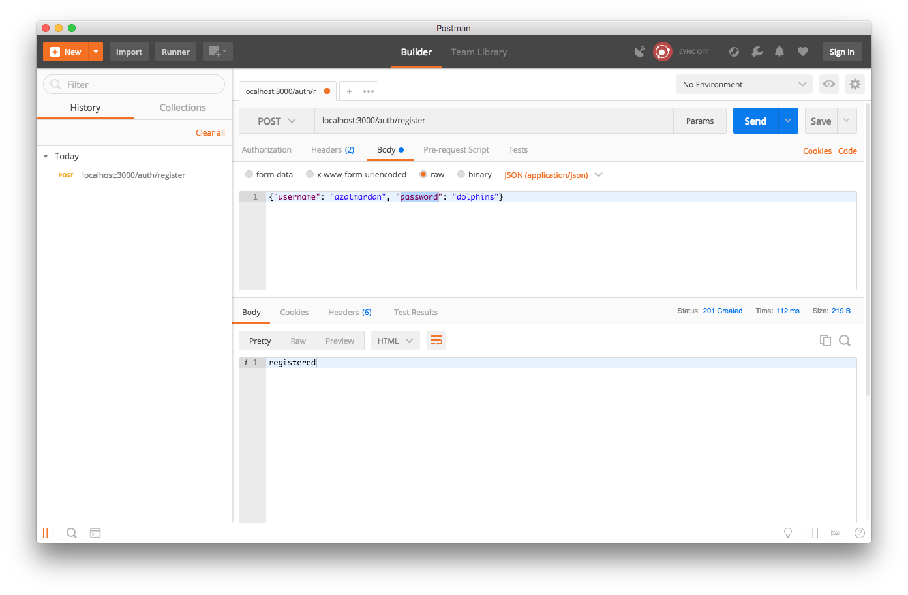
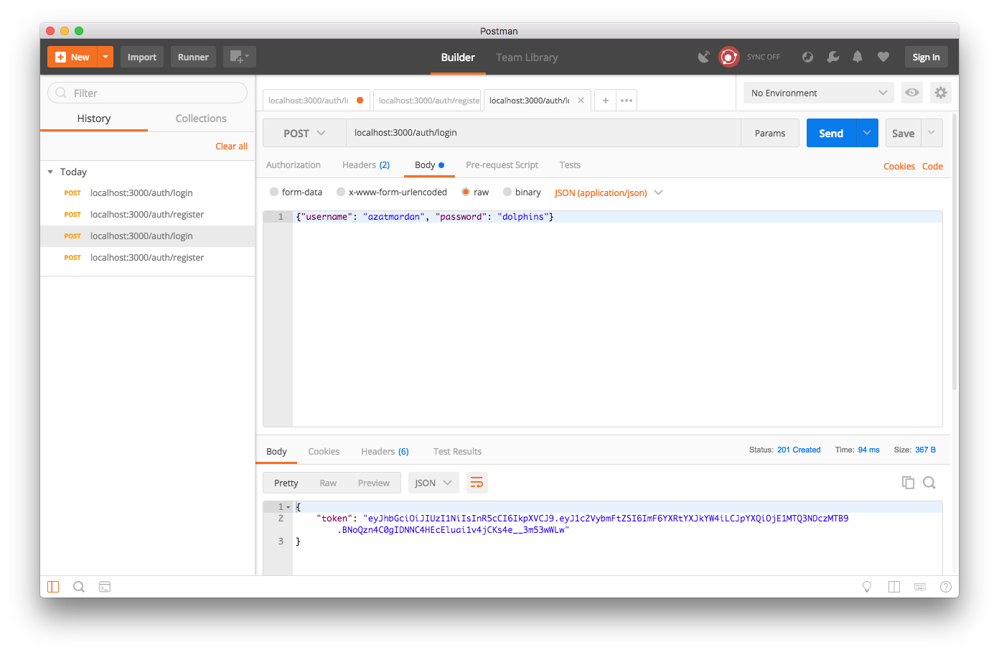
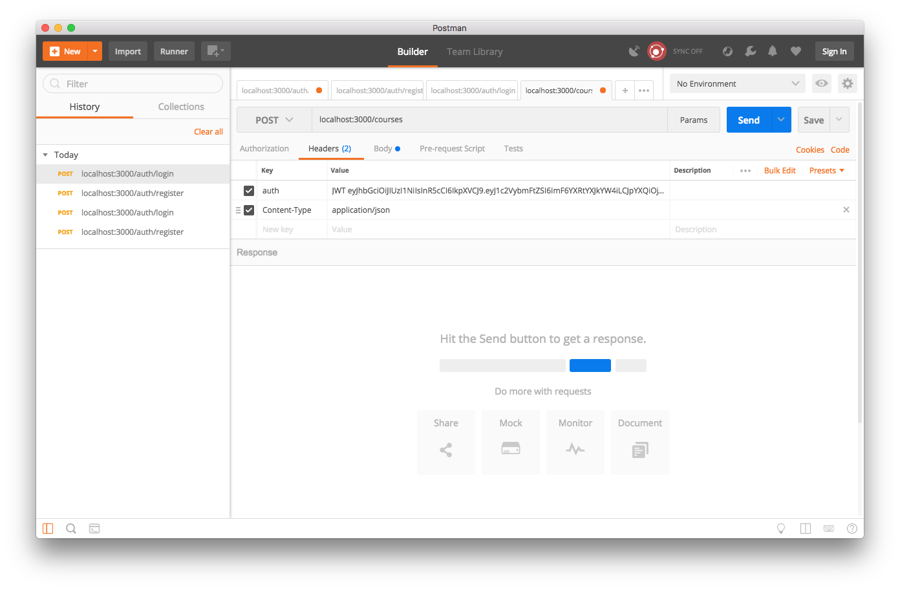
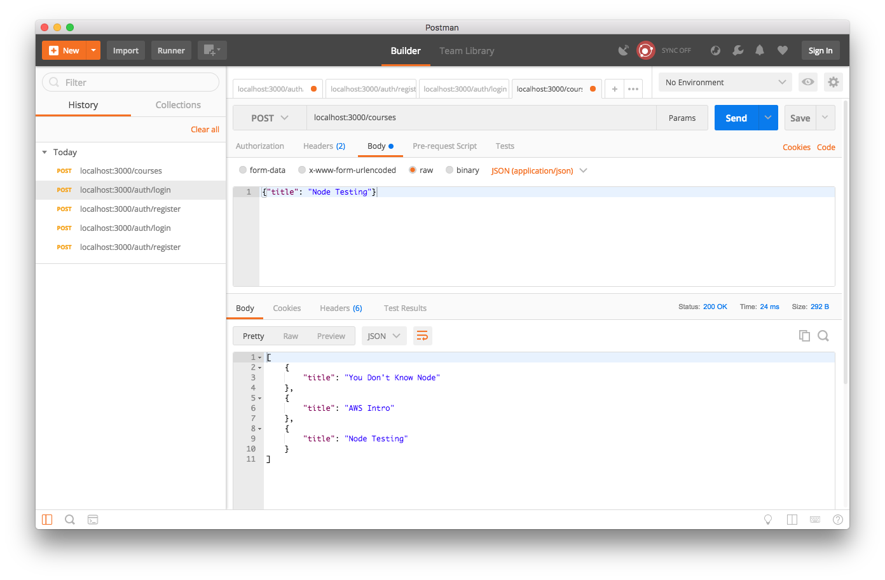
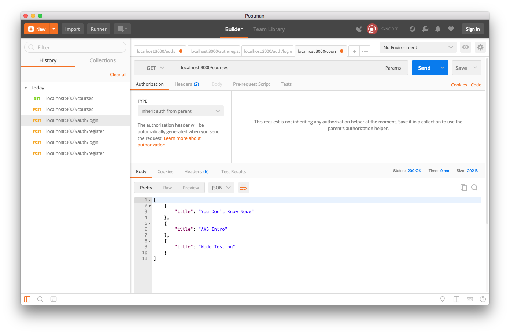
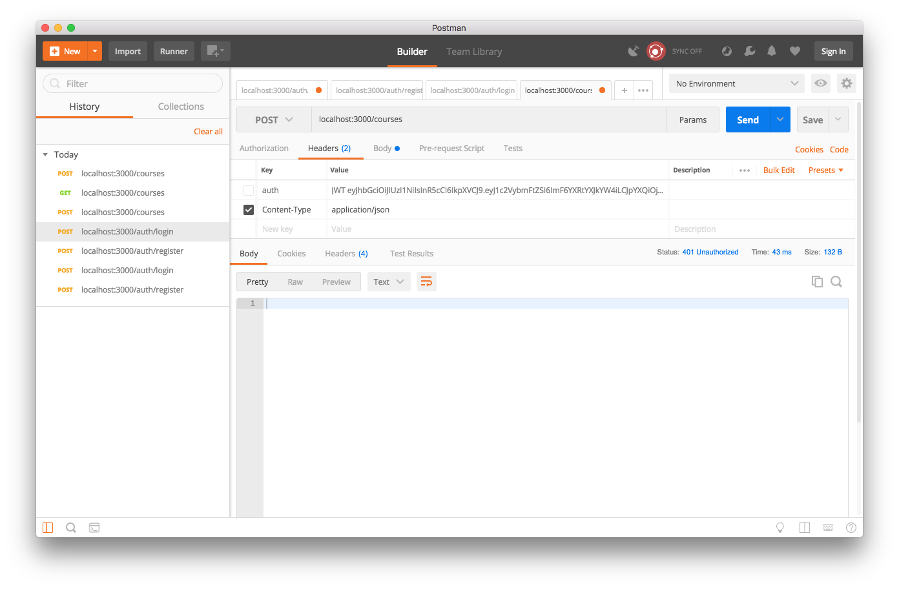

Chapter 6
---------
 # Security and Auth in Node.js

You know that security is an important aspect of any real-world web application. This is especially true nowadays, because our apps don’t function in silos anymore. What if I tell you that you don't have to spend days studying for security certifications or read sketchy dark-web hacker forums to implement a secure Node app? I'll show you a few tricks.

We can makes our apps and communications secure by using various approaches, such as token-based authentication and/or OAuth (<http://oauth.net>). We can leverage numerous third-party services (e.g., Google, Twitter, GitHub) or become service providers ourselves (e.g., provide a public API). 
 
 In this practical book, I dedicate the whole chapter to matters of authorization, authentication, OAuth, and best practices. We'll look at the following topics:

- Authorization with Express.js middleware
- Token-based authentication
- Session-based authentication
- Project: Adding email and password login to Blog
- Node.js OAuth
- Project: Adding Twitter OAuth 1.0 sign-in to Blog with Everyauth (<https://github.com/bnoguchi/everyauth>)

# Authorization with Express.js Middleware

Authorization in web apps usually means restricting certain functions to privileged clients. These functions can either be methods, pages, or REST API endpoints.

Express.js middleware allows us to apply certain rules seamlessly to all routes, groups of routes (namespacing), or individual routes.

- *All routes*: `app.get('*', auth)`
- *Groups of routes*: `app.get('/api/*', auth)`
- *Individual routes*: `app.get('/admin/users', auth)`

For example, if we want to protect all `/api/` endpoints, we utilize the following middleware with `*`:

```js
app.all('/api/*', auth)
app.get('/api/users', users.list)
app.post('/api/users', users.create)
```    

Interestingly enough, `app.all()` with a URL pattern and an `*` is functionally the same as utilizing `app.use()` with a URL in a sense that they both will be triggered only on those URLs that are matching the URL pattern:

```js
app.use('/api', auth)
```

Another way of doing the same thing is to use `auth` middleware on each route which requires it:

```js
app.get('/', home) // no Auth needed
app.get('/api/users', auth, users.list) // Auth needed
app.post('/api/users', auth, users.create) // Auth needed
```

In the previous examples, `auth()` is a function with three parameters: `req`, `res`, and `next`. For example in this middleware, you can call the OAuth service or query a database to get the user profile to *authorize* it (check for permissions) or to check for JWT (JSON Web Tokens) or web session to *authenticate* the user (check who it is). Or, most likely, do both!

```js
const auth = (req, res, next) => {
  // ...
  // Assuming you get user profile and user.auth is true or false
  if (user.auth) return next()
  else next(new Error('Not authorized')) // or res.send(401)
}
```

The `next()` part is important, because this is how Express.js proceeds to execute subsequent request handlers and routes (if there’s a match in a URL pattern). If `next()` is invoked without anything, then the normal execution of the server will proceed. That is Express will go to the next middleware and then to the routes that match the URL. 

If `next()` is invoked with an error object such as `next(new Error('Not authorized'))`, then Express will jump straight to the first error handler, and none of the subsequent middleware or routes will be executed.

# Token-Based Authentication

For applications to know which privileges a specific client has (e.g., admin), we must add an authentication step. In the previous example, this step went inside the `auth()` function.

The most common authentication is a cookie&session–based authentication, and the next section deals with this topic. However, in some cases, more REST-fulness is required, or cookies/sessions are not supported well (e.g., mobile). In this case, it’s beneficial to authenticate each request with a token (probably using the OAuth2.0 (<http://tools.ietf.org/html/rfc6749>) scheme). The token can be passed in a query string or in HTTP request headers. Alternatively, we can send some other authentication combination of information, such as email/username and password, or API key, or API password, instead of a token.

In our example of token-based authentication, each request can submit a token in a query string (accessed via `req.query.token`). And if we have the correct value stored somewhere in our app (database, or in this example just a constant `SECRET_TOKEN`), we can check the incoming token against it. If the token matches our records, we call `next()` to proceed with the request executions; if not, then we call `next(error)`, which triggers Express.js error handler execution (see the upcoming note):

```js
const auth = (req, res, next) => {
  if (req.query.token && token === SECRET_TOKEN) {
    // client is fine, proceed to the next route
    return next()
  } else {
    return  next(new Error('Not authorized'))
      // or res.send(401)
  }
}
```


In a more realistic example, we use API keys and secrets to generate HMAC-SHA1 (hash-based message authentication code—secure hash algorithm strings), and then compare them with the value in `req.query.token`.

**Note** Calling `next()` with an error argument is analogous to throwing in the towel (i.e., giving up). The Express.js app enters the error mode and proceeds to the error handlers.

We just covered the token-based authentication, which is often used in REST APIs. But user-facing web apps (i.e., browser-enabled users & consumers) often use with cookies. We can use cookies to store and send session IDs with each request. 

Cookies are similar to tokens, but require less work for us, the developers! This approach is the cornerstone of session-based authentication. The session-based method is the recommended way for basic web apps, because browsers already know what to do with session headers. In addition, in most platforms and frameworks, the session mechanism is built into the core. So, let’s jump straight into session-based authentication with Node.js.

# JSON Web Token (JWT) Authentication

Developers use JSON Web Tokens (JWT) to encrypted data, which is then stored on the client. JWTs have all the any information unlike regular tokens (API keys or OAuth access tokens), which are more like passwords. Thus, JWTs remove the need for a database to store user information. 

In my opinion, JWT is less secure than web sessions. This is because web sessions store the data on the server (usually in a database) and only store a session ID on the client. Despite JWT using encryption, anyone can break any encryption given enough time and processing power.

Nevertheless, JWT is a very common technique that frontend web apps developers use. JWTs eliminate the need for the server-side database or a store. All info is in this token, which has three parts: header, payload and signature. Whereas the structure of JWT is the same, the encryption method can vary depending on what a developer's choice: HS256, RS512, ES384, and so on. I'm always paranoid about security, so the stronger the algorithm, the better. RS512 will be good for most of the cases circa 2020.

To implement a simple JWT login, let's use the `jsonwebtoken` library for signing tokens and `bcrypt` for hashing passwords. When a client wants to create an account, the system takes the password and hashes it asynchronously so as not to block the server from processing other requests The slower the hashing, the worse for attackers and the better for you. For example, this is how to get the password from the incoming request body and store the hash into the `users` array using 10 rounds of hashing, which is good enough:

```js
app.post('/auth/register', (req, res) => {
    bcrypt.hash(req.body.password, 10, (error, hash)=>{
      if (error) return res.status(500).send()
      users.push({
        username: req.body.username,
        passwordHash: hash
      })
      res.status(201).send('registered')
    })
  })
``` 


Once the user record is created (which has the hash), we can log in users to exchange the username and password for the JWT. They'll use this JWT for all other requests like a special key to authenticate and maybe unlock protected and restricted resources (that's *authorization* because not all users will have access to all the restricted resources).

The GET route is not a protected route, but POST is a protected one, because there's an extra `auth` middleware there that will check for the JWT:

```js
app.get('/courses', (req, res) => {
    res.send(courses)
  })
app.post('/courses', auth, (req, res) => {
    courses.push({title: req.body.title})
    res.send(courses)
  })
```  

The login route checks for the presence of this username in the `users` array but this can be a database call or a call to another API, not a simple `find()` method. Next, `bcrypt` has a `compare()` method that asynchronously compares the hash with the plain password. If they match (`matched == true`), then `jwt.sign()` will issue a signed (encrypted) token that has the username in it. (It can have many other fields, not just one field.) 

```js
app.post('/auth/login', (req, res) => {
    const foundUser = users.find((value, index, list) => {
      if (value.username === req.body.username) return true
      else return false
    })
    if (foundUser) {
      bcrypt.compare(req.body.password, foundUser.passwordHash, (error, matched) => {
        if (!error && matched) {
          res.status(201).json({token: jwt.sign({ username: foundUser.username}, SECRET)})
        } else res.status(401).send()
      })
    } else res.status(401).send()
  })
```

JWT uses a special value `SECRET` to encrypt the data. Preferably when the app goes to production, an environment variable or a public key will populate the `SECRET` value. However now, `SECRET` is just a hard-coded `const` string. 

When you get this JWT, you can make requests to POST `/courses`. The `auth`, which checks for JWT, uses the `jwt` module and the data from the headers. I use the `auth` header name. The name of the header doesn't matter as long as you use the same name on the server and on the client. For the server, I set the header name in the `auth` middleware. 

Some developers like to use `Authorization`, but it's confusing to me since we're not authorizing, but authenticating. The authorization, which controls who can do what, is happening in the Node middleware. Here, we are performing authentication, which identifies who is this.

My `auth` header will look like this `JWT TOKEN_VALUE`. Ergo, to extract the token value out of the header, I use a string function `split(' ')`:

```js
const auth = (req, res, next) => {
  if (req.headers && req.headers.auth && req.headers.auth.split(' ')[0] === 'JWT') {
    jwt.verify(req.headers.auth.split(' ')[1], SECRET, (error, decoded) => {
      if (error) return res.status(401).send()
      req.user = decoded
      console.log('authenticated as ', decoded.username)
      next()
    })
  }
  else return res.status(401).send()
}
```

You can play with the full working and tested code in `code/ch6/jwt-example`. I like to use CURL, but most of my Node workshop attendees like Postman (a cross-platform GUI app), so in Figure 6-2 I show how to use Postman to extract the JWT (on login). And Figure 6-3 uses the token on POST `/courses` by having the token in the header `auth` after JWT with a space (`JTW TOKEN_VALUE`).

We finished the implementation. Now test the JWT example with these step-by-step instructions in CURL, Postman or any other HTTP client:

1. GET `/courses` will return a list of two courses that are hard-coded in `server.js`.
2. POST `/courses` with JSON data `{"title": "blah blah blah"}` will return 401 Not Authorized. Now we know that this is a protected route, and we need to create a new user to proceed.
3. POST `/auth/register` with username and password will create a new user, as shown in Figure 6-1. Next we can log in to the server to get the token.
4. POST `/auth/login` with username and password that match the existing records will return JWT, as shown in Figure 6-2.
5. POST `/courses` with title and JWT from step 4 in the `auth` header will create a new course (response status 201), as shown in Figures 6-3 and 6-4.
6. GET `/courses` will show your new title. Verify it. No need for JWT for this request, but it won't hurt either. Figure 6-5.
7. Celebrate and get a cup of tea with a (paleo) cookie 🍪.


***Figure 6-1.** Registering a new user by sending JSON payload*


***Figure 6-2.** Logging in to get JWT *

Don't forget to select `raw` and `application/json` when registering (POST `/auth/register`) and when making other POST requests. And now that you saw my password, please don't hack my accounts (<https://github.com/danielmiessler/SecLists/pull/155>).


***Figure 6-3.** Using JWT in the header auth*


***Figure 6-4.** 200 status for the new course request with JWT in the header and the JSON payload*


***Figure 6-5.** Verifying new course*

Finally, you can uncheck the `auth` header that has the JWT value and try to make another POST `/courses` request, as shown in Figure 6-6. The request will fail miserably (401), as it should because there's no JWT this time (see `auth` middleware in `server.js`).


***Figure 6-6.** Unchecking auth header with JWT leads to 401 as expected*


JWT is easy to implement. Developers don't need to create and maintain a shared database for the services. That's the main benefit. Clients get JWTs after the login request. 

Once on the client, client code stores JWT in browser or mobile local storage or cookies (also in the browser). React, Vue, Elm, or Angular front-end apps send this token with each request. If you plan to use JWT, it's important to protect your secret and to pick a strong encryption algorithm to make it harder for attackers to hack your JWT data. 

If you ask me, sessions are more secure because with sessions I store my data *on the server* instead of on the client. Let's talk about sessions.

# Session-Based Authentication

Session-based authentication is done via the `session` object in the request object `req`. A web session in general is a secure way to store information about a client so that subsequent requests from that same client can be identified.

In the main Express.js file, we'll need to import (`require()`) two modules to enable sessions. We need to include and use `cookie-parser` and `express-session`: 

1. `express.cookieParser()`: Allows for parsing of the client/request cookies
2. `express.session()`: Exposes the `res.session` object in each request handler, and stores data in the app memory or some other persistent store like MongoDB or Redis

Note: in `express-session` version 1.5.0 and higher, there's no need to add the `cookie-parser` middleware. In fact, it might lead to some bad behavior. So it's recommended to use `express-sesison` by itself because it will parse and read cookie by itself.

Needless to say, `cookie-parser` and `express-session` must be installed via npm into the project's `node_modules` folder. You can install them with: 

```
npm i cookie-parser express-session -SE
```

In the main Express file such as `app.js` or `server.js`, import with `require()` and apply to the Express app with `app.use()`:

```js
const cookieParser = require('cookie-parser')
const session = require('express-session')
...
app.use(cookieParser())
app.use(session())
```


The rest is straightforward. We can store any data in `req.session` and it appears automagically on each request from the same client (assuming their browser supports cookies). Hence, the authentication consists of a route that stores some flag (true/false) in the session and of an authorization function in which we check for that flag (if true, then proceed; otherwise, exit). For example to log in, we set the property `auth` on the `session` to `true`. The `req.session.auth` value will persist on future requests from the same client.

```js
app.post('/login', (req, res, next) => {
  if (checkForCredentials(req)) {  
  // checkForCredentials checks for credentials passed in the request's payload
    req.session.auth = true
    res.redirect('/dashboard') // Private resource
  } else {
    res.status(401).send() // Not authorized
  }
})
```

**Warning** Avoid storing any sensitive information in cookies. The best practice is not to store any info in cookies manually—except session ID, which Express.js middleware stores for us automatically—because cookies are not secure. Also, cookies have a size limitation that is very easy to reach and which varies by browser with Internet Explore having the smallest limit.

By default, Express.js uses in-memory session storage. This means that every time an app is restarted or crashes, the sessions are wiped out. To make sessions persistent and available across multiple servers, we can use a database such as Redis or MongoDB as a session store that will save the data on restarts and crashes of the servers. 

In fact, having Redis for the session store is one of the best practices that my team and I used at Storify and DocuSign. Redis provided one source of truth for the session data among multiple servers. Our Node apps were able to scale up well because they were stateless. We also used Redis for caching due to its efficiency.

# Project: Adding E-mail and Password Login to Blog

To enable session-based authentication in Blog, we need to do the following:

1. Import and add the session middleware to the configuration part of `app.js`.
2. Implement the authorization middleware `authorize` with a session-based authorization so we can reuse the same code for many routes.
3. Add the middleware from step 2 to protected pages and routes in `app.js` routes, e.g., `app.get('/api/, authorize, api.index)`.
4. Implement an authentication route POST `/login`, and a logout route, GET `/logout`, in `user.js`.

We will start with the session middleware.

## Session Middleware

Let’s add the automatic cookie parsing and support for session middleware in these two lines by putting them in the middle of configurations in `app.js`:

```js
const cookieParser = require('cookie-parser')
const session = require('express-session')
// Other middleware
app.use(cookieParser('3CCC4ACD-6ED1-4844-9217-82131BDCB239'))
app.use(session({secret: '2C44774A-D649-4D44-9535-46E296EF984F'}))
// Routes
```

**Warning** You should replace randomly generated values with your own ones.

`session()` must be preceded by `cookieParser()` because session depends on cookies to work properly. For more information about these and other Express.js/Connect middleware, refer to *Pro Express.js 4* (Apress, 2014).

Beware of another cookie middleware. It's name is `cookie-sesison` and it's not as secure as `cookie-parser` with `express-session`. This is because `cookie-session` stores all information in the cookie, not on the server. `cookie-session` can be used in some cases but I do not recommend it. The usage is to import the module and to apply it to the Express.js `app`:

```js
const cookieSession = require('cookie-session')
app.use(cookieSession({secret: process.env.SESSION_SECRET}))
``` 

Again, the difference is that `express-session` uses secure in-memory or Redis storage—and cookies store only for the session ID, i.e., `sid`—whereas `cookie-session` uses browser cookies to store session information. In other words, the entire session is serialized into cookie-based storage, not just the session key. This approach should be avoided because of cookie size limitations and security concerns.

It’s useful to pass request authentication information to the templates. We can do so by adding middleware that checks the `req.session.admin` value for truthyness and adds an appropriate property to `res.locals`:

```js
app.use(function(req, res, next) {
  if (req.session && req.session.admin)
    res.locals.admin = true
  next()
})
```

Let's add authorization to the Blog project.

## Authorization in Blog

Authorization is also done via middleware, but we won’t set it up right away with `app.use()` like we did in the snippet for `res.locals`. Instead, we define a function that checks for `req.session.admin` to be true, and proceeds if it is. Otherwise, the 401 Not Authorized error is thrown, and the response is ended.

```js
// Authorization
const authorize = (req, res, next) => {
  if (req.session && req.session.admin)
    return next()
  else
    return res.send(401)
}
```    

Now we can add this middleware to certain protected endpoints (another name for routes). Specifically, we will protect the endpoints to see the admin page (GET `/admin`), to create a new article (POST `/post`), and to see the create new article page (GET `/post`):

```js
app.get('/admin', authorize, routes.article.admin)
app.get('/post', authorize, routes.article.post)
app.post('/post', authorize, routes.article.postArticle)
```

We add the authorize middleware to API routes as well... to *all* of them, using `app.all()`:

```js
app.all('/api', authorize)
app.get('/api/articles', routes.article.list)
app.post('/api/articles', routes.article.add)
app.put('/api/articles/:id', routes.article.edit)
app.delete('/api/articles/:id', routes.article.del)
```

The `app.all('/api', authorize)` statement is a more compact alternative to adding `authorize` to all `/api/...` routes manually. Less copypasta and more code reuse, please.

I know a lot of readers like to see the entire source code. Thus, the full source code of the `app.js` file after adding session support and authorization middleware is as follows (under the `ch6/blog-password` folder):

```js
const express = require('express')
const routes = require('./routes')
const http = require('http')
const path = require('path')
const mongoskin = require('mongoskin')
const dbUrl = process.env.MONGOHQ_URL || 'mongodb://@localhost:27017/blog'

const db = mongoskin.db(dbUrl)
const collections = {
  articles: db.collection('articles'),
  users: db.collection('users')
}

const cookieParser = require('cookie-parser')
const session = require('express-session')
const logger = require('morgan')
const errorHandler = require('errorhandler')
const bodyParser = require('body-parser')
const methodOverride = require('method-override')

const app = express()
app.locals.appTitle = 'blog-express'

// Expose collections to request handlers
app.use((req, res, next) => {
  if (!collections.articles || !collections.users) return next(new Error('No collections.'))
  req.collections = collections
  return next()
})

// Express.js configurations
app.set('port', process.env.PORT || 3000)
app.set('views', path.join(__dirname, 'views'))
app.set('view engine', 'pug')

// Express.js middleware configuration
app.use(logger('dev'))
app.use(bodyParser.json())
app.use(bodyParser.urlencoded({extended: true}))
app.use(methodOverride())
app.use(require('stylus').middleware(path.join(__dirname, 'public')))
app.use(express.static(path.join(__dirname, 'public')))
app.use(cookieParser('3CCC4ACD-6ED1-4844-9217-82131BDCB239'))
app.use(session({secret: '2C44774A-D649-4D44-9535-46E296EF984F',
  resave: true,
  saveUninitialized: true}))

// Authentication middleware
app.use((req, res, next) => {
  if (req.session && req.session.admin) { 
    res.locals.admin = true 
  }
  next()
})

// Authorization Middleware
const authorize = (req, res, next) => {
  if (req.session && req.session.admin)
    return next()
  else
    return res.status(401).send()
}

if (app.get('env') === 'development') {
  app.use(errorHandler())
}

// PAGES&ROUTES
app.get('/', routes.index)
app.get('/login', routes.user.login)
app.post('/login', routes.user.authenticate)
app.get('/logout', routes.user.logout)
app.get('/admin', authorize, routes.article.admin)
app.get('/post', authorize, routes.article.post)
app.post('/post', authorize, routes.article.postArticle)
app.get('/articles/:slug', routes.article.show)

// REST API ROUTES
app.all('/api', authorize)
app.get('/api/articles', routes.article.list)
app.post('/api/articles', routes.article.add)
app.put('/api/articles/:id', routes.article.edit)
app.delete('/api/articles/:id', routes.article.del)

app.all('*', function (req, res) {
  res.status(404).send()
})

// http.createServer(app).listen(app.get('port'), function(){
  // console.log('Express server listening on port ' + app.get('port'));
// });

const server = http.createServer(app)
const boot = function () {
  server.listen(app.get('port'), function () {
    console.info(`Express server listening on port ${app.get('port')}`)
  })
}
const shutdown = function () {
  server.close(process.exit)
}
if (require.main === module) {
  boot()
} else {
  console.info('Running app as a module')
  exports.boot = boot
  exports.shutdown = shutdown
  exports.port = app.get('port')
}
```

Now we can implement authentication (different from authorization).

## Authentication in Blog

The last step in session-based authorization is to allow users and clients to turn the `req.session.admin` switch on and off. We do this by having a login form and processing the POST request from that form. 

For authenticating users as admins, we set the appropriate flag (`admin=true`), in the `routes.user.authenticate` in the `user.js` file. This is done in the POST `/login` route, which we defined in the `app.js`—a line that has this statement: 

```
app.post('/login', routes.user.authenticate)
```

In `user.js`, expose the method to the importer, i.e., the file that imports this `user.js` module:

```js
exports.authenticate = (req, res, next) => {
```

The form on the login page submits data to this route. In general, a sanity check for the input values is always a good idea. If values are falsy (including empty values), we'll render the login page again with the message `error`. 

The `return` keyword ensures the rest of the code in this method isn’t executed. If the values are non-empty (or otherwise truthy), then the request handler will not terminate yet and will proceed to the next statements:

```js
exports.authenticate = (req, res, next) => {
  if (!req.body.email || !req.body.password)
    return res.render('login', {
      error: 'Please enter your email and password.'
    })
```

Thanks to the database middleware in `app.js`, we can access database collections in `req.collections`. In our app’s architecture, email is a unique identifier (there are no two accounts with the same email), so we use the `findOne()` function to find a match of the email and password combination (logical AND):

```js
  req.collections.users.findOne({
    email: req.body.email,
    password: req.body.password
  }, (error, user) => {
```

**Warning** In virtually all cases, we don’t want to store passwords as a plain text; we should store salts and password hashes instead. In this way, if the database gets compromised, passwords are not seen. For salting, use the core Node.js module crypto.

`findOne()` returns an error object and the `user` result object. However, we should still do error processing manually:

```js
    if (error) return next(error)
    if (!user) return res.render('login', {error: 'Incorrect email&password combination.'})
```

If the program has made it thus far (avoiding a lot of `return` statements prior), we can authenticate the user as administrator, thus enabling the authentication and the `auth` (authorization) method:

```js
    req.session.user = user
    req.session.admin = user.admin
    res.redirect('/admin')
  })
}
```

The `logout` route is trivial. We clear the session by calling `destroy()` on `req.session`:

```js
exports.logout = (req, res, next) => {
  req.session.destroy((error) => {
    if (error) return console.log(error)
    res.redirect('/')
  })
}
```

The full source code of `code/ch6/blog-password/routes/user.js` for your reference is as follows:

```js
exports.list = function (req, res) {
  res.send('respond with a resource')
}

exports.login = function (req, res, next) {
  res.render('login')
}

exports.logout = function (req, res, next) {
  req.session.destroy()
  res.redirect('/')
}

exports.authenticate = function (req, res, next) {
  if (!req.body.email || !req.body.password) { return res.render('login', {error: 'Please enter your email and password.'}) }
  req.collections.users.findOne({
    email: req.body.email,
    password: req.body.password
  }, function (error, user) {
    if (error) return next(error)
    if (!user) return res.render('login', {error: 'Incorrect email&password combination.'})
    req.session.user = user
    req.session.admin = user.admin
    res.redirect('/admin')
  })
}
```

It's better to test the enhancements earlier. Everything should be ready for running the app.

## Running the App

Now everything should be set up properly to run Blog. In contrast, to the example in Chapter 5, we see protected pages only when we’re logged in. These protected pages enable us to create new posts, and to publish and unpublish them. But as soon as we click Logout in the menu, we no longer can access the administrator page. 

The executable code is under the `code/ch6/blog-password` folder of the `practicalnode` repository: https://github.com/azat-co/practicalnode.

# The `oauth` Module

The `oauth` module is the powerhouse of OAuth 1.0/2.0 schemes and flows for Node.js. It’s a module that generates signatures, encryptions, and HTTP headers, and makes requests. You can find it on npm at <https://www.npmjs.org/package/oauth> and on GitHub at <https://github.com/ciaranj/node-oauth>.

We still need to initiate the OAuth flows (i.e., requests back and forth between consumer, provider, and our system), write the callback routes, and store information in sessions or databases. Refer to the service provider’s (e.g., Facebook, Twitter, Google) documentation for endpoints, methods, and parameter names.

It is recommended that `node-auth` be used when complex integration is needed or when only certain pieces of OAuth are needed (e.g., header signatures are generated by node-auth, but the request is made by the `superagent` library).

To add OAuth version 0.9.15 (the latest as of this writing) to your project, simply say the following incantation:

```
$ npm install oauth@0.9.15
```

Once you install the `oauth` module, you can start implementing OAuth flows such as Twitter OAuth 2.0.

## Twitter OAuth 2.0 Example with Node.js OAuth

OAuth 2.0 is less complicated and, some might argue, less secure than OAuth 1.0. You can find plenty of blog posts, flame wars and rants on OAuth 1 vs 2 online, if you wish. I'll give you my short version here. 

In essence, OAuth 2.0 doesn't prescribe encryption and instead relies on SSL (https) for encryption. On the other hand, OAuth 1 dictates the encryption. 

The way OAuth 2.0 works is similar to the token-based authorization we examined earlier, for which we have a single token, called a *bearer*, that we pass along with each request. Think about bearer as a special kind of a password that unlocks all the treasures. To get that token, all we need to do is exchange our app’s token and secret for the bearer. 

Usually, this bearer can be stored for a longer time than OAuth 1.x tokens (depending on the rules set by a specific service provider) and can be used as a single key/password to open protected resources. This bearer acts as our token in the token-based auth.

The following is an OAuth 2.0 request example, which I wrote for the `oauth` docs:  <https://github.com/ciaranj/node-oauth#oauth20>. It'll illustrate how to make an OAuth 2 request to Twitter API.

First, we create an `oauth2` object that has a Twitter consumer key and secret (replace the values with yours):

```js
const OAuth = require('oauth')
const OAuth2 = OAuth.OAuth2
const twitterConsumerKey = 'your key'
const twitterConsumerSecret = 'your secret'
const oauth2 = new OAuth2(twitterConsumerKey,
  twitterConsumerSecret,
  'https://api.twitter.com/',
  null,
  'oauth2/token',
  null
)
```

Then, we request access to the token/bearer from the service provider:

```js
oauth2.getOAuthAccessToken(
  '',
  {'grant_type': 'client_credentials'},
  function (e, access_token, refresh_token, results) {
    console.log('bearer: ', access_token)
    // Store bearer
    // Make OAuth2 requests using this bearer to protected endpoints
  }
)
```

Now we can store the bearer for future use and make requests to protected endpoints with it.

**Note** Twitter uses OAuth 2.0 for endpoints (resources) which don't require users permissions. These endpoints use what's called *app-only authorization*, because they are accessible on behalf of apps, not on behalf of users of apps. Not all endpoints are available through app-only auth, and quotas/limitations are different. Conversely, Twitter uses OAuth 1.0 for authorization of requests made on behalf of the users of the apps. To learn what endpoints use OAuth 2 and what OAuth 1, please refer to the official documentation at <http://dev.twitter.com>.

## Everyauth

The Everyauth module allows for multiple OAuth strategies to be implemented and added to any Express.js app in just a few lines of code. Everyauth comes with strategies for most of the service providers, so there’s no need to search and implement service provider-specific endpoints, parameters names, and so forth. Also, Everyauth stores user objects in a session, and database storage can be enabled in a `findOrCreate` callback using a promise pattern.

**Tip** Everyauth has an email and password strategy that can be used instead of the custom-built auth. More information about it can be found in the Everyauth documentation at the [GitHub repository](https://github.com/bnoguchi/everyauth#password-authentication) (<https://github.com/bnoguchi/everyauth#password-authentication>).

Each one of the third-party services may be different. You can implement them all yourself. But Everyauth has lots of submodules that implement exactly what OAuth flow each third-party service need. You simply provide credentials to submodules, configure them, and avoid any worries in regards to the details of OAuth flow(s). That's right, you just plug in your app secret and client ID and boom! You are rolling, all dandy like a candy.  

Everyauth submodules are specific implementations of authorizations. And boy, open source contributors wrote tons of these submodules (strategies), so developers don't have to reinvent the wheel: password (simple email and password), Facebook, Twitter, Google, LinkedIn, Dropbox, Tumblr, Evernote, GitHub, Instagram, Foursquare, Yahoo!, Justin.tv, Vimeo, Basecamp, AngelList, Dwolla, OpenStreetMap, VKontakte (Russian social network famous for its pirated media), Mail.ru, SoundCloud, MailChimp, Stripe, Salesforce, Box.net, OpenId, LDAP and Windows Azure Access Control Service, and the list goes on and on at <https://github.com/bnoguchi/everyauth/blob/master/README.md>.

# Project: Adding Twitter OAuth 1.0 Sign-in to Blog with Everyauth

A typical OAuth 1.0 flow consists of these three steps (simplified):

1. Users go to a page/route to initiate the OAuth dance. There, our app requests a token via GET/POST requests using the signed app’s consumer key and secret. For example, `/auth/twitter` is added automatically by Everyauth.
2. The app uses the token extracted in step 1 and redirects users to the service provider (Twitter) and waits for the callback.
3. The service provider redirects users back to the app, which catches the redirect in the callback route (e.g., `/auth/twitter/callback`). Then, the app extracts the access token, the access token secret, and the user information from the Twitter incoming request body/payload.

However, because we’re using Everyauth, we don’t need to implement requests for the initiation and the callback routes!

Let’s add a Sign in with Twitter button to our project. We need the button itself (image or a link), app key, and secret (obtainable at dev.twitter.com), and then we must augment our authorization route to allow for specific Twitter handlers to be administrated on Blog.

## Adding a Sign-in with a Twitter Link

By default, Everyauth uses the `/auth/:service_provider_name` pattern to initiate the three-legged OAuth 1.0 strategy. This, of course, can be customized, but to keep it short and simple (KISS), we can just add this link to `code/ch6/blog-everyauth/views/includes/menu.pug`:

```pug
      li(class=(menu === 'login') ? 'active' : '')
        a(href='/auth/twitter') Sign in with Twitter
```

The whole `menu.pug` has if/else ternary expressions and looks like this:

```pug
.menu
  ul.nav.nav-pills
    li(class=(menu === 'index') ? 'active' : '')
      a(href='/') Home
    if (admin)
      li(class=(menu === 'post') ? 'active' : '')
        a(href="/post") Post
      li(class=(menu === 'admin') ? 'active' : '')
        a(href="/admin") Admin
      li
        a(href="/logout") Log out
    else
      li(class=(menu === 'login')? 'active' : '')
        a(href='/login') Log in
      li
        a(href='/auth/twitter') Sign in with Twitter
```

## Configuring the Everyauth Twitter Strategy

To add the Everyauth module (`everyauth)` to Blog, type the following in the terminal:

```
$ npm i everyauth@0.4.9 -SE
```


The configuration of the Everyauth Twitter strategy is implemented in `app.js`, but in larger apps it’s a good idea to abstract these types of strategies into separate files. The most important thing to remember is that Everyauth middleware needs to precede the `app.route` call.

To procure the Twitter app consumer key and secret, we harness environmental variables via `process.env`:

```js
const TWITTER_CONSUMER_KEY = process.env.TWITTER_CONSUMER_KEY
const TWITTER_CONSUMER_SECRET = process.env.TWITTER_CONSUMER_SECRET
```

To pass these variables, we can use Makefile. In the Makefile, add these lines, substituting ABC and XYZ with your values:

```
start:
    TWITTER_CONSUMER_KEY=ABCABC \
    TWITTER_CONSUMER_SECRET=XYZXYZXYZ \
    node app.js
```

Also, add the `start` command to `.PHONY`:

```
.PHONY: test db start
```

As another option, we can create a bash file `start.sh`:

```
TWITTER_CONSUMER_KEY=ABCABC \
TWITTER_CONSUMER_SECRET=XYZXYZXYZ \
node app.js
```

Now we go back to the `app.js` file, in which we need to import the Everyauth module:

```js
everyauth = require('everyauth')
```

It’s a good practice to run the module in debug mode the first few times:

```js
everyauth.debug = true
```

Each submodule is enabled using chained commands and promises. To define the previously mentioned key and secret, execute the following:

```js
everyauth.twitter
  .consumerKey(TWITTER_CONSUMER_KEY)
  .consumerSecret(TWITTER_CONSUMER_SECRET)
```

Then, to tell the module what to do when Twitter sends back the authorized user object `twitterUserMetadata`, type this chained method with four arguments:

```js
  .findOrCreateUser((session, 
    accessToken, 
    accessTokenSecret, 
    twitterUserMetadata) => {
```

We can return the user object right away, but to emulate async writing to a database, let’s create a promise

```js
        const promise = this.Promise()
```

and use the `process.nextTick` call, which is analogous to `setTimeout(callback, 0);`, and acts in an asynchronous manner. In a real-world app, you might want to find or save the data to the database:

```js
    process.nextTick(function(){
```

Change Azat’s username to yours:

```js
        if (twitterUserMetadata.screen_name === 'azat_co') {
```

Store the `user` object in the in-memory session, just like we did in the `/login` route:

```js
          session.user = twitterUserMetadata
```

Most importantly, set admin flag to `true`:

```js
          session.admin = true
        }
```

Everyauth expects us to fulfill the promise when it’s ready:

```js
        promise.fulfill(twitterUserMetadata)
    })
    return promise
    // return twitterUserMetadata
  })
```

After all the steps are done, instruct Everyauth where to redirect the user:

```js
  .redirectPath('/admin')
```

Everyauth is so smart that it automatically adds a `/logout` route, which means our route (`app.get('/logout', routes.user.logout);`) won't be used. So we need to add some extra logic to the default Everyauth strategy. Otherwise, the session will always keep admin = true. In the `handleLogout` step, we clear our session by calling the exact same method from `user.js`:

```js
everyauth.everymodule.handleLogout(routes.user.logout)
```

The next line tells Everyauth how to find a user object based on the `user` argument, but because we stored the whole user object in the session and we don’t store user info in `findOrCreate`, we can just return back the same object:

```js
everyauth.everymodule.findUserById( (user, callback) => {
  callback(user)
})
```

Last but not least, the line that follows enables Everyauth routes and it must go after cookie and session middleware, but must come before normal routes (e.g., `app.get(), app.post()`):

```js
app.use(everyauth.middleware())
```

The full source code of the `code/ch6/blog-everyauth/app.js` file after adding the Everyauth Twitter OAuth1.0 strategy is rather lengthy, so I won't print it here, but you can find it on GitHub at the book's repository.


To run the app, execute `$ make start`, and **don’t forget to replace** the Twitter username, consumer key, and secret with yours. Then when you click on the "Sign in with Twitter" button, you'll be redirected to Twitter to authorize this application. After that you'll be redirected back to the localhost app and should see the admin page menu. We have been authorized by a third-party service provider! 

Also, the user information is available to your app so it can be stored in the database for future use. If you already gave permissions, the redirect to and from Twitter might happen very fast. I captured the terminal output in Figure 6-7. The logs show each step of Everyauth process such as getting tokens and sending responses. You can customize each step.


***Figure 6-7.** Everyauth Twitter strategy with debug mode in action*

Auths are important. Good job. 

# Summary

In this chapter, we learned how to implement standard email and password authentication, and used Express.js middleware to protect sensitive pages and endpoints in Blog. Then, we covered OAuth 1.0 and OAuth 2.0 with Everyauth and OAuth modules, respectively. 

Now we have a few security options for Blog. In the next chapter, we'll explore Mongoose (<http://mongoosejs.com>), the object-relational mapping object-document mapping (ODM) Node.js library for MongoDB. 

The Mongoose library is a good choice for complex systems with a lot of interdependent business logic between entities, because it completely abstracts the database and provides developers with tools to operate with data only via Mongoose objects. The chapter will touch on the main Mongoose classes and methods, explain some of the more advanced concepts, and refactor persistence in Blog.
