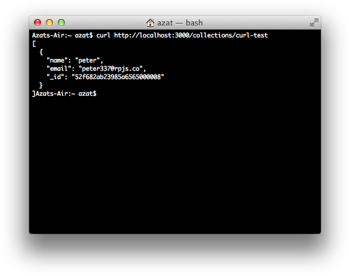
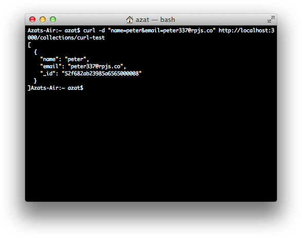

Chapter 8
---------
# Building Node.js REST API Servers with Express.js and Hapi

Modern-day web developers use an architecture consisting of a *thick* client and a a *thin* back-end layer. They use frameworks such as Backbone.js (<http://backbonejs.org>), AngularJS (<https://angularjs.org>), Ember.js (<http://emberjs.com>), and the like to build the thick client. On the other hand, they use REST APIs for the *thin* back-end layer. ( typically represented by a representational state transfer (REST) web application programing interface (API) service). This architecture, dubbed thick client or single-page application (SPA), has become more and more popular. No surprise here. There are many advantages to this thick-client approach:

- SPA (single-page applications) are faster because they render elements of the webpage in the browser without the need to always fetch the HTML from the server.
- The bandwidth is smaller since most of the page layout stays the same once it's loaded, thus the browser only needs the data in JSON format for the changing elements of the webpage.
- The same back-end REST API can serve multiple client apps/consumers, with web applications being just one of them (mobile and public third-party apps are examples of others).
- There is a separation of concerns, i.e., the clients can be replaced without compromising the integrity of the core business logic, and vice versa.
- User interface / user experience (UI/UX) are inherently hard to test, especially with event-driven, single-page apps, and then there&#39;s an added complexity of cross-browser testing; but, with separation of business logic into the back-end REST API, that logic becomes easy to test in both unit and functional testing.

Therefore, the majority of new projects take the REST API and clients approach. Development teams may take this approach even if they have just one client for the time being, which is typically a web app, because they realize that otherwise, when they eventually add more apps, they&#39;ll have to redo their work. 

That's why we&#39;ve seen a rise of the back-end-as-a-service niche in which a back-end RESTful API can be rented on a monthly or hourly basis which offloads the need for developing and maintenance away from developers. Examples are AWS Lambda, MongoLab, Firebase, and now discontinued Parse.com. 

Of course, we can't always rent a service. Sometimes we need the control or customization, and other times we need more security. That's why developers still implement their own services. With Node, to create a RESTful API services is as easy as stealing a vegan burrito from a San Francisco hipster (not that vegan burritos are any good).

To get started with Node.js REST servers, in this chapter we cover the following:

- RESTful API basics
- Project dependencies
- Test coverage with Mocha (<http://visionmedia.github.io/mocha>) and superagent (<http://visionmedia.github.io/superagent>)
- REST API server implementation with Express and Mongoskin (<https://github.com/kissjs/node-mongoskin>)
- Refactoring: Hapi.js (<http://hapijs.com>) REST API Server

The REST API server is able to process the creation of objects, and retrieval of objects and collections, and make changes to objects and remove objects. For your convenience, all the source code is in the `ch8` folder in github.com/azat-co/practicalnode (<https://github.com/azat-co/practicalnode>).


# RESTful API Basics

RESTful API (<https://en.wikipedia.org/wiki/Representational_state_transfer#Applied_to_Web_services>)[^1] became popular because of the demand in distributed systems in which each transaction needs to include enough information about the state of the client. This standard is stateless, because no information about the clients&#39; states is stored on the server, making it possible for each request to be served by a different system. This make scaling systems up or down a breeze. 

In a sense, the stateless servers are like loosely coupled classes in programming. Lots of infrastructure techniques use the best programming practices; in addition to loose coupling, versioning, automation, and continuous integration can all be applied to infrastructure to a great benefit.

Distinct characteristics of RESTful API (i.e., if API is RESTful, it usually follows these principles) are as follows:

- RESTful API has better scalability support because different components can be deployed independently to different servers.
- It replaced the Simple Object Access Protocol (SOAP (<http://en.wikipedia.org/wiki/SOAP>[^2]) because of the simpler verb and noun structure.
- It uses HTTP methods such as GET, POST, DELETE, PUT, OPTIONS, and so forth.
- JSON is not the only option (although it is the most popular). Unlike SOAP, which is a protocol, the REST methodology is flexible in choosing formats. For example alternative formats might be Extensible Markup Language (XML) or comma-separated values formats (CSV)

Table 8-1 shows an example of a simple create, read, update, and delete (CRUD[^3]) (<http://en.wikipedia.org/wiki/Create,_read,_update_and_delete>) REST API for message collection.

Table 8-1. Example of the CRUD REST API structure

| **Method** | **URL** | **Meaning** |
| --- | --- | --- |
| GET | `/messages.json` | Return list of messages in JSON format |
| PUT | `/messages.json` | Update/replace all messages and return status/error in JSON |
| POST | `/messages.json` | Create new message and return its ID in JSON format |
| GET | `/messages/{id}.json` | Return message with ID `{id}` in JSON format |
| PUT | `/messages/{id}.json` | Update/replace message with id `{id}`; if `{id}` message doesn&#39;t exist, create it |
| DELETE | `/messages/{id}.json` | Delete message with ID `{id}`, return status/error in JSON format |

REST is not a protocol; it&#39;s an architecture in the sense that it&#39;s more flexible than SOAP, which we know is a protocol. Therefore, REST API URLs could look like `/messages/list.html` or `/messages/list.xml`, in case we want to support these formats.

PUT and DELETE are idempotent methods. (Idempotent is another fancy word that computer scientists invented to charge high tuition fees for college degrees.) An idempotent method basically means that if the server receives two or more similar requests, the end result is the same. Ergo idempotent are safe to replicate.

And GET is nullipotent (safe), while POST is not idempotent (not safe). POST might affect the state and cause side effects.

More information on REST API can be found at Wikipedia (<http://en.wikipedia.org/wiki/Representational_state_transfer>)[^4] and in the article “A Brief Introduction to REST (<http://www.infoq.com/articles/rest-introduction>).”

In our REST API server, we perform CRUD operations and harness the Express.js middleware (<http://expressjs.com/api.html#middleware>)concept with the `app.param()` and `app.use()` methods. So, our app should be able to process the following commands using the JSON format (`collectionName` is the name of the collection, typically pluralized nouns, e.g., messages, comments, users):

- *POST* `/collections/{collectionName}`: request to create an object; responds with the of newly created object ID
- *GET* `/collections/{collectionName}/{id}`: request with ID to retrieve an object
- *GET* `/collections/{collectionName}/`: request to retrieve any items from the collection (`items`); in our example, we&#39;ll have this query options: up to 10 items and sorted by ID
- *PUT* `/collections/{collectionName}/{id}`: request with ID to update an object
- *DELETE* `/collections/{collectionName}/{id}`: request with ID to remove an object

Let's start our project by declaring dependencies.

# Project Dependencies

To get started with our project, we need to install packages. In this chapter, we use Mongoskin (<https://github.com/kissjs/node-mongoskin>), a MongoDB library, which is a better alternative to the plain, good-ol&#39; native MongoDB driver for Node.js (<https://github.com/mongodb/node-mongodb-native>). In addition, Mongoskin is more lightweight than Mongoose and it is schemaless (which I personally like, but I know some devs might prefer to have the safety and consistency of a schema).

The second choice is the framework. We are going to use the most popular, the most used, the framework with the most plugins—Express.js (<http://expressjs.com>). Express.js extends the core Node.js `http` module (<http://nodejs.org/api/http.html>) to provide more methods and features. Needless to say, I'm a huge fan of Express. Partially because I wrote a book on it (*Pro Express.js* (Apress, 2014)), which is still the most comprehensive book on the framework, and partially, because my team and I used Express at Storify, DocuSign, and Capital One to build multiple heavily trafficked apps.

The Express.js framework has boatloads of plugin modules called *middleware*. These middleware modules allow devs to pick and choose whatever functionality they need without having to buy in into some large, bulky, cookie-cutter, opinionated framework. In a way, Express serves as a foundation for a custom-built framework that is exactly what a project needs, not more and not less. Some people compare the Express.js framework with Ruby&#39;s Sinatra because it&#39;s non-opinionated and configurable.

First, we need to create a `ch8/rest-express` folder (or download the source code):

```
$ mkdir rest-express
$ cd rest-express
$ npm init -y
```

As mentioned in the previous chapter, Node.js/npm provides multiple ways to install dependencies, including the following:

- Manually, one by one
- As a part of `package.json`
- By downloading and copying modules
 
To keep things simple, let&#39;s just use the `package.json` approach. You can create the `package.json` file, or copy the `dependencies` section or the whole file:

```js
{
  "name": "rest-express",
  "version": "0.2.1",
  "description": "REST API application with Express, Mongoskin, MongoDB, Mocha and Superagent",
  "main": "index.js",
  "directories": {
    "test": "test"
  },
  "scripts": {
    "start": "node index.js",
    "test": "PORT=3007 ./node_modules/.bin/mocha test -R spec"
  },
  "author": "Azat Mardan (http://azat.co/)",
  "license": "MIT",
  "dependencies": {
    "body-parser": "1.18.2",
    "express": "4.16.2",
    "mongodb": "2.2.33",
    "mongoskin": "2.1.0",
    "morgan": "1.9.0"
  },
  "devDependencies": {
    "expect.js": "0.3.1",
    "mocha": "4.0.1",
    "standard": "10.0.3",
    "superagent": "3.8.0"
  }
}
```

Then, simply run this command to install modules for the application:

```
$ npm install
```

As a result, the `node_modules` folder should be created with the `superagent`, `express`, `mongoskin`, and `expect` libraries. If you change the versions specified in `package.json` to the later ones, please make sure to update the code according to the packages&#39; change logs.

# Test Coverage with Mocha and Superagent

Before the app implementation, let&#39;s write functional tests that make HTTP requests to our soon-to-be-created REST API server. In a test-driven development (TDD) manner, let&#39;s use these tests to build a Node.js free JSON REST API server using the Express.js framework and Mongoskin library for MongoDB.

In this section, we'll walk through the writing of functional tests using the Mocha (<http://visionmedia.github.io/mocha>) and `superagent` (<http://visionmedia.github.io/superagent>)[^5] libraries. The tests need to perform basic CRUD by posting HTTP requests to our server.

If you know how to use Mocha or just want to jump straight to the Express.js app implementation, feel free to do so. You can use CURL terminal commands for testing, too.

Assuming we already have Node.js, npm, and MongoDB installed, let&#39;s create a _new_ folder (or, if you wrote the tests, use that folder). Let&#39;s use Mocha as a command-line tool, and Expect.js and superagent as local libraries. To install the Mocha CLI (if it&#39;s not available via `$ mocha –V`), run this command from the terminal:

```
$ npm install -g mocha@4.0.1
```

Expect.js and superagent should be available already as part of the installation done in the previous section.

**Tip**  Installing Mocha locally gives us the ability to use different versions at the same time. To run tests, simply point to `./node_modules/.bin/mocha`. Use `npm i mocha@4.0.1 -DE` to install Mocha locally.

To launch tests, use the `npm test` alias to `mocha test` (global) or `./node_modules/.bin/mocha test` (local). A better alternative is to use Makefile, as described in Chapter 6.

Now let&#39;s create a `test/index.js` file in the same folder (`ch8/rest-express`), which will have six suites:

1. Create a new object
2. Retrieve an object by its ID
3. Retrieve the whole collection
4. Update an object by its ID
5. Check an updated object by its ID
6. Remove an object by its ID

HTTP requests are a breeze with Superagent&#39;s chained functions, which we can put inside each test suite.

So, we start with dependencies and then have three Mocha statements:

```js
const boot = require('../index.js').boot
const shutdown = require('../index.js').shutdown
const port = require('../index.js').port

const superagent = require('superagent')
const expect = require('expect.js')

before(() => {
  boot()
})

describe('express rest api server', () => {
  // ...
})

after(() => {
  shutdown()
})
```

Then, we write our first test case wrapped in the test case (`describe` and its callback). The main thing happens in the request (made by `superagent`) callback. There, we put multiple assertions that are the bread and butter (or meat and veggies for paleo readers) of TDD. To be strictly correct, this test suite uses BDD language, but this difference is not essential for our project.

The idea is simple. We make a POST HTTP request to a local instance of the server which we required and booted right from the test file. When we send the request, we pass some data. This creates the new object. We can expect that there are no errors, that the body of a certain composition, etc. We save the newly created object ID into `id` to use it for requests in the next test cases. 


```js
describe('express rest api server', () => {
  let id

  it('post object', (done) => {
    superagent.post(`http://localhost:${port}/collections/test`)
      .send({
        name: 'John',
        email: 'john@rpjs.co'
      })
      .end((e, res) => {
        expect(e).to.eql(null)
        expect(res.body.length).to.eql(1)
        expect(res.body[0]._id.length).to.eql(24)
        id = res.body[0]._id
        done()
      })
  })
  // ...
})
```

As you may have noticed, we&#39;re checking for the following:

- The error object should be null (`eql(null)`).
- The response body array should have one item (`to.eql(1)`).
- The first response body item should have the `_id` property, which is 24 characters long, i.e., a hex string representation of the standard MongoDB ObjectId type.

To finish, we save the newly created object&#39;s ID in the `id` global variable so we can use it later for retrievals, updates, and deletions. Speaking of object retrievals, we test them in the next test case. Notice that the `superagent` method has changed to `get()`, and the URL path contains the object ID. You can “uncomment” `console.log` to inspect the full HTTP response body:

```js
  it('retrieves an object', (done) => {
    superagent.get(`http://localhost:${port}/collections/test/${id}`)
      .end((e, res) => {
        expect(e).to.eql(null)
        expect(typeof res.body).to.eql('object')
        expect(res.body._id.length).to.eql(24)
        expect(res.body._id).to.eql(id)
        done()
      })
  })
```  

The `done()` callback allows us to test async code. Without it, the Mocha test case ends abruptly, long before the slow server has time to respond.

The next test case&#39;s assertion is a bit more interesting because we use the `map()` function on the response results to return an array of IDs. In this array, we find our ID (saved in the `id` variable) with the `contain` method. The `contain` method is a more elegant alternative to `native indexOf()`. It works because the results, which are limited to 10 records, come sorted by IDs, and our object was created just moments ago.

```js
  it('retrieves a collection', (done) => {
    superagent.get(`http://localhost:${port}/collections/test`)
      .end((e, res) => {
        expect(e).to.eql(null)
        expect(res.body.length).to.be.above(0)
        expect(res.body.map(function (item) { return item._id })).to.contain(id)
        done()
      })
  })
```  

When the time comes to update our object, we actually need to send some data. We do this by passing an object to superagent&#39;s function. Then, we assert that the operation was completed with `(msg=success)`:

```js
  it('updates an object', (done) => {
    superagent.put(`http://localhost:${port}/collections/test/${id}`)
      .send({
        name: 'Peter',
        email: 'peter@yahoo.com'
      })
      .end((e, res) => {
        expect(e).to.eql(null)
        expect(typeof res.body).to.eql('object')
        expect(res.body.msg).to.eql('success')
        done()
      })
  })
```  

The last two test cases, which assert retrieval of the updated object and its deletion, use methods similar to those used before:

```js
 it('checks an updated object', (done) => {
    superagent.get(`http://localhost:${port}/collections/test/${id}`)
      .end((e, res) => {
        expect(e).to.eql(null)
        expect(typeof res.body).to.eql('object')
        expect(res.body._id.length).to.eql(24)
        expect(res.body._id).to.eql(id)
        expect(res.body.name).to.eql('Peter')
        done()
      })
  })
  it('removes an object', (done) => {
    superagent.del(`http://localhost:${port}/collections/test/${id}`)
      .end((e, res) => {
        expect(e).to.eql(null)
        expect(typeof res.body).to.eql('object')
        expect(res.body.msg).to.eql('success')
        done()
      })
  })
})
```

It's important to finish the work of the server when we are done with testing:

```js
after(() => {
  shutdown()
})
```

The full source code for testing is in the `ch8/rest-express/test/index.js` file.

To run the tests, we can use the `$ mocha test` command, `$ mocha test/index.js`, or `npm test`. For now, the tests should fail because we have yet to implement the server!

For those of you who require multiple versions of Mocha, another alternative, which is better, is to run your tests using local Mocha binaries: `./node_modules/mocha/bin/mocha ./test`. This, of course, assumes that we have installed Mocha locally into `node_modules`.

**Note**  By default, Mocha doesn't use any reporters, and the result output is lackluster. To receive more explanatory logs, supply the `-R <name>` option (e.g., `$ mocha test -R spec` or `$ mocha test -R list`).

# REST API Server Implementation with Express and Mongoskin

Create and open `code/ch8/rest-express/index.js`, which will be the main application file.

First things first. Let&#39;s import our dependencies into the application, that's in `index.js`:

```js
const express = require('express')
const mongoskin = require('mongoskin')
const bodyParser = require('body-parser')
const logger = require('morgan')
const http = require('http')
```

Express.js instantiation of an app instance follows:

```js
const app = express()
```

Express middleware is a powerful and convenient feature of Express.js to organize and reuse code. Why write our own code if we can use a few middleware modules? To extract parameters and data from the requests, let&#39;s use the `bodyParser.json()` middleware from `body-parser`.  `logger()`, which is `morgan` npm module, is optional middleware that allows us to print requests. We apply them with `app.use()`. In addition, we can use port configuration and server logging middleware.

```js
app.use(bodyParser.json())
app.use(logger())
app.set('port', process.env.PORT || 3000)
```

Mongoskin makes it possible to connect to the MongoDB database in one effortless line of code:

```js
const db = mongoskin.db('mongodb://@localhost:27017/test')
```

**Note**   If you wish to connect to a remote database (e.g., Compose (<https://www.compose.com>) or mLab), substitute the string with your username, password, host, and port values. Here is the format of the uniform resource identifier (URI) string (no spaces): `mongodb://[username:password@] host1[:port1][,host2[:port2],... [,hostN[:portN]]] [/[database][?options]]`.

The next statement is a helper function that converts hex strings into MongoDB ObjectID data types:

```js
const id = mongoskin.helper.toObjectID
```

The `app.param()` method is another form of Express.js middleware. It basically allows to *do something every time there is this value in the URL pattern of the request handler.* In our case, we select a particular collection when a request pattern contains a string `collectionName` prefixed with a colon (we'll see this when we examine routes):

```js
app.param('collectionName', (req, res, next, collectionName) => {
  req.collection = db.collection(collectionName)
  return next()
})
```

I had many students at my workshop exclaim, "It's not working", when they were staring at the root `localhost:3000` instead of using a path like `localhost:3000/collections/messages`. To avoid such confusion, let&#39;s include a root route with a message that asks users to specify a collection name in their URLs:

```js
app.get('/', (req, res, next) => {
  res.send('Select a collection, e.g., /collections/messages')
})
```

Now the real work begins. The GET `/collections/:collectionName` is your typical REST read operation, that is, we need to retrieve a list of items. We can sort it by `_id` and use a limit of 10 to make it a bit more interesting. Here is how we can harness `find()` using the `req.collection`, which was created in the `app.param` middleware.

```js
app.get('/collections/:collectionName', (req, res, next) => {
  req.collection.find({}, {limit: 10, sort: [['_id', -1]]})
    .toArray((e, results) => {
      if (e) return next(e)
      res.send(results)
    }
  )
})
```

So have you noticed a `:collectionName` string in the URL pattern parameter? This and the previous `app.param()` middleware are what give us the `req.collection` object, which points to a specified collection in our database. `toArray` create either an error `e` or array of items `results`.

Next is the object-creating endpoint POST `/collections/:collectionName`. It is slightly easier to grasp because we just pass the whole payload to the MongoDB. Again we use `req.collection`. The second argument to `insert()` is optional. Yeah. I know it's not super secure to pass unfiltered and not-validated payloads to the database, but what can go wrong? (Sarcasm font.)

```js
app.post('/collections/:collectionName', (req, res, next) => {
  // TODO: Validate req.body
  req.collection.insert(req.body, {}, (e, results) => {
    if (e) return next(e)
    res.send(results.ops)
  })
})
```

This approach when we create a RESTful API without schema or restrictions on the data structure is often called *free JSON REST API*, because clients can throw data structured in any way, and the server handles it perfectly. I found this architecture very advantageous for early prototyping due to the ability to use this API for any data just by changing the collection name or the payload that I'm sending from my client, i.e., a front-end app.

Next is GET `/collections/:collectionName/:id`, e.g., `/collections/messages/123`. For that we'll be using a single-object retrieval function `findOne()`, which is more convenient than `find()`. This is because  `findOne()` returns an object directly instead of a cursor, as `find()`. That's good. We can drop awkward `toArray()`. The function signature for `findOne()` is different because now it has to take the callback.

We're also extracting the ID from the `:id` part of the URL path with `req.params.id` Express.js magic because we need the ID of this particular document and because we can have multiple URL parameters defined in the URL path of the Express route.

```js
app.get('/collections/:collectionName/:id', (req, res, next) => {
  req.collection.findOne({_id: id(req.params.id)}, (e, result) => {
    if (e) return next(e)
    res.send(result)
  })
})
```

Of course, the same functionality can be achieved with `find`, using `{_id: ObjectId(req.params.id)}` as the query and with `toArray()`, but you know that already.

The PUT request handler gets more interesting because `update()` doesn't return the augmented object. Instead, it returns a count of affected objects. Also, `{$set:req.body}` is a special MongoDB operator that sets values. MongoDB operators tend to start with a dollar sign `$`, like `$set` or `$push`.

The second parameter `{safe:true, multi:false}` is an object with options that tell MongoDB to wait for the execution before running the callback function and to process only one (the first) item. The callback to `update()` is processing error `e`, and if it's null and the number of update documents is 1 (it could be 0 if the ID is not matching—no error `e` in this case), it sends back the success to the client.

```js
app.put('/collections/:collectionName/:id', (req, res, next) => {
  req.collection.update({_id: id(req.params.id)},
    {$set: req.body},
    {safe: true, multi: false}, (e, result) => {
      if (e) return next(e)
      res.send((result.result.n === 1) ? {msg: 'success'} : {msg: 'error'})
    })
})
```

Lastly, we define the DELETE `/collections/:collectionName/:id` route to remove one document. The ID is coming from the `req.params.id` like in the other individual-document routes. The callback will have two arguments, with the second having the `result` property. Thus we use `result.result`.

In the callback of `remove()`, we create an if/else to output a custom JSON message with `msg`, which equals either a `success` string for one (1) removed document, or the `error` message for a value different from one (1). The error `e` is a MongoDB error like "cannot connect".

```js
app.delete('/collections/:collectionName/:id', (req, res, next) => {
  req.collection.remove({_id: id(req.params.id)}, (e, result) => {
    if (e) return next(e)
    res.send((result.result.n === 1) ? {msg: 'success'} : {msg: 'error'})
  })
})
```

The last few lines of the `index.js` file (`code/ch8/rest-express/index.js` make our file compatible with either starting the server or exporting it to be used/started elsewhere, i.e., in the tests:

```js
const server = http.createServer(app)
const boot = () => {
  server.listen(app.get('port'), () => {
    console.info(`Express server listening 
      on port ${app.get('port')}`)
  })
}

const shutdown = () => {
  server.close(process.exit)
}

if (require.main === module) {
  boot()
} else {
  console.info('Running app as a module')
  exports.boot = boot
  exports.shutdown = shutdown
  exports.port = app.get('port')
}
```

Just in case something is not working well, the full code of the Express.js REST API server is in the `code/ch8/rest-express/index.js` file.

Now exit your editor and run `index.js` file with the `node` command. If it's Linux or macOS, you can use this command in your terminal: 

```
$ node .
```

The command above with the dot (`.`) is the equivalent of `$ node index.js`. Sadly, if you are on Windows, then `node .` will not work, so you have to use the full file name.

Test your server manually or automatically. Just do it, then do it again. To test automatically, execute the tests with Mocha. Tests will start a new server, so you may want to close/terminate/kill your own server to avoid the annoying "error address in use" error.

```
$ mocha test
```

If you are bored of a standard Mocha result report, then a slightly cuter reporter is nyan (Figure 8-1). 


You can use it with `-R nyan` as follows:

```
$ mocha test -R nyan
```

***Figure 8-1.** Who wouldn&#39;t like a library with Nyan Cat?*

If you really don&#39;t like Mocha, BDD or TDD, manual testing with CURL is always there for you. :-) At least on POSIX (Linux, Unix, macOS), CURL is built-in and comes with those OSes. On Windows, you can [download the CURL tool manually](https://curl.haxx.se/download.html). 

For GET CURLing, simply provide the URL, and you will get the server response which is the JSON of the object, as shown in Figure 8-2:

```
curl http://localhost:3000/collections/curl-test
```



***Figure 8-2.** A GET request made with CURL*

**Note**  GET requests also work in the browser because every time you open a URL in a browser, you make a GET request. For example, open (<http://localhost:3000/test>) while your server is running.

CURLing data to make a POST request is easy (Figure 8-3). Provide `-d` for data. Use the urlencoded format with `key=value&key1=value1`, etc. or use a JSON file with the at (`@`) symbol: `-d @testplace.json`. Most likely you need to provide the header too: `--header "Content-Type: application/json"`. 

Here's an example of sending name and email values with POST:

```
$ curl -d "name=peter&email=peter337@rpjs.co" --header "Content-Type: application/json" http://localhost:3000/collections/curl-test
```



***Figure 8-3.** The result of sending a POST request via CURL*

DELETE or PUT can be made with the option `--request NAME`. Remember to add the ID in the URL, such as:

```
$ curl --request DELETE http://localhost:3000/collections/curl-test/52f6828a23985a6565000008
```


For a short, nice tutorial on the main CURL commands and options, take a look at *CURL Tutorial with Examples of Usage* at <http://www.yilmazhuseyin.com/blog/dev/curl-tutorial-examples-usage>.

In this chapter, our tests are longer than the app code itself, so abandoning TDD may be tempting, but believe me, *the good habits of TDD save you hours and hours of work* during any serious development, when the complexity of the application on which you are working is high.

You might wonder why spend time on TDD in the chapter about REST APIs. The answer is mainly because testing saves time and testing of RESTful API is easy compared to testing of the frond-end app, UIs, and web pages. You see, REST APIs don&#39;t have UIs in the form of web pages. APIs are intended for consumption by other programs (i.e., consumers or clients). Ergo, the best way to develop APIs is to utilize tests. If you think about tests—they are like small client apps. This ensures a smooth integration between APIs and clients. We test responses and their JSON structure. This is functional or integration testing.

However, this is not the whole story. TDD is great when it comes to refactoring. The next section illustrates this by refactoring project from Express.js to Hapi. And after we&#39;re done, we can rest assured that by running the same tests, that the functionality isn&#39;t broken or changed.

# Refactoring: Hapi REST API Server

[Hapi](http://spumko.github.io) (<http://spumko.github.io>) (npm (<https://www.npmjs.org/package/hapi>) and GitHub (<https://github.com/hapijs/hapi>)) is an enterprise-grade framework. It&#39;s more complex and feature rich than Express.js, and it&#39;s easier to develop in large teams (<http://hueniverse.com/2012/12/hapi-a-prologue>). Hapi was started by (and used at) Walmart Labs that support Walmart's heavily trafficked e-commerce website. So Hapi has been battle-tested at a YUGE scale.

The goal of this section is to show you alternative patterns in implementing the REST API server in Node.js. Now, because we have Mocha tests, we can refactor our code with peace of mind. Here&#39;s the `package.json` for this project:

```js
{
  "name": "rest-hapi",
  "version": "0.0.1",
  "description": "REST API application with Express, Mongoskin, MongoDB, Mocha and Superagent",
  "main": "index.js",
  "directories": {
    "test": "test"
  },
  "scripts": {
    "start": "node index.js",
    "test": "mocha test -R spec"
  },
  "author": "Azat Mardan (http://azat.co/)",
  "license": "MIT",
  "dependencies": {
    "good": "7.3.0",
    "hapi": "16.6.2",
    "mongodb": "2.2.33",
    "mongoskin": "2.1.0"
  },
  "devDependencies": {
    "mocha": "4.0.1",
    "superagent": "3.8.0",
    "expect.js": "0.3.1"
  }
}
```

You can either use `package.json` with `$ npm install` or, for Hapi installation only, simply run `$ npm install hapi@16.6.2 good@7.3.0 --save` from the `ch8/rest-hapi` folder. `hapi` is the framework&#39;s module and `good` is its logger. The `npm install` command downloads the modules and unpacks them in the `node_modules` folder. Next, we need to create a `hapi-app.js` file and open it in the editor.

As usual, at the beginning of a Node.js program (`code/ch8/rest-hapi/index.js`), we import dependencies. Then, we define domain (localhost) and port (3000). Next we create the Hapi server object using `new Hapi.server()`:

```js
const port = process.env.PORT || 3000
const Hapi = require('hapi')
server.connection({ port: port, host: 'localhost' })
const server = new Hapi.Server()
```

And we create the database connection `db`, just like in the Express.js example:

```js
const mongoskin = require('mongoskin')
const db = mongoskin.db('mongodb://@localhost:27017/test', {})
const id = mongoskin.helper.toObjectID
```

Instead of middleware like we used in Express, in Hapi we will create a function that will load the database collection asynchronously based on the provided `name` argument, which is a URL param. The `loadCollection()` function gives us the database collection that is corresponding to the `name` value (use an enum in a real project):

```js
const loadCollection = (name, callback) => {
  callback(db.collection(name))
}
```

The next part is the most distinct compared with Express.js. Developers use properties for methods and paths, and instead of `res` (or `response`) we use `reply` inside of the `handler` property. Every route is an item in the array passed to `server.route()`. The first such route is for the home page (`/`):

```js
server.route([
  {
    method: 'GET',
    path: '/',
    handler: (req, reply) => {
      reply('Select a collection, e.g., /collections/messages')
    }
  },
  // ...
]) 
```  

The next item in this array passed to `server.route()` (that is the argument to the `route` method), is the route that returns a list of items as a response to a `GET /collection/:collectionName` request. The main logic happens in the handler function again, where we call the `loadCollection()` function, find any objects (`find({})`), and output sorted results limited to 10 items:

```js
  {
    method: 'GET',
    path: '/collections/{collectionName}',
    handler: (req, reply) => {
      loadCollection(req.params.collectionName, (collection) => {
        collection.find({}, {limit: 10, sort: [['_id', -1]]})
          .toArray((e, results) => {
            if (e) return reply(e)
            reply(results)
        })
      })
    }
  },
```  

The third route handles the creation of new objects (`POST /collections/collectionName`). Again, we use `loadCollection()` and then call the `insert` method with a request body (`req.payload`):

```js
  {
    method: 'POST',
    path: '/collections/{collectionName}',
    handler: (req, reply) => {
      loadCollection(req.params.collectionName, (collection) => {
        collection.insert(req.payload, {}, (e, results) => {
          if (e) return reply(e)
          reply(results.ops)
        })
      })
    }
  },
```  

Please note that each URL parameter is enclosed in `{}`, unlike the `:name` convention that Express.js uses. This is in part because colon (`:`) is a valid URL symbol, and by using it as a parameter identifier we cannot use colon (`:`) in our URL addresses. (Although I don't know why you would colon when you can use slash `/`.)

The next route is responsible for getting a single record by its ID (`/collection/collectionName/id`). The main logic of using the `findOne()` method is the same as in the Express.js server example:

```js
  {
    method: 'GET',
    path: '/collections/{collectionName}/{id}',
    handler: (req, reply) => {
      loadCollection(req.params.collectionName, (collection) => {
        collection.findOne({_id: id(req.params.id)}, (e, result) => {
          if (e) return reply(e)
          reply(result)
        })
      })
    }
  },
```  

This route updates documents in the database and, again, most of the logic in the handler remains the same, as in the Express.js example, except that we call `loadCollection()` to get the right collection based on the URL parameter `collectionName`:

```js
  {
    method: 'PUT',
    path: '/collections/{collectionName}/{id}',
    handler: (req, reply) => {
      loadCollection(req.params.collectionName, (collection) => {
        collection.update({_id: id(req.params.id)},
          {$set: req.payload},
          {safe: true, multi: false}, (e, result) => {
            if (e) return reply(e)
            reply((result.result.n === 1) ? {msg: 'success'} : {msg: 'error'})
          })
      })
    }
  },
```  

The last route handles deletions. First, it gets the right collection via the URL parameter (`collectionName`). Then, it removes the object by its ID and sends back the message (`success` or `error`):

```js
  {
    method: 'DELETE',
    path: '/collections/{collectionName}/{id}',
    handler: (req, reply) => {
      loadCollection(req.params.collectionName, (collection) => {
        collection.remove({_id: id(req.params.id)}, (e, result) => {
          if (e) return reply(e)
          reply((result.result.n === 1) ? {msg: 'success'} : {msg: 'error'})
        })
      })
    }
  }
]) // for "server.route(["
```  

The next configuration is optional. It configures server logging with `good`:

```js
const options = {
  subscribers: {
    'console': ['ops', 'request', 'log', 'error']
  }
}

server.register(require('good', options, (err) => {
  if (!err) {
    // Plugin loaded successfully, you can put console.log here
  }
}))
```

The next statement of `ch8/rest-hapi/index.js` creates a function that starts the server with the `server.start()` method:

```js
const boot = () => {
  server.start((err) => {
    if (err) {
      console.error(err)
      return process.exit(1)
    }
    console.log(`Server running at: ${server.info.uri}`)
  })
}
```    

The next statement creates a function to close the process:

```js
const shutdown = () => {
  server.stop({}, () => {
    process.exit(0)
  })
}
```

Lastly, we put an if/else to boot up the server straightaway when this file is run directly or export `boot`, `shutdown`, and `port` when this file is loaded as a module (with `require()`):

```js
if (require.main === module) {
  console.info('Running app as a standalone')
  boot()
} else {
  console.info('Running app as a module')
  exports.boot = boot
  exports.shutdown = shutdown
  exports.port = port
}
```

The following summarizes what we did differently while switching from Express.js to Hapi:

* Defined routes in an array
* Used method, path, and handler properties of the route object
* Used the `loadCollection` method instead of middleware
* Used `{name}` instead of `:name` for defining URL parameters

As alway, the full source code is in the GitHub repository. The file and its path is `ch8/rest-hapi/index.js`.

If we run the newly written Hapi server with `$ node index.js` (or `$ npm start`) and then run tests in a separate tab/window, the tests pass! If they don't for some reason, then download and run the source code from the GitHub repository github.com/azat-co/practicalnode (<http://github.com/azat-co/practicalnode>).

# Summary

The loosely coupled architecture of REST API servers and clients (mobile, web app, or front end) allows for better maintenance and works perfectly with TDD/BDD. In addition, NoSQL databases such as MongoDB are good at handling free REST APIs. We don&#39;t have to define schemas, and we can throw any data at it and the data is saved!

The Express.js and Mongoskin libraries are great when you need to build a simple REST API server using a few lines of code. Later, if you need to expand the libraries, they also provide a way to configure and organize your code. If you want to learn more about Express.js, take a look at *Pro Express.js* (Apress, 2014). Also, it&#39;s good to know that for more complex systems, the Hapi server framework is there for you. 🤗

In this chapter, in addition to Express.js, we used MongoDB via Mongoskin. We also used Mocha and Superagent to write functional tests that, potentially, save us hours in testing and debugging when we refactor code in the future. 

Then we easily flipped Express.js for Hapi and, thanks to the tests, we are confident that our code works as expected. The differences between the Express and Hapi frameworks as we observed are in the way we defined routes and URL parameters and output the response.

[^1] <https://en.wikipedia.org/wiki/Representational_state_transfer#Applied_to_Web_services>

[^2] <http://en.wikipedia.org/wiki/SOAP>

[^3] <http://en.wikipedia.org/wiki/Create,_read,_update_and_delete>

[^4] <http://en.wikipedia.org/wiki/Representational_state_transfer>

[^5] <http://visionmedia.github.io/superagent/>
