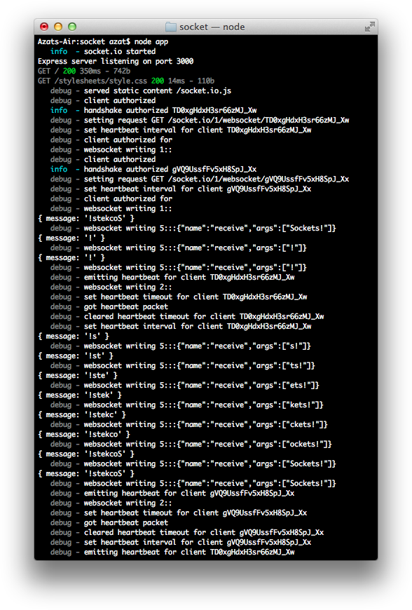

Chapter 9
---------
# Real-Time Apps with WebSocket, Socket.IO, and DerbyJS

Real-time apps are becoming more and more widespread in financial trading, gaming, social media, various DevOps tools, cloud services, and of course news. The main factor contributing to this trend is that technologies have become much better. They allow for a greater bandwidth to transmit data, and for more calculations to process and retrieve the data.

HTML5 pioneered the new standard of real-time connections called *WebSocket*. The way it works, in browser JavaScript you get a global object called `WebSocket`. This object is a class and has all kinds of methods for developers to implement the WebSocket protocol client. 

The WebSocket protocol (or `ws://` in the URL format) is very different from HTTP or HTTPS. Hence, developers need a special ws server. Just having an HTTP server won't cut it. And as you know, Node.js is a highly efficient, non-blocking input/output platform. 

Implementing WebSocket servers with Node is pure joy because Node is fast and because Node is also JavaScript just like the WebSocket clients (i.e., browser JavaScript). Thus, Node is very well suited for the task of being a back-end pair to the browser with it's WebSocket API.

To get you started with WebSocket and Node.js, we&#39;ll keep things simple stupid (KISS) (<http://en.wikipedia.org/wiki/KISS_principle>) and cover the following:

- What is WebSocket?

- Native WebSocket and Node.js with the ws module example

- Socket.IO and Express.js example

- Collaborative online editor example with DerbyJS, Express.js, and MongoDB

# What Is WebSocket?

WebSocket is a special communication “channel” between browsers (clients) and servers. It&#39;s an HTML5 protocol. WebSocket&#39;s connection is constant, in contrast to traditional HTTP requests, with the latter usually initiated by the client. Therefore, there&#39;s no way for a server to notify the client if there are updates. 

By maintaining a duplex open connection between the client and the server, updates can be pushed in a timely fashion without clients needing to poll at certain intervals. This main factor makes WebSocket ideal for real-time apps for which data need to be available on the client immediately. For more information on WebSocket, take a look at the extensive resource [About HTML5 WebSocket](http://www.websocket.org/aboutwebsocket.html) (<http://www.websocket.org/aboutwebsocket.html>).

There&#39;s no need to use any special libraries to use WebSocket in modern browsers. The following StackOverflow has a list of such browsers: [What browsers support HTML5 WebSockets API?](http://stackoverflow.com/questions/1253683/what-browsers-support-html5-websocket-api) (<http://stackoverflow.com/questions/1253683/what-browsers-support-html5-websocket-api>)For older browser support, the workaround includes falling back on polling.

As a side note, polling (both short and long), can also be used to emulate the real-time responsiveness of web apps. In fact, some advanced libraries (Socket.IO) fall back to polling when WebSocket becomes unavailable as a result of connection issues or users not having the latest versions of browsers. Polling is relatively easy and we don&#39;t cover it here. It can be implemented with just a `setInterval()` callback and an end point on the server. However, there&#39;s not real-time communication with polling; each request is separate.

# Native WebSocket and Node.js with the ws Module Example

Sometimes it&#39;s easier to start from the simplest thing and build things on top of it. With this in mind, our mini project includes building a native WebSocket implementation that talks with the Node.js server with the help of the ws module:

- Browser WebSocket implementation
- Node.js server with ws module implementation

Let&#39;s examine this with a quick example.

## Browser WebSocket Implementation

This is our front-end code (file `ch9/basic/index.html`) for Chrome version 32.0.1700.77. We start with typical HTML tags:

```html
<html>
  <head>
  </head>
  <body>
```

The main code lives in the `script` tag, where we instantiate an object from global `WebSocket`. When we do so, we provide the server URL. Notice the `ws://` instead of a familiar `http://`. The letters `ws://` stand for the WebSocket protocol.

```html
    <script type="text/javascript">
      var ws = new WebSocket('ws://localhost:3000');
```

As soon as the connection is established, we send a message to the server:

```js
      ws.onopen = function(event) {
        ws.send('front-end message: ABC');
      };
```

Usually, messages are sent in response to user actions, such as mouse clicks. When we get any message from the WebSocket location, the following handler is executed:

```js
      ws.onmessage = function(event) {
        console.log('server message: ', event.data);
      };
```
A good practice is to have an `onerror` event handler. We logging the error message:

```js
      ws.onerror = function(event) {
        console.log('server error message: ', event.data);
      };
```

We then close the tags and save the file:

```html
    </script>
  </body>
</html>
```

To make sure you don&#39;t miss anything, here&#39;s the full source code of `ch9/basic/index.html` which is very straightforward and rather small:

```html
<html>
  <head>
  </head>
  <body>
    <script type="text/javascript">
      var ws = new WebSocket('ws://localhost:3000');
      ws.onopen = function(event) {
        ws.send('front-end message: ABC');
      };
      ws.onmessage = function(event) {
        console.log('server message: ', event.data);
      };
    </script>
  </body>
</html>
```

## Node.js Server with ws Module Implementation

WebSocket.org provides an echo service for testing the browser WebSocket, but we can build our own small Node.js server with the help of the [ws](http://npmjs.org/ws) (<http://npmjs.org/ws>) ([GitHub](https://github.com/einaros/ws)) (<https://github.com/einaros/ws>) library. You can create `package.json` and install `ws`:

```
$ npm init -y
$ npm install ws@3.3.0 -SE
```

In the `ch9/basic/server.js` file, we import `ws` and initialize the server into the `wss` variable:

```js
const WebSocketServer = require('ws').Server
const wss = new WebSocketServer({port: 3000})
```

Akin to the front-end code, we use an event pattern to wait for a connection. When the connection is ready, in the callback we send the string `XYZ` and attach an event listener `on('message')` to listen to incoming messages from the page:

```js
wss.on('connection', (ws) => {
  ws.send('XYZ')
  ws.on('message', (message) => {
    console.log('received: %s', message)
  })
})
```

Moreover, let's add some continuous logic which will provides current time to the browser using `ws.send()` and `new Date`:

```js
wss.on('connection', (ws) => {
  ws.send('XYZ')
  setInterval(()=>{
    ws.send((new Date).toLocaleTimeString())
  }, 1000)
  ws.on('message', (message) => {
    console.log('received: %s', message)
  })
})
```


The full code of the server code is in `code/ch9/basic/server.js`.

Start the Node.js server with `$ node server`. Then, open `index.html` in the browser and you should see this message in the JavaScript console (option + command + j on Macs): `server message: XYZ` (Figure 9-1).


***Figure 9-1.** Browser outputs a message received via WebSocket*

While in the terminal, the Node.js server output is `received: front-end message: ABC`, which is illustrated in Figure 9-2.


***Figure 9-2.** The server outputs the browser message received via WebSocket*

Native HTML5 WebSocket is an amazing technology. However, WebSocket is a protocol and an evolving standard. This means that each browser implementation might vary. And, of course, if support for older browsers is needed, you should do your research and test.

In addition, often the connection may be lost and may need to be re-established. To handle cross-browser and backward compatibility, as well as re-opening, a lot of developers depend on the Socket.IO library, which we will explore in the next section.

# Socket.IO and Express.js Example

Full coverage of the [Socket.IO](http://socket.io) (<http://socket.io>) library absolutely deserves its own book. Nevertheless, because it&#39;s such a popular library, and getting started with it is very easy with Express.js, we include in this chapter an example that covers the basics. This mini project illustrates duplex-channel communication between browser and server.

As in most real-time web apps, the communication between a server and a client happens in response either to some user actions or as a result of updates from the server. So, in our example, the web page renders a form field in which each character echoes (browser to server and back) in reverse in real time. The example harnesses Express.js command-line tool scaffolding, Socket.IO, and Pug (see screenshots of the working app in Figures 9-3 and 9-4). Of course, you can just download the app from [github.com/azat-co/practicalnode](http://github.com/azat-co/practicalnode) (<http://github.com/azat-co/practicalnode>).

To include Socket.IO, we can use `$ npm install socket.io@0.9.16 --save` and repeat it for every module, or we can use `package.json` and `$ npm install`:

```js
{
  "name": "socket-express",
  "version": "0.1.0",
  "private": true,
  "scripts": {
    "start": "node app.js"
  },
  "dependencies": {
    "body-parser": "1.18.2",
    "cookie-parser": "1.4.3",
    "debug": "3.1.0",
    "express": "4.16.2",
    "morgan": "1.9.0",
    "pug": "2.0.0-rc.4",
    "socket.io": "2.0.4"
  }
}
```

Socket.IO, in some way, might be considered another server, because it handles socket connections and not our standard HTTP requests. This is how we refactor autogenerated Express.js code:

```js
const http = require('http')
const express = require('express')
const path = require('path')
const logger = require('morgan')
const bodyParser = require('body-parser')
```

The standard Express.js configuration is as follows:

```js
const routes = require('./routes/index')
const app = express()

// view engine setup
app.set('views', path.join(__dirname, 'views'))
app.set('view engine', 'pug')

app.use(logger('dev'))
app.use(bodyParser.json())
app.use(bodyParser.urlencoded({extended: true}))
app.use(express.static(path.join(__dirname, 'public')))

app.use('/', routes)
```

Then, the Socket.IO piece is as follows:

```js
const server = http.createServer(app)
const io = require('socket.io').listen(server)
```

When the Socket server connection is established, we attach a `messageChange` event listener that implements logic that is reversing an incoming string:

```js
io.sockets.on('connection', (socket) => {
  socket.on('messageChange', (data) => {
    console.log(data)
    socket.emit('receive', data.message.split('').reverse().join(''))
  })
})
```

We finish by starting the server with `listen()` as we always do:

```js
app.set('port', process.env.PORT || 3000)
server.listen(app.get('port'), () => {
  console.log(`Express server listening on port ${app.get('port')}`)
})
```

Just in case these snippets are confusing, the full content of the Express app with SocketIO is in `code/ch9/socket-express/app.js`.

A quick remark about port numbers: by default, WebSocket connections can use the standard ports: 80 for HTTP and 443 for HTTPS.

Last, our app needs some front-end love in `index.pug`. Nothing fancy; just a form field and some front-end JavaScript in the Pug template:

```pug
extends layout

block content
  h1= title
  p Welcome to
    span.received-message #{title}
  input(type='text', class='message', placeholder='what is on your mind?', onkeyup='send(this)')
  script(src="/socket.io/socket.io.js")
  script.
    var socket = io.connect('http://localhost:3000');
    socket.on('receive', function (message) {
      console.log('received %s', message);
      document.querySelector('.received-message').innerText = message;
    });
    var send = function(input) {
      console.log(input.value)
      var value = input.value;
      console.log('sending %s to server', value);
      socket.emit('messageChange', {message: value});
    }
```    

Again, start the server and open the browser to see real-time communication. Typing text in the browser field logs data on the server without messing up HTTP requests and waiting. The approximate browser results are shown in Figure 9-3; the server logs are shown in Figure 9-4.


***Figure 9-3.** The input of `!stekcoS yields Sockets!`*



***Figure 9-4.** Express.js server catching and processing input in real time*

For more Socket.IO examples, go to [socket.io/#how-to-use](http://socket.io/#how-to-use) (<http://socket.io/#how-to-use>).

# Collaborative Online Code Editor Example with DerbyJS, Express.js, and MongoDB

**TK: Most likely to be replaced with something else**

[Derby](http://derbyjs.com) (<http://derbyjs.com>) is a new, sophisticated [MVC](http://en.wikipedia.org/wiki/Model%E2%80%93view%E2%80%93controller) (<http://en.wikipedia.org/wiki/Model%E2%80%93view%E2%80%93controller>) framework designed to be used with [Express](http://expressjs.com) (<http://expressjs.com>) as its middleware, whereas [Express.js](http://expressjs.com) (<http://expressjs.com>) is a popular node framework that uses the middleware concept to enhance the functionality of applications. Derby also comes with the support of [Racer](https://github.com/codeparty/racer) (<https://github.com/codeparty/racer>), a data synchronization engine, and [Handlebars](https://github.com/wycats/handlebars.js) (<https://github.com/wycats/handlebars.js>)-like template engine, among [many other features](http://derbyjs.com/#features) (<http://derbyjs.com/#features>).

[Meteor](http://meteor.com) (<http://meteor.com>) and [Sails.js](http://sailsjs.org) (<http://sailsjs.org>) are other reactive (real-time) full-stack MVC Node.js frameworks comparable with DerbyJS. However, Meteor is more opinionated and often relies on proprietary solutions and packages.

The following example illustrates how easy it is to build a real-time application using Express.js, DerbyJS, MongoDB, and Redis.

The structure for this DerbyJS mini project is as follows:

- Project dependencies and `package.json`
- Server-side code
- DerbyJS app
- DerbyJS view
- Editor tryout

## Project Dependencies and package.json

If you haven&#39;t installed Node.js, npm, MongoDB, or Redis, you can do it now by following instructions in these resources:

- [Installing Node.js via package manager](https://github.com/joyent/node/wiki/Installing-Node.js-via-package-manager) (<https://github.com/joyent/node/wiki/Installing-Node.js-via-package-manager>)
- [Installing npm](http://howtonode.org/introduction-to-npm) (<http://howtonode.org/introduction-to-npm>)
- [Install MongoDB](http://docs.mongodb.org/manual/installation/#install-mongodb) (<http://docs.mongodb.org/manual/installation/#install-mongodb>)
- [Redis Quick Start](http://redis.io/topics/quickstart) (<http://redis.io/topics/quickstart>)

Create a project folder, `editor`, and a file `package.json` with the following content:

    {
      "name": "editor",
      "version": "0.0.1",
      "description": "Online collaborative code editor",
      "main": "index.js",
      "scripts": {
        "test": "mocha test"
      },
      "git repository": "http://github.com/azat-co/editor",
      "keywords": "editor node derby real-time",
      "author": "Azat Mardan",
      "license": "BSD",
      "dependencies": {
        "derby": "~0.5.12",
        "express": "~3.4.8",
        "livedb-mongo": "~0.3.0",
        "racer-browserchannel": "~0.1.1",
        "redis": "~0.10.0"
      }
    }

This gets us the `derby` (DerbyJS), `express` (Express.js), `livedb-mongo`, `racer-browserchannel`, and `redis` (Redis client) modules. DerbyJS and Express.js are for routing and they use corresponding frameworks (versions 0.5.12 and 3.4.8). Redis, `racer-browserchannel`, and `livedb-mongo` allow DerbyJS to use Redis and MongoDB databases.

## Server-side Code

As an entry point for our application, create `editor/server.js` with a single line of code that starts a Derby server we have yet to write:

    require('derby').run(__dirname + '/server.js');

Create and start adding the following lines to `editor/server.js`. First, import the dependencies:

    var path = require('path'),
      express = require('express'),
      derby = require('derby'),
      racerBrowserChannel = require('racer-browserchannel'),
      liveDbMongo = require('livedb-mongo'),

Then, define the Derby app file:

      app = require(path.join(__dirname, 'app.js')),

Instantiate the Express.js app:

      expressApp = module.exports = express(),

the Redis client:

      redis = require('redis').createClient(),

and the local MongoDB connection URI:

      mongoUrl = 'mongodb://localhost:27017/editor';

Now we create a `liveDbMongo` object with the connection URI and `redis` client object:

    var store = derby.createStore({
      db: liveDbMongo(mongoUrl + '?auto_reconnect', {
        safe: true
      }),
      redis: redis
    });

Define a public folder with static content:

    var publicDir = path.join(__dirname, 'public');

Then, declare Express.js middleware in chained calls:

    expressApp
      .use(express.favicon())
      .use(express.compress())

It's important to include DerbyJS-specific middleware that exposes Derby routes and model objects:

      .use(app.scripts(store))
      .use(racerBrowserChannel(store))
      .use(store.modelMiddleware())
      .use(app.router())

Regular Express.js router middleware follows:

      .use(expressApp.router);

It&#39;s possible to mix Express.js and DerbyJS routes in one server—the 404 catchall route:

    expressApp.all('*', function(req, res, next) {
      return next('404: ' + req.url);
    });

The full source code of `server.js` is as follows:

    var path = require('path'),
      express = require('express'),
      derby = require('derby'),
      racerBrowserChannel = require('racer-browserchannel'),
      liveDbMongo = require('livedb-mongo'),
      app = require(path.join(__dirname, 'app.js')),
      expressApp = module.exports = express(),
      redis = require('redis').createClient(),
      mongoUrl = 'mongodb://localhost:27017/editor';

    var store = derby.createStore({
      db: liveDbMongo(mongoUrl + '?auto_reconnect', {
        safe: true
      }),
      redis: redis
    });

    var publicDir = path.join(__dirname, 'public');

    expressApp
      .use(express.favicon())
      .use(express.compress())
      .use(app.scripts(store))
      .use(racerBrowserChannel(store))
      .use(store.modelMiddleware())
      .use(app.router())
      .use(expressApp.router);

    expressApp.all('*', function(req, res, next) {
      return next('404: ' + req.url);
    });

## DerbyJS App

The DerbyJS app (`app.js`) shares code smartly between the browser and the server, so you can write functions and methods in one place (a Node.js file). However, parts of `app.js` code become browser JavaScript code (not just Node.js) depending on the DerbyJS rules. This behavior allows for better code reuse and organization, because you don&#39;t have to duplicate routes, the helper function, and utility methods. One of the places where the code from the DerbyJS app file becomes browser code only is inside `app.ready()`, which we will see later.

Declare the variable and create an app:(`editor/app.js`):

    var app;
    app = require('derby').createApp(module);

Declare the root route so that when a user visits it, the new snippet is created and the user is redirected to the `/:snippetId` route:

    app.get('/', function(page, model, _arg, next) {
      snippetId = model.add('snippets', {
        snippetName: _arg.snippetName,
        code: 'var'
      });
      return page.redirect('/' + snippetId);
    });
DerbyJS uses a route pattern similar to Express.js, but instead of response (`res`), we use `page`, and we get data from the `model` argument.

The `/:snippetId` route is where the editor is displayed. To support real-time updates to the Document Object Model (DOM), all we need to do is to call `subscribe`:

    app.get('/:snippetId', function(page, model, param, next) {
      var snippet = model.at('snippets.'+param.snippetId);
      snippet.subscribe(function(err){
        if (err) return next(err);
        console.log (snippet.get());
        model.ref('_page.snippet', snippet);
        page.render();
      });
    });

The `model.at` method with a parameter in a `collection_name.ID` pattern is akin to calling `findById()`—in other words, we get the object from the store/database.

`model.ref()` allows us to bind an object to the view representation. Usually in the view we would write `{{_page.snippet}}` and it would update itself reactively. However, to make the editor look beautiful, we use the [Ace editor from Cloud9](http://ace.c9.io) (<http://ace.c9.io>). Ace is attached to the `editor` object (global browser variable).

Front-end JavaScript code in DerbyJS is written in the `app.ready` callback. We need to set Ace content from the Derby model on app start:

    app.ready(function(model) {
      editor.setValue(model.get('_page.snippet.code'));

Then, it listens to model changes (coming from other users) and updates the Ace editor with new text (front-end code):

      model.on('change', '_page.snippet.code', function(){
        if (editor.getValue() !== model.get('_page.snippet.code')) {
          process.nextTick(function(){
            editor.setValue(model.get('_page.snippet.code'), 1);
          })
        }
      });

`process.nextTick` is a function that schedules the callback (passed as a parameter to it) in the next event loop iteration. This trick allows us to avoid an infinite loop when the updated model from one user triggers a change event on the Ace editor, and that triggers an unnecessary update on the remote model.

The code that listens to Ace changes (e.g., new character) and updates the DerbyJS model:

      editor.getSession().on('change', function(e) {
        if (editor.getValue() !== model.get('_page.snippet.code')) {
          process.nextTick(function(){
            model.set('_page.snippet.code', editor.getValue());
          });
        }
      });
    });

`_page` is a special DerbyJS name used for rendering/binding in the views.

For reference, the full source code of `editor/app.js` is as follows:

    var app;

    app = require('derby').createApp(module);

    app.get('/', function(page, model, _arg, next) {
      snippetId = model.add('snippets', {
        snippetName: _arg.snippetName,
        code: 'var'
      });
      return page.redirect('/' + snippetId);
    });

    app.get('/:snippetId', function(page, model, param, next) {
      var snippet = model.at('snippets.'+param.snippetId);
      snippet.subscribe(function(err){
        if (err) return next(err);
        console.log (snippet.get());
        model.ref('_page.snippet', snippet);
        page.render();
      });
    });

    app.ready(function(model) {
      editor.setValue(model.get('_page.snippet.code'));
      model.on('change', '_page.snippet.code', function(){
        if (editor.getValue() !== model.get('_page.snippet.code')) {
          process.nextTick(function(){
            editor.setValue(model.get('_page.snippet.code'), 1);
          });
        }
      });
      editor.getSession().on('change', function(e) {
        if (editor.getValue() !== model.get('_page.snippet.code')) {
          process.nextTick(function(){
            model.set('_page.snippet.code', editor.getValue());
          });
        }
      });
    });

## DerbyJS View

The DerbyJS view (`views/app.html`) is quite straightforward. It contains built-in tags such as `<Title:>`, but most of the things are generated dynamically by the Ace editor after the page is loaded.

Let&#39;s start by defining the title and head:

    <Title:>
      Online Collaborative Code Editor
    <Head:>
      <meta charset="UTF-8">
      <meta http-equiv="X-UA-Compatible" content="IE=edge,chrome=1">
      <title>Editor</title>
      <style type="text/css" media="screen">
        body {
            overflow: hidden;
        }

        #editor {
            margin: 0;
            position: absolute;
            top: 0px;
            bottom: 0;
            left: 0;
            right: 0;
        }
      </style>

Then, load jQuery and Ace from content delivery networks (CDNs):

      <script src="//cdnjs.cloudflare.com/ajax/libs/ace/1.1.01/ace.js"></script>
      <script src="//code.jquery.com/jquery-2.1.0.min.js"></script>

Apply a hidden `input` tag and editor element inside the body tag:

    <Body:>
      <input type="hidden" value="{_page.snippet.code}" class="code"/>
      <pre id="editor" value="{_page.snippet.code}"></pre>

Initialize the Ace editor object as global (the `editor` variable), then set the theme and language (of course, JavaScript!) with `setTheme()` and `setMode()`, respectively:

    <script>
        var editor = ace.edit("editor");
        editor.setTheme("ace/theme/twilight");
        editor.getSession().setMode("ace/mode/javascript");
    </script>

The full source code of `views/app.html` is as follows:

    <Title:>
      Online Collaborative Code Editor
    <Head:>
      <meta charset="UTF-8">
      <meta http-equiv="X-UA-Compatible" content="IE=edge,chrome=1">
      <title>Editor</title>
      <style type="text/css" media="screen">
        body {
            overflow: hidden;
        }

        #editor {
            margin: 0;
            position: absolute;
            top: 0px;
            bottom: 0;
            left: 0;
            right: 0;
        }
      </style>
      <script src="//cdnjs.cloudflare.com/ajax/libs/ace/1.1.01/ace.js"></script>
      <script src="//code.jquery.com/jquery-2.1.0.min.js"></script>
    <Body:>
      <input type="hidden" value="{_page.snippet.code}" class="code"/>
      <pre id="editor" value="{_page.snippet.code}"></pre>
    <script>
        var editor = ace.edit("editor");
        editor.setTheme("ace/theme/twilight");
        editor.getSession().setMode("ace/mode/javascript");
    </script>

**Note**  It&#39;s vital to preserve the same view name (i.e., `app.html`) as the DerbyJS app file (`app.js`), because this is how the framework knows what to use.

## Editor Tryout

If you followed all the previous steps, there should be `app.js`, `index.js`, `server.js`, `views/app.html`, and `package.json` files.

Let&#39;s install the modules with `$ npm install`. Start the databases with `$ mongod` and `$ redis-server`, and leave them running. Then, launch the app with `$ node .` or `$ node index`.

Open the first browser window at <http://localhost:3000/> and it should redirect you to a new snippet (with ID in the URL). Open a second browser window at the same location and start typing (Figure 9-5). You should see the code updating in the first window! Congratulations! In just a few minutes, we built an app that might have taken programmers a few months to build back in the 2000s, when front-end JavaScript and AJAX-y web sites were first gaining popularity.


***Figure 9-5.** Collaborative online code editor*

The working project is available on GitHub at <https://github.com/azat-co/editor>.

# Summary

In this chapter, we saw that there&#39;s native support for WebSocket in modern HTML5 browsers, and we learned how to get started with Socket.IO and Express.js to harness the power of WebSocket in Node.js. In addition, we explored the mighty full-stack framework of DerbyJS in the editor example.

In the next chapter we&#39;ll move to the essential part of any real-world project which is getting Node.js apps to a production level readiness by adding extra configuration, monitoring, logging and other things.
