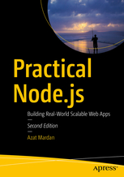

# Practical Node.js

This is the manuscript (draft) and code for Practical Node.js, 2nd Edition [Apress, 2018]. It's work in progress and the draft will be completed in the end of 2017. For the code of the 1st edition, please visit [1st-edition](https://github.com/azat-co/practicalnode/releases/tag/1st-edition).

You can get final 2nd edition (pre-order now or buy when it's ready) at Apress: <http://www.apress.com/us/book/9781484230381>.

1st Edition [2014]

2nd Edition [2018]

<http://practicalnodebook.com>

# Book, Rights and Publishing

Practical Node, 2nd Edition is a work-in-open book. It means that the book is written, updated and previewed in this reposition as free-to-read drafts, but are also being professionally edited, typeset, designed, produced, published, printed in soft cover and distributed to physical and electronic stores through the reputable tech publisher Apress Media.

If find the content here useful in any form, prefer print version, prefer professionally produced Kindle, ePUB or PDF, or just want to support me and Apress to create more work-in-open projects like Practical Node, 2nd Edition, please purchase the books once they are available for sale, through your normal physical or electronic book stores

If you'd like to contribute financially towards the effort (or any of my other open source work) aside from purchasing the books, or hire me as a speaker, write me an message via [my blog](https://webapplog.com/azat), or through [Twitter, Facebook or LinkedIn](http://azat.co).

# Practical Node.js, 2nd Edition Table of Contents

1. [Setting up Node.js and Other Essentials](https://github.com/azat-co/practicalnode/blob/master/chapter1/chapter1.md) [2nd Edition] <-- NEEDS REVIEW! 👀
2. [Using Express.js 4 to Create Node.js Web Apps](https://github.com/azat-co/practicalnode/blob/master/chapter2/chapter2.md) [2nd Edition] <-- NEEDS REVIEW! 👀
3. [TDD and BDD for Node.js with Mocha](https://github.com/azat-co/practicalnode/blob/master/chapter3/chapter3.md) [2nd Edition] <-- NEEDS REVIEW! 👀
4. [Template Engines: Pug and Handlebars](https://github.com/azat-co/practicalnode/blob/master/chapter4/chapter4.md) [2nd Edition] <-- NEEDS REVIEW! 👀
5. [Persistence with MongoDB and Mongoskin](https://github.com/azat-co/practicalnode/blob/master/chapter5/chapter5.md) [2nd Edition] <-- NEEDS REVIEW! 👀
6. [Using Sessions and OAuth to Authorize and Authenticate Users in Node.js Apps](https://github.com/azat-co/practicalnode/blob/master/chapter6/chapter6.md) [2nd Edition] <-- NEEDS REVIEW! 👀
7. [Boosting Your Node.js Data with the Mongoose ODM Library](https://github.com/azat-co/practicalnode/blob/master/chapter7/chapter7.md) [2nd Edition] <-- NEEDS REVIEW! 👀
8. [Building Node.js REST API Servers with Express.js and Hapi](https://github.com/azat-co/practicalnode/blob/master/chapter8/chapter8.md) [1s Edition]
9. [Real-Time Apps with WebSocket, Socket.IO, and DerbyJS](https://github.com/azat-co/practicalnode/blob/master/chapter9/chapter9.md) [1s Edition]
10. [Getting Node.js Apps Production Ready](https://github.com/azat-co/practicalnode/blob/master/chapter10/chapter10.md) [1s Edition]
11. [Deploying Node.js Apps](https://github.com/azat-co/practicalnode/blob/master/chapter11/chapter11.md) [1s Edition]
12. [Publishing Node.js Modules and Contributing to Open Source](https://github.com/azat-co/practicalnode/blob/master/chapter12/chapter12.md) [1s Edition]

Note: It's work in progress (1st -> 2nd Edition) and the draft will be completed in the end of 2017. See for [2nd Edition] for newer updated content.

# Help Needed

The help is needed in the following areas:

* Provide ideas, topics, new chapters, project, suggestions for 3rd edition in GitHub issues - NOW
* Review 3rd edition for typos (copy editing) when it's ready
* Review 3rd edition from a tech perspective (tech editing) when it's ready
* Review and run updated the code for 3rd edition when it's ready

# Live Corporate Training

Practical Node is a work of 30+ in-person courses, workshops and classes delivered by me in-person at various companies (Walmart Labs, Cisco, Intuit, Starbucks, Capital One, OnDeck, HubSpot, VMWare to name just a few), dev schools (Hack Reactor, DevBootcamp, Flat Iron NY, etc.) and conferences (ForwardJS, Node Interactive and others). If you need a corporate remote/online or onsite in-person training delivered by me, then [send me a message](https://webapplog.com/azat).

# Live Public Training

[NodeProgram.com](http://nodeprogram.com) is the place to find out about next live (remote/online) and in-person workshops/seminars/classes.

# Self-Paced Training

[Node University](https://node.university) is the ultimate, most comprehensive and complete resource on Node.js and full stack JavaScript. [View free self-paced courses](https://node.university/courses/category/free) or view [all self-paced courses](https://node.university/courses).

# Contribution

TBD

# Supporters

Practical Node, 2nd Edition was supported through [the Kickstarter campaign (funded in just three days)](https://www.kickstarter.com/projects/azat/practical-nodejs-book-2nd-edition-open-sourced-on). Thank you to the major backers of the book:

* **[DevelopIntelligence](http://www.developintelligence.com): Managed learning solutions including training design and development, program delivery and management** - $500
* Matthew Amacker - $200
* Jordan Horiuchi - $200
* Tim Chen - $175 
* Alexey Bushnev - $175 
* Aleksey Maksimov - $175 
* Maurice van Cooten - $175 
* Ryan - $175 
* Ng Yao Min - $175
* Kommana Karteek - $160 
* Elias Yousef - $150 
* Arhuman - $150 
* Javier Armendariz - $150 
* Dave Anderson - $150 
* Edithson Abelard - $150 
* Ron Male - $145 
* Win - $145 
* Harold Avilez - $145 
* Moe Joe - $145 
* Guest 1871315922 - $145 
* Philipp Jauss - $145 
* Judy Herilla - $145 
* Jaydev Dhinoja - $145 
* Carlos Rodriguez - $145 
* Pak - $145 
* Jim Texter - $145 
* David Wolff - $145 
* German Yesid Rubiano Romero - $125 
* shannon Johnstone - $125 
* Mani Rana - $125 
* Jeff Anderson - $125 
* Tajinder Pal Singh - $125 
* Sridhar Domakonda - $125 
* Dieter - $125 
* Felix Wang - $125 
* Dan Jensen - $125 
* Joel Register - $125 
* Edgar Sanchez - $125 
* Alexey - $125 
* Peter Sjölin - $125 
* Sksamy - $125 
* Manuel Padrón Martínez - $125 
* William Bartholomew - $125 
* Sukesh Kumar Dash - $125 
* Ross Matthews - $125 
* Elaine David - $125 
* Phil Aylesworth - $125 
* 張大寶 - $125 
* Vishnu - $125 
* Jonathan Jou - $125 
* Ernest Weems - $125 
* Allen Lam - $125 
* Martinerko - $125 
* Sharif H. Khan - $125 
* Larry Statham - $125 
* Syllie - $125 
* Eric J. - $125 
* Jim Tyhurst - $125 
* Oliver Schoenborn - $125 
* Benjamin Sweetnam - $75 
* Ian Partridge - $75 
* Hafeez Syed - $75 
* Chuck Huie - $75 
* Thomas Greenhalgh - $75 
* Sanghee Kim - $75 
* JoeL Ivey - $75 
* Clifford Lum - $75 
* Ben Altieri - $75 
* Patrick - $75 
* Mani S - $75 
* Simon St-Germain - $75 
* Jaiyaramakrishnan Mahendran - $75 
* Kevin Youkhana - $75 
* Eymard Ventura - $75 
* Matt Braun - $75 
* Brent - $75 
* Helio Alves - $75 
* Matthew Winter - $75 
* Omar Gómez Figueroa - $75 
* Herwin Rey - $75 
* Laura Steiner - $75 
* Ben Manning - $75 
* David le Blanc - $75 
* Brian Chirgwin - $75 
* Cédric Donner - $75 
* Gary Poon - $75 
* Mitchell Harpur - $75 
* Beardsley Ruml - $50 
* Swanand Kriyaban - $50 
* Suhas - $50 
* Yong Seok Jeon - $50 
* Martin Moellenbeck - $45
* Mikael Wallin - $45
* Aakash Jain - $35
* Alexandru Nedel - $35
* John Bond - $35
* Michael Patrick R. Flores - $35
* Lou Yufan - $35
* Creative Area - $35
* Chew Chit Siang - $35
* Yuri Oliveira - $35
* Khoa Nguyen - $35
* Piti Champeethong - $35
* Siim Orasmäe - $25
* Jorge Ordoñez Mendez - $25
* Tim Goshinski - $25

# Practical Node.js, 1st Edition (Apress, 2014)

* [1st Edition Manuscript (starting point for 2nd Edition)](https://github.com/azat-co/practicalnode/releases/tag/1st-edition-manuscript)
* GitHub: <https://github.com/azat-co/practicalnode/releases/tag/1st-edition>
* Amazon: <http://amzn.to/NuQ0fM>
* Apress: <http://www.apress.com/9781430265955>
